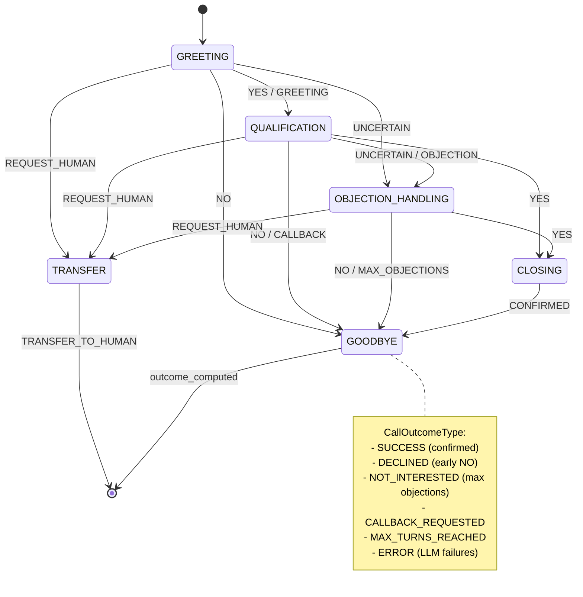

# Day 17: Conversation State Machine, Prompt Templates & LLM Guardrails

Day 17 focused on finalizing the conversation state machine with explicit outcome tracking, implementing per-campaign prompt templates, and adding LLM guardrails with human-like fallback responses.

---

## Summary

| Area | Changes |
|------|---------|
| State Machine | Added `CallOutcomeType` enum, `determine_outcome()` method, CALLBACK intent |
| Prompt Templates | Created `CampaignPromptConfig` model for per-campaign customization |
| LLM Guardrails | Timeout handling, deterministic mode, human-like fallback responses |
| Testing | Added 33 new unit tests across 2 test files |

---

## 1. Conversation State Machine Enhancement

### Problem
The existing state machine tracked conversation states (GREETING → QUALIFICATION → OBJECTION_HANDLING → CLOSING → TRANSFER → GOODBYE) but lacked explicit outcome tracking for QA and analytics.

### Solution
Added explicit call outcome determination via `CallOutcomeType` enum.

**New enum in `conversation_state.py`:**
```python
class CallOutcomeType(str, Enum):
    SUCCESS = "success"                   # Goal achieved
    DECLINED = "declined"                 # User said no
    NOT_INTERESTED = "not_interested"     # Max objections reached
    CALLBACK_REQUESTED = "callback_requested"  
    TRANSFER_TO_HUMAN = "transfer_to_human"
    MAX_TURNS_REACHED = "max_turns_reached"
    ERROR = "error"                       # LLM failures
    UNKNOWN = "unknown"
```

**Extended `ConversationContext`:**
```python
# Outcome tracking fields
call_outcome: Optional[CallOutcomeType] = None
outcome_reason: Optional[str] = None
goal_achieved: bool = False
callback_requested: bool = False
llm_error_count: int = 0
```

**New `determine_outcome()` method in `conversation_engine.py`:**
```python
def determine_outcome(
    self,
    final_state: ConversationState,
    context: ConversationContext,
    turn_count: int = 0
) -> CallOutcomeType:
    """Determine explicit call outcome for QA tracking."""
    if context.llm_error_count >= 2:
        return CallOutcomeType.ERROR
    if context.callback_requested:
        return CallOutcomeType.CALLBACK_REQUESTED
    if context.user_confirmed:
        return CallOutcomeType.SUCCESS
    # ... more outcome logic
```

**Added CALLBACK intent detection:**
```python
UserIntent.CALLBACK: [
    r'\b(call (me )?(back|later|another time))\b',
    r'\b(not a good time|bad time)\b',
    r'\b(busy right now|in a meeting)\b',
]
```

### State Machine Diagram (Mermaid)



### State Machine Diagram (ASCII - Text Only)

```
┌─────────────────────────────────────────────────────────────────────────────┐
│                     ENHANCED CONVERSATION STATE MACHINE                      │
│                           with Outcome Tracking                              │
└─────────────────────────────────────────────────────────────────────────────┘

                              ┌──────────────┐
                              │   START      │
                              └──────┬───────┘
                                     │
                                     ▼
                              ┌──────────────┐
                         ┌────│   GREETING   │────┐
                         │    └──────┬───────┘    │
                         │           │            │
              NO/GOODBYE │   YES/GREETING         │ REQUEST_HUMAN
                         │           │            │
                         ▼           ▼            ▼
                  ┌──────────┐ ┌─────────────┐ ┌──────────┐
                  │ GOODBYE  │ │QUALIFICATION│ │ TRANSFER │
                  └────┬─────┘ └──────┬──────┘ └────┬─────┘
                       │              │              │
    ┌──────────────────┘              │              └──────────────────┐
    │                                 │                                 │
    │           ┌─────────────────────┼─────────────────────┐           │
    │           │                     │                     │           │
    │    UNCERTAIN/           YES     │     NO/CALLBACK     │           │
    │    OBJECTION                    │                     │           │
    │           │                     │                     │           │
    │           ▼                     ▼                     │           │
    │  ┌─────────────────┐     ┌──────────┐                 │           │
    │  │OBJECTION_HANDLING│     │ CLOSING  │                 │           │
    │  └────────┬────────┘     └────┬─────┘                 │           │
    │           │                   │                       │           │
    │     YES   │   NO/MAX          │ CONFIRMED             │           │
    │     ┌─────┴─────┐             │                       │           │
    │     │           │             │                       │           │
    │     ▼           ▼             ▼                       ▼           ▼
    │  ┌──────┐   ┌──────────┐  ┌──────────┐          ┌──────────┐ ┌──────────┐
    │  │CLOSING│   │ GOODBYE  │  │ GOODBYE  │          │ GOODBYE  │ │ TRANSFER │
    │  └──────┘   └────┬─────┘  └────┬─────┘          └────┬─────┘ └────┬─────┘
    │                  │             │                     │            │
    └──────────────────┴─────────────┴─────────────────────┴────────────┘
                                     │
                                     ▼
                    ┌────────────────────────────────────┐
                    │         CALL OUTCOME TYPE          │
                    ├────────────────────────────────────┤
                    │  SUCCESS         - Goal achieved   │
                    │  DECLINED        - User said no    │
                    │  NOT_INTERESTED  - Max objections  │
                    │  CALLBACK_REQUESTED                │
                    │  TRANSFER_TO_HUMAN                 │
                    │  MAX_TURNS_REACHED                 │
                    │  ERROR           - LLM failures    │
                    │  UNKNOWN                           │
                    └────────────────────────────────────┘
```

### State Transition Table

| From State | Intent | To State | Outcome |
|------------|--------|----------|---------|
| GREETING | YES/GREETING | QUALIFICATION | - |
| GREETING | NO | GOODBYE | DECLINED |
| GREETING | UNCERTAIN | OBJECTION_HANDLING | - |
| GREETING | REQUEST_HUMAN | TRANSFER | TRANSFER_TO_HUMAN |
| QUALIFICATION | YES | CLOSING | - |
| QUALIFICATION | NO | GOODBYE | DECLINED |
| QUALIFICATION | CALLBACK | GOODBYE | CALLBACK_REQUESTED |
| QUALIFICATION | UNCERTAIN/OBJECTION | OBJECTION_HANDLING | - |
| OBJECTION_HANDLING | YES | CLOSING | - |
| OBJECTION_HANDLING | NO/MAX | GOODBYE | NOT_INTERESTED |
| CLOSING | CONFIRMED | GOODBYE | SUCCESS |
| *any* | MAX_TURNS | GOODBYE | MAX_TURNS_REACHED |
| *any* | LLM_ERROR x2 | GOODBYE | ERROR |

## 2. Campaign-Specific Prompt Templates

### Problem
All campaigns used the same prompt templates. Need per-campaign customization for system prompts, compliance text, and LLM settings.

### Solution
Created `CampaignPromptConfig` model for database-stored (JSONB) campaign-specific configuration.

**New file `campaign_prompt_config.py`:**
```python
class CampaignPromptConfig(BaseModel):
    """Campaign-specific prompt configuration."""
    
    system_prompt_override: Optional[str] = None
    greeting_override: Optional[str] = None
    compliance_text: Optional[str] = None  # TCPA, legal disclaimers
    tools_context: Optional[str] = None
    
    # LLM behavior overrides
    temperature: Optional[float] = None
    max_tokens: Optional[int] = None
    response_style: str = "conversational"
    language: str = "en"
    max_sentences: int = 2
    context_variables: Dict[str, str] = {}
```

This model can be stored in `campaigns.prompt_config` JSONB column.

---

## 3. LLM Guardrails

### Problem
LLM failures could expose the AI nature through generic error messages or cause call failures.

### Solution
Created `LLMGuardrails` service with human-like fallback responses that never hint at AI involvement.

**New file `llm_guardrails.py`:**

```python
class LLMGuardrails:
    # Fallback responses per state - NO AI hints
    FALLBACK_RESPONSES = {
        ConversationState.GREETING: [
            "Oh sorry, could you say that again? I missed that.",
            "Apologies, go ahead, I'm listening.",
        ],
        ConversationState.QUALIFICATION: [
            "Right, let me just note that down. So what works best for you?",
            "Got it. And what time would be ideal?",
        ],
        # ... more states
    }
    
    # Graceful goodbye after max errors (still human-like)
    GRACEFUL_GOODBYE_RESPONSES = [
        "I apologize, but I need to step away. Someone will call you back shortly.",
        "Let me have a colleague follow up with you directly. Thank you!",
    ]
```

**Timeout handling in `groq.py`:**
```python
async def stream_chat_with_timeout(
    self,
    messages: List[Message],
    timeout_seconds: float = 10.0,
    **kwargs
) -> AsyncIterator[str]:
    """Stream with timeout for graceful degradation."""
    try:
        async with asyncio.timeout(timeout_seconds):
            async for token in self.stream_chat(messages, **kwargs):
                yield token
    except asyncio.TimeoutError:
        raise LLMTimeoutError(f"LLM timed out after {timeout_seconds}s")
```

**Deterministic mode for QA:**
```python
def set_deterministic_mode(self, enabled: bool = True, seed: int = 42):
    """Enable deterministic mode for QA testing."""
    self._deterministic_mode = enabled
    self._deterministic_seed = seed  # Fixed seed
    # Temperature forced to 0.0 for reproducibility
```

**Integration in `voice_pipeline_service.py`:**
```python
try:
    async for token in self.llm_provider.stream_chat_with_timeout(
        messages=messages_with_prefill,
        timeout_seconds=self.guardrails.config.max_response_time_seconds,
        ...
    ):
        response_text += token
        
    # Clean and validate response
    response_text = self.guardrails.clean_response(response_text)
    response_text = self.guardrails.truncate_response(response_text)
    is_valid, reason = self.guardrails.validate_response(response_text, rules)
    
except LLMTimeoutError:
    # Human-like fallback - NO AI hints
    fallback_response, should_end = self.guardrails.get_fallback_response(
        state=new_state,
        call_id=call_id,
        error_count=session.conversation_context.llm_error_count
    )
    response_text = fallback_response
```

---

## Files Changed

| File | Action | Lines Changed |
|------|--------|---------------|
| `app/domain/models/conversation_state.py` | MODIFIED | +35 (CallOutcomeType, context fields) |
| `app/domain/models/campaign_prompt_config.py` | NEW | 100 lines |
| `app/domain/services/conversation_engine.py` | MODIFIED | +70 (determine_outcome, CALLBACK) |
| `app/domain/services/llm_guardrails.py` | NEW | 244 lines |
| `app/infrastructure/llm/groq.py` | MODIFIED | +70 (timeout, deterministic mode) |
| `app/domain/services/voice_pipeline_service.py` | MODIFIED | +60 (guardrails integration) |
| `tests/unit/test_llm_guardrails.py` | NEW | 230 lines |
| `tests/unit/test_call_outcome.py` | NEW | 210 lines |

---

## Test Results

```
tests/unit/test_conversation_engine.py - 31 passed
tests/unit/test_llm_guardrails.py - 16 passed
tests/unit/test_call_outcome.py - 17 passed
```

Total: 64 tests passing, 0 failures.

---

## Key Design Decisions

1. **Human-like fallbacks**: Fallback responses sound 100% natural - "Oh sorry, could you say that again?" instead of "I'm experiencing technical difficulties".

2. **Outcome determinism**: `CallOutcomeType` provides explicit, queryable outcomes for QA dashboards.

3. **Graceful degradation**: After 2 LLM errors, the agent says goodbye naturally ("Let me have a colleague follow up...") rather than exposing the AI.

4. **Database storage for templates**: `CampaignPromptConfig` uses JSONB for flexibility without schema migrations.

5. **Timeout with retry**: Single timeout triggers fallback response; conversation continues. Only 2+ errors end the call.

---

