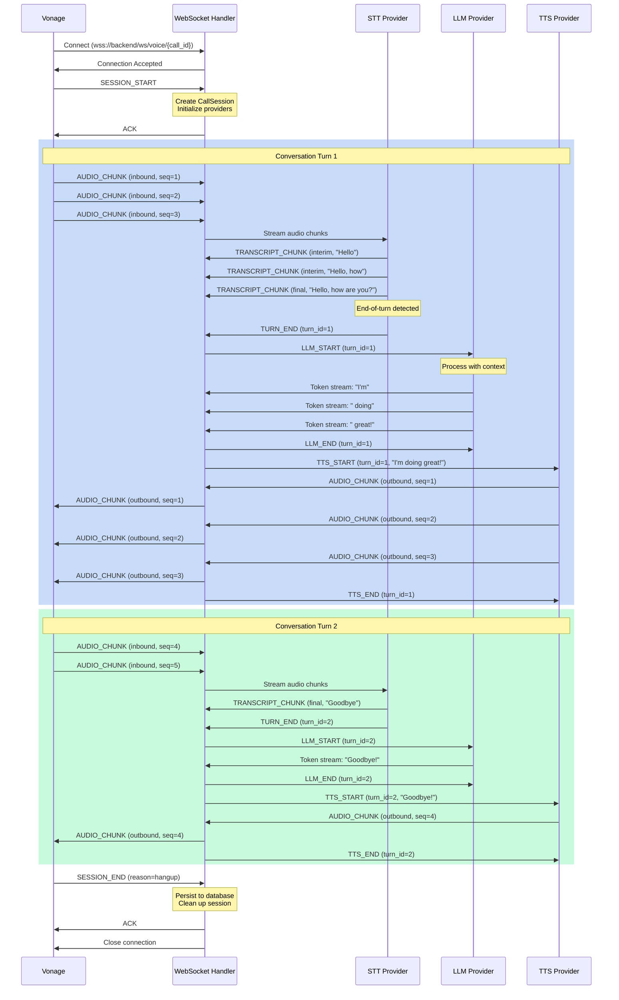
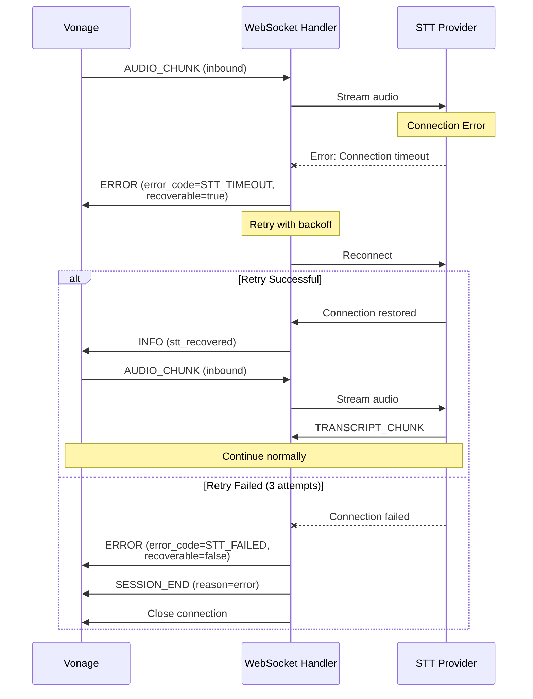
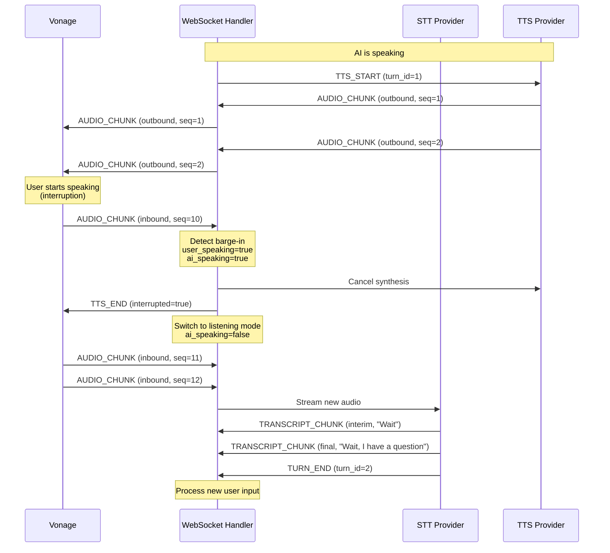
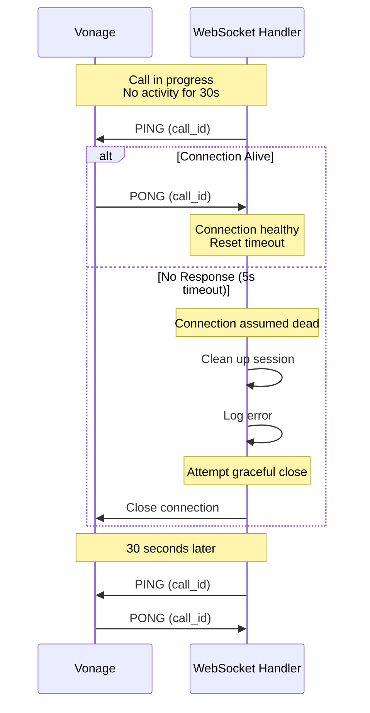
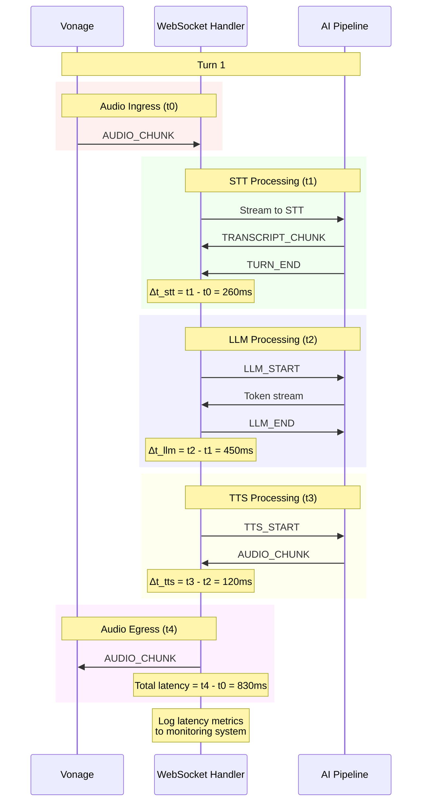
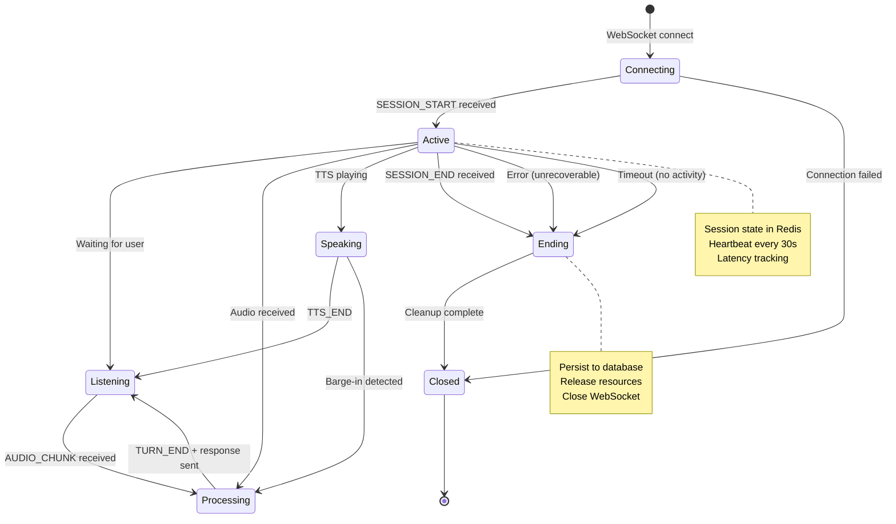
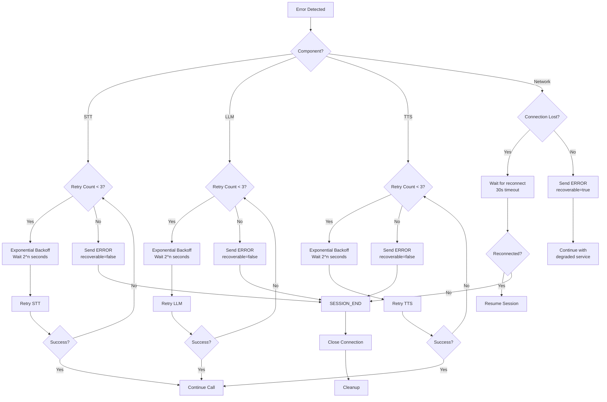

# WebSocket Message Flow Diagrams

## 1. Successful Call Flow



---

## 2. Error Handling Flow



---

## 3. Barge-In (Interruption) Flow



---

## 4. Heartbeat (Keep-Alive) Flow



---

## 5. Multi-Turn Conversation with Latency Tracking



---

## 6. Session Lifecycle



---

## 7. Error Recovery Decision Tree



---

## Message Format Examples

### SESSION_START
```json
{
  "type": "session_start",
  "call_id": "550e8400-e29b-41d4-a716-446655440000",
  "campaign_id": "campaign-123",
  "lead_id": "lead-456",
  "system_prompt": "You are a helpful sales assistant for Acme Corp.",
  "voice_id": "6ccbfb76-1fc6-48f7-b71d-91ac6298247b",
  "language": "en",
  "timestamp": "2025-12-03T20:00:00.000Z"
}
```

### TRANSCRIPT_CHUNK
```json
{
  "type": "transcript_chunk",
  "call_id": "550e8400-e29b-41d4-a716-446655440000",
  "text": "Hello, how are you?",
  "is_final": true,
  "confidence": 0.95,
  "timestamp": "2025-12-03T20:00:05.123Z"
}
```

### TURN_END
```json
{
  "type": "turn_end",
  "call_id": "550e8400-e29b-41d4-a716-446655440000",
  "turn_id": 1,
  "full_transcript": "Hello, how are you?",
  "timestamp": "2025-12-03T20:00:05.456Z"
}
```

### ERROR
```json
{
  "type": "error",
  "call_id": "550e8400-e29b-41d4-a716-446655440000",
  "error_code": "STT_TIMEOUT",
  "error_message": "Speech-to-text service timed out after 5 seconds",
  "component": "stt",
  "recoverable": true,
  "timestamp": "2025-12-03T20:00:10.789Z"
}
```

### SESSION_END
```json
{
  "type": "session_end",
  "call_id": "550e8400-e29b-41d4-a716-446655440000",
  "reason": "hangup",
  "duration_seconds": 125.5,
  "timestamp": "2025-12-03T20:02:05.500Z"
}
```

---

## Implementation Notes

### Sequence Number Management

```python
class AudioSequencer:
    def __init__(self):
        self.inbound_seq = 0
        self.outbound_seq = 0
        self.missing_packets = set()
    
    def next_inbound(self) -> int:
        self.inbound_seq += 1
        return self.inbound_seq
    
    def next_outbound(self) -> int:
        self.outbound_seq += 1
        return self.outbound_seq
    
    def check_sequence(self, received_seq: int, direction: str) -> bool:
        """Check for missing packets"""
        expected = self.inbound_seq + 1 if direction == "inbound" else self.outbound_seq + 1
        
        if received_seq != expected:
            # Packet loss detected
            for i in range(expected, received_seq):
                self.missing_packets.add(i)
            return False
        return True
```

### Latency Tracking

```python
class LatencyTracker:
    def __init__(self):
        self.timestamps = {}
    
    def mark(self, event: str, call_id: str):
        """Mark timestamp for an event"""
        key = f"{call_id}:{event}"
        self.timestamps[key] = time.time()
    
    def measure(self, start_event: str, end_event: str, call_id: str) -> float:
        """Measure latency between two events in milliseconds"""
        start_key = f"{call_id}:{start_event}"
        end_key = f"{call_id}:{end_event}"
        
        if start_key not in self.timestamps or end_key not in self.timestamps:
            return 0.0
        
        return (self.timestamps[end_key] - self.timestamps[start_key]) * 1000
```
