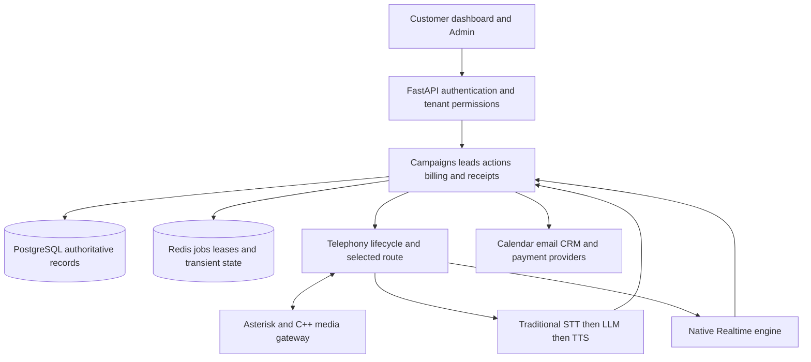

# Talky AI Customer Purchase and Feature Maturity Assessment

Frozen baseline from 2 October 2026. Copied on 4 October for the production ready plan; evidence links were made portable. Findings and observations have not been refreshed or marked resolved.

Assessment date: 2 October 2026. Audience: product owner, engineering, QA, operations and customer success. Purpose: decide what can responsibly be sold, identify what prevents a paying customer from receiving value, and provide repeatable acceptance criteria for the existing product scope.

**Purchase verdict: I would not buy the current broad self-service subscription, annual commitment, white-label reseller offering, or a receptionist service that requires live human transfer. I would consider a narrowly defined, supervised core-calling pilot after the commercial blockers and release requirements below are satisfied.** This is a conditional future decision, not approval to start that pilot today.

The strongest part of the product is its increasingly careful voice, routing, tenant and action infrastructure. The weakest part is the consistency of the whole customer journey: some features are engineered and tested, some are deliberately unavailable, some screens still simulate business operations, and several commercial promises lack measured support. A client pays for a reliable outcome across that entire journey.

## 1 Evidence and limits

The source inspected is repair head `d7b584050e9e45c6b8a1bf543636afd87437ab22`. Its successful CI checked PR merge `3689f0d806e40d58d018d8a03316436fb5cec2d4`, incorporating main `3f65aa2d508114374034d2b8a378a624c3d13f9d`. That merge adds six upstream UI/documentation files; it is not an identical tree to the repair head. Release evidence must identify the tested merge, rather than silently substituting a different artifact.

Fresh read-only production checks at 07:25–07:31 UTC on 2 October found revision `b93b23de72fe6fe0fe84d3244c5f59e83401ff74`. API, Python workers, gateway, Asterisk, PostgreSQL and Redis were running; dependency readiness and worker heartbeats were healthy. There were zero active sessions in the first snapshot. This proves idle service health at that time, not call quality, recovery or capacity. The installed trunk timer was still 15 seconds; the candidate's 10-second change was not deployed.

Relevant positive evidence is substantial:

- Unit/security CI: 10,422 passed, 13 skipped; a separate run also reported 18 passing subtests. Backend application coverage was 65.59%.
- Migrated PostgreSQL integration: 22 passed, including five redial concurrency, recovery, isolation and caller-ID cases. Preserved baseline checks added 14 bootstrap and one hold-resolution test.
- Fast voice suite: 241 passed. Frontend: 513 passed and two skipped. Admin: 13 passed. Builds, type checking, blocking security checks, Docker and gateway sanitizer/shutdown checks passed.
- Actual provider exercises exist, including 40 synthetic text turns in the latest conversation artifact and two earlier Cartesia-to-Flux synthetic PCM fixtures. These are limited provider experiments, not real customer telephone acceptance.
- Two defects were investigated through small offline reproductions during this assessment: billing webhook retry loss and the Realtime relationship-correction guard's bounded memory. Neither reproduction called a provider, charged money or contacted a customer.

There was no new customer-call listening session, charge/refund, live CRM/email/calendar action, load test, restore or deployment in this assessment. Human-rated naturalness, current caller-heard latency, conversion uplift, support burden and true unit economics remain unmeasured here. Historic artifacts retain their original source revisions; they do not certify the final `lead_gen@12` prompt.

This report maps the known product surface and records gaps explicitly. It is not an exhaustive line-by-line security audit, a legal compliance opinion or a guarantee that every defect has been found. Inaccessible contracts, external monitoring, provider-account limits and unseen operating procedures remain unknown, rather than being counted as either working or absent.

Use these evidence labels throughout:

| Label | Meaning |
|---|---|
| Confirmed defect | A concrete source path or bounded reproduction demonstrates the unwanted behavior. It does not imply a customer incident has already occurred. |
| Capability limit | The feature is deliberately unavailable, partial or conditional. |
| Design risk | A plausible failure follows from a specific architecture or policy choice; its field frequency is not established. |
| Evidence gap | The required customer outcome or claim was not proven by the evidence inspected. |
| Repaired candidate | A prior defect has a tested fix in the candidate; deployment and acceptance are separate facts. |

Priorities are contextual: **P1 blocks sale or reliance on the affected promise; P2 materially harms reliability, supportability or usability; P3 is lower-impact polish.** A P1 reseller defect does not mean that core tenant isolation is absent. Maturity is not averaged into a reassuring percentage: a broken payment lifecycle can block purchase even when most other features are engineered.

## 2 Would a real client buy it

| Buyer and intended purchase | Decision today | Why | What would change the decision |
|---|---|---|---|
| Small business seeking supervised outbound lead qualification | Conditional pilot only, after blockers | Core routes, lead capture and receipts have meaningful engineering evidence; comprehension and real-call outcomes are not yet established. | Correct commercial flow, compatible deployment, approved calling profile, known campaign knowledge, real-call acceptance and named support. |
| Buyer expecting immediate self-service setup and unattended calling | No | Setup spans several screens and systems; a complete novice first-value journey is unproven. Current production is older than the tested repair. | A new user independently completes signup, purchase, authorized number/trunk setup, knowledge setup, test call and result verification. |
| Receptionist buyer requiring transfer to a person | No for that requirement | Controlled inbound transfer is explicitly disabled in production. The UI correctly explains this. | Existing transfer proof gates pass on real controlled calls, including child-leg cleanup, busy/no-answer and settlement. |
| Buyer needing inbound FAQ or message intake without transfer | Conditional pilot only | This is a narrower supported workflow, but telephone, consent, message persistence and outage handling need acceptance. | Explicitly exclude transfer, prove supported escalation/intake behavior and define after-hours/dependency-failure handling. |
| Agency buying white-label tenant provisioning and billing | No | Reviewed tenant controls persist local browser state; partner billing displays fixed sample figures and invoices. | Server-authoritative provisioning, suspension, permissions, entitlements and billing, independently verified across browsers and tenants. |
| Customer making an annual commitment | No | The annual UI selection is not represented in the checkout request. Invoice detail and webhook recovery have additional defects. | Authoritative price options and complete charge, activate, renew, fail, cancel, refund and reconcile acceptance. |
| Enterprise or sensitive-data buyer relying on high availability and procurement assurances | No on current evidence | No established current-release carrier capacity, recovery-time proof, end-to-end alert delivery or verified procurement package. | Contract-specific security/privacy review, documented suppliers, agreed and measured reliability/recovery objectives, proven operations. |

The reason to retain confidence in a future purchase is the reusable foundation: real provider adapters, tenant isolation, deterministic action checks, durable records, explicit unknown outcomes, separately configured voice engines and extensive regression work. The reason to withhold payment today is that important customer promises can still fail at the boundaries between those pieces.

## 3 Confirmed commercial defects and unfinished product behavior

**C01 — P1 — Contact enquiries can be silently lost.** The public contact form waits 1.5 seconds, clears its inputs and displays success without sending a request or persisting an enquiry. This is a real false-success path, separate from CRM contact import. A prospective buyer can lose a sales or support enquiry before creating an account. Wire it to one durable intake path, or provide an honest email link until ready. Success must require a server receipt; failures must retain the draft. Acceptance: double-click, retry, reload and service failure produce either one accepted enquiry or a visible unsent state. [Contact implementation](https://github.com/talkyai-source/Talky.ai-complete-/blob/d7b58405/Talk-Leee/src/components/home/contact-section.tsx#L39).

**C02 — P1 — Annual pricing is presentation without a matching purchase contract.** The plans screen advertises approximately 17% savings and calculates a yearly display, but checkout submits only `plan_id` and return URLs. The backend reads that plan's single Stripe price ID; changing the toggle does not change the purchase request. This establishes a mismatch without knowing the live price configured in Stripe. Hide the annual choice until the catalog supports it, or pass a server-validated price option with its interval. Acceptance: amount, currency, interval, renewal date and provider price agree from selection through invoice. [Plans screen](https://github.com/talkyai-source/Talky.ai-complete-/blob/d7b58405/Talk-Leee/src/app/billing/plans/page.tsx#L55), [checkout service](https://github.com/talkyai-source/Talky.ai-complete-/blob/d7b58405/backend/app/domain/services/billing_service.py#L147).

**C03 — P1 — A failed subscription webhook can become permanently ignored.** The service claims an event before business processing. Top-up failures release that claim, but ordinary subscription/invoice handlers do not provide equivalent recovery. The actual method, exercised with an in-memory claim and a transient failing handler, produced `handler_failed`, then `duplicate`, with only one handler attempt. A paid customer could remain incorrectly activated or invoiced despite provider retries. This is a reproduced failure boundary, not evidence of an existing customer loss. Use recoverable event states and idempotent business updates; simply deleting a claim after partly applied work is not a complete fix. Acceptance must inject failures before and after each durable mutation, then verify safe retry and reconciliation. Stripe documents duplicate and unordered delivery, so both belong in the test contract. [Handler](https://github.com/talkyai-source/Talky.ai-complete-/blob/d7b58405/backend/app/domain/services/billing_service.py#L465), [Stripe delivery behavior](https://docs.stripe.com/webhooks), [offline evidence](baseline-artifacts/2026-10-02-maturity-billing-repro.json).

**C04 — P1 — Invoice details can present invented facts.** The detail endpoint substitutes plan allowance for used minutes, sets tax, overage and peak concurrency to zero, constructs a plan line from the invoice total, and joins current subscription/plan data. Adjustments return an empty list; a separate overage estimate falls back to 10 cents per minute without a stored rate. These are not authoritative invoice facts. Prefer the actual provider invoice/PDF and recorded totals; show unavailable where detail was not captured. Preserve immutable invoice items before presenting a detailed breakdown. Acceptance: tax, credits, discounts, top-ups and plan changes match the provider invoice, and historical detail does not change when the current plan changes. [Invoice projection](https://github.com/talkyai-source/Talky.ai-complete-/blob/d7b58405/backend/app/api/v1/endpoints/billing.py#L542).

**C05 — P1 for reseller sales — White-label operational screens are still prototypes.** Partner tenant creation, editing and suspension update React/localStorage state, although tooltips describe ability to place calls. Partner billing hardcodes usage, cost and paid invoices. These reviewed screens do not visibly disclose their local/demo nature. Existing core Admin APIs and tenant isolation do not make these particular controls operational. Hide or explicitly isolate the demo surfaces from paid use; wire the real authorized backend when that offering is ready. Acceptance: another browser sees the created tenant, real membership and entitlements exist, suspension blocks server-side work, and every invoice is real. [Tenant state](https://github.com/talkyai-source/Talky.ai-complete-/blob/d7b58405/Talk-Leee/src/app/white-label/%5Bpartner%5D/tenants/tenants-client.tsx#L118), [partner billing](https://github.com/talkyai-source/Talky.ai-complete-/blob/d7b58405/Talk-Leee/src/app/white-label/%5Bpartner%5D/billing/page.tsx#L70).

**C06 — P1 for promised self-service cancellation; otherwise P2 — Cancellation and billing communication are incomplete journeys.** Backend billing portal and period-end cancellation exist, but no customer frontend consumer was found; the UI links to plan selection instead. Email support remains a stated alternative, so cancellation is not categorically impossible. Payment-email recipient selection also uses legacy `owner`, while canonical signup uses `tenant_admin`. Expose one clear authorized manage/cancel route and align recipient roles. Acceptance: the owner sees the effective end date, cancellation survives reload, renewal stops, paid access continues appropriately, and a failure never produces a success claim. [Billing endpoints](https://github.com/talkyai-source/Talky.ai-complete-/blob/d7b58405/backend/app/api/v1/endpoints/billing.py#L267), [recipient selection](https://github.com/talkyai-source/Talky.ai-complete-/blob/d7b58405/backend/app/domain/services/billing_service.py#L951).

**C07 — P1 for sold automated alerts; otherwise P2, with a potentially higher privacy impact — Notifications are not durable server automation.** The reviewed external notification path posts from the browser and discards failures. Its storage keys are not scoped by authenticated tenant/user, and logout does not visibly clear that store. Closed browsers, CORS and network failures can lose delivery. A cross-account history/destination exposure is a specific risk requiring browser reproduction, not an observed disclosure. Scope and clear local state on identity changes; use existing durable server delivery for operational notifications. Acceptance: tenant A's history and destination never appear after tenant B signs in; failed delivery has a visible, retryable status. [Notification store](https://github.com/talkyai-source/Talky.ai-complete-/blob/d7b58405/Talk-Leee/src/lib/notifications.ts#L80).

**C08 — P2 — Published legacy signup still conflicts with the canonical schema.** The current verified-code signup has meaningful repairs and membership creation. A separately mounted legacy registration path inserts `owner`, which is outside the canonical role constraint, and does not use the same membership invariant. Retire that route or delegate to the canonical implementation. Acceptance: every published registration route works against the migrated database and cannot leave an orphan tenant or grant incorrect membership. This is not a claim that current normal signup is entirely broken. [Legacy registration](https://github.com/talkyai-source/Talky.ai-complete-/blob/d7b58405/backend/app/api/v1/endpoints/auth/registration.py#L125).

**C09 — P1 for promised managed support; otherwise P2 — Parts of the operating console remain unavailable.** Actions Log and Incidents contain Coming Soon surfaces; selected customer Admin consoles explicitly report unavailable functionality. Other call, tenant, user, connector and audit APIs are real. A support promise must match what an operator can actually diagnose and repair. Prioritize tracing a complaint across call, lead, action receipt and billing before expanding the console. Acceptance: an authorized support operator resolves a failed follow-up or billing mismatch with audit evidence and no guessed database edits. [Actions log](https://github.com/talkyai-source/Talky.ai-complete-/blob/d7b58405/Admin/frontend/src/pages/ActionsLogPage.tsx#L31), [incidents](https://github.com/talkyai-source/Talky.ai-complete-/blob/d7b58405/Admin/frontend/src/pages/IncidentsPage.tsx#L31).

## 4 Voice and agent quality assessment

**Naturalness and overall voice quality are ungraded in this report.** There is insufficient representative listening evidence to give an honest 7/10 or claim that the voice is bad. Two synthetic provider fixtures cannot establish accent handling, telephone intelligibility, pacing, warmth or resilience to a caller talking over the agent.

The recent fixes deserve credit: opening delivery is distinguished from interruption; topic-level refusal is separated from ending the call; contact corrections require evidence; partial speech is not treated as fully played; current caller ID comes from the selected route and actual call leg. Those are repaired candidate behaviors. Their real-world frequency and production acceptance are still separate work.

**V01 — P1 — Real telephone quality and performance remain unproven for this release.** Cartesia first-audio observations of 169 and 205 milliseconds describe two provider responses, not total conversational delay. The Realtime smoke used synthetic text and a simulated gateway. An earlier capacity/soak report explicitly invalidates its SIP-only/no-RTP evidence. No current concurrency ceiling or human-rated naturalness claim follows from these tests. Use the existing harnesses, the intended carrier and actual selected voice profiles for bidirectional audio acceptance. [Provider fixture scope](https://github.com/talkyai-source/Talky.ai-complete-/blob/d7b584050e9e45c6b8a1bf543636afd87437ab22/docs/sessions/artifacts/2026-10-01-audio-provider-eval.json), [invalidated load evidence](https://github.com/talkyai-source/Talky.ai-complete-/blob/d7b584050e9e45c6b8a1bf543636afd87437ab22/telephony/docs/phase_3/day10_concurrency_soak_evidence.md).

**V02 — P1 for approving the affected model profile — Groq still demonstrated a comprehension failure.** The synthetic provider exercise showed a misremembered previous question even though captured request history contained the exact preceding question. This is not explained by a lost-history bug. Small Luna/Gemini/Cerebras samples do not establish universal superiority or readiness either. Approve a complete model/prompt/voice/knowledge profile only against the same reviewed scenarios; keep unsuccessful profiles experimental for that use case. Do not make an automatic larger-model switch the default remedy. [Recorded provider evidence](https://github.com/talkyai-source/Talky.ai-complete-/blob/d7b584050e9e45c6b8a1bf543636afd87437ab22/docs/sessions/artifacts/2026-10-02-call-experience-model-probe.json).

**V03 — P1/P2 — Traditional no/weak-match turns can include a conflicting knowledge fallback.** The fallback instructions tell the agent it will check and ensure confirmation, even when available tools provide no follow-up route. Other instructions forbid unsupported future promises. This is a confirmed instruction contradiction; it does not prove an external action occurred. Replace that fallback with a short honest inability to confirm and only an actually available next step. Acceptance must evaluate the assembled prompt with no tools, unavailable tools and working tools, rather than testing one template sentence alone. [Knowledge fallback](https://github.com/talkyai-source/Talky.ai-complete-/blob/d7b58405/backend/app/domain/services/voice_pipeline/turn_streamer.py#L193).

**V04 — P2 defect; P1 before approving the affected profile — Realtime relationship corrections can leave a bounded guard's memory.** The relationship guard reads a 12-message buffer, and typed live state has no persistent field for an explicit denial of a customer relationship. In a bounded offline test, the guard rejected an existing-customer claim immediately after a denial, but no longer rejected it after the denial aged out. This is a confirmed guard coverage gap, not proof that the live model necessarily repeats the claim. Store the latest explicit relationship correction in existing typed state, with provenance and a valid later reversal. Acceptance: the correction still constrains an incompatible claim after 30 turns; a later explicit caller correction updates it appropriately. [Realtime buffer](https://github.com/talkyai-source/Talky.ai-complete-/blob/d7b58405/backend/app/realtime/bridge.py#L678), [offline proof](baseline-artifacts/2026-10-02-maturity-realtime-memory-repro.json).

**V05 — P1 for a transfer-dependent customer — Controlled inbound human transfer is unavailable in production.** The controlled inbound transfer declaration is false, with a narrow staging proof path. The UI correctly disables it. Do not present production receptionist-to-human handoff as included. Either exclude it explicitly or complete the existing two-leg, restart, hangup and settlement proofs before enabling it. [Capability declaration](https://github.com/talkyai-source/Talky.ai-complete-/blob/d7b58405/backend/app/domain/services/telephony/inbound_transfer.py#L20).

**V06 — P2 — Recovery has real limits that should be explicit.** Traditional provider failover is opt-in. STT fallback can use another engine from the same vendor/account, so it is not independent protection from a shared vendor outage. TTS fallback requires credentials and a voice mapping; replay after partial output is intentionally avoided. STT recovery has a bounded replay buffer and can require repetition. Realtime unexpected disconnect ends the session rather than transparently reconnecting mid-call. These are mostly deliberate tradeoffs. Show effective fallback readiness and test the chosen configuration; avoid adding unsafe replay to make recovery appear seamless. [Voice orchestration](https://github.com/talkyai-source/Talky.ai-complete-/blob/d7b58405/backend/app/domain/services/voice_orchestrator.py#L1164), [Realtime connection](https://github.com/talkyai-source/Talky.ai-complete-/blob/d7b58405/backend/app/realtime/openai.py#L766).

OpenAI's evaluation guidance supports moving from controlled cases to realistic noisy audio and multi-turn interaction, with human review of complete sessions. That is the appropriate direction for the existing test work. The test sizes and thresholds proposed later in this report are our proposed product gates, not OpenAI performance guarantees. [Realtime evaluation guide](https://developers.openai.com/cookbook/examples/realtime_eval_guide), [evaluation best practices](https://developers.openai.com/api/docs/guides/evaluation-best-practices).

## 5 Money limits, operations and data governance

**O01 — P1 where sold as a hard allowance — Outbound minute limits are not guaranteed during a narrow metering failure.** The shared minute lookup can return unlimited after a query error; the worker's check also passes on lookup failure. A later CallGuard can fall back to a stored usage value that is not reliably current. Other DNC, platform, spend and concurrency guards remain, and a total database outage can still stop calling. The precise exposure is a failed usage query with other checks working and stale stored usage below the limit. Introduce an explicit metering-unavailable state and a documented bounded continuity policy. A customer-visible hard cap must stop new admission when its authority is unknown. Also define whether the allowance resets on the calendar month or subscription anniversary; the current usage query uses the calendar month. [Shared lookup](https://github.com/talkyai-source/Talky.ai-complete-/blob/d7b58405/backend/app/domain/services/minutes_quota.py#L115), [worker check](https://github.com/talkyai-source/Talky.ai-complete-/blob/d7b58405/backend/app/workers/dialer_worker.py#L1522), [additional guard](https://github.com/talkyai-source/Talky.ai-complete-/blob/d7b58405/backend/app/domain/services/call_guard.py#L1002).

**O02 — P1 for promised hard limits; otherwise P2 — Provider account limits and global limits have different coverage.** The provider concurrency registry is per-process. Flux's prewarm and streaming sockets do not use the guard that the Nova path uses, so the named Deepgram guard setting does not constrain that selected path. Global/per-pod call slots still exist; this is not unlimited calling. Separately, ordinary outbound global-lease acquisition can fail open on Redis failure, while inbound uses a stricter policy. Prove configured limits at the actual process/account boundary, with cancellation-safe release and a documented Redis-degraded admission policy. Do not add a distributed scheduler before it is needed. [Provider guard](https://github.com/talkyai-source/Talky.ai-complete-/blob/d7b58405/backend/app/infrastructure/providers/provider_concurrency.py#L18), [Flux socket](https://github.com/talkyai-source/Talky.ai-complete-/blob/d7b58405/backend/app/infrastructure/stt/deepgram_flux.py#L489), [global policy](https://github.com/talkyai-source/Talky.ai-complete-/blob/d7b58405/backend/app/domain/services/global_concurrency.py#L104).

**O03 — P1 for recovery promises — Backup job success is not restored-service proof.** A fresh backup job reported success. Scripts provide checksums and other useful checks, but independent archive restoration, production-shaped migration and off-host survivability were not demonstrated in the inspected evidence. A usable daily dump leaves up to roughly a day's changes exposed between successful backups; failed or unusable dumps can widen that gap. Achieved recovery point and recovery time remain unverified and require agreed targets. Use the existing isolated restore procedure and record timings, tenant isolation, object storage and key recovery. No current uptime or recovery SLA should be inferred from the age of a running container. [Recovery procedure](https://github.com/talkyai-source/Talky.ai-complete-/blob/d7b584050e9e45c6b8a1bf543636afd87437ab22/docs/RUNBOOK.md#backups), [deployment requirements](https://github.com/talkyai-source/Talky.ai-complete-/blob/d7b584050e9e45c6b8a1bf543636afd87437ab22/docs/DEPLOYMENT.md).

**O04 — P1 for managed reliability — Alert instrumentation exists, but delivery to a person is unproven.** Metrics, worker heartbeats and healthwatch are real. The checked Alertmanager example has empty delivery receivers; no on-host Prometheus/Alertmanager process was observed. External monitoring was not enumerated, so this is not a claim that none exists. A working log message does not prove on-call notification. Inject a controlled failure and retain receipt, acknowledgement and recovery evidence. [Alertmanager configuration](https://github.com/talkyai-source/Talky.ai-complete-/blob/d7b584050e9e45c6b8a1bf543636afd87437ab22/telephony/observability/alertmanager/alertmanager.yml), [healthwatch](https://github.com/talkyai-source/Talky.ai-complete-/blob/d7b584050e9e45c6b8a1bf543636afd87437ab22/backend/deploy/healthwatch.sh).

**O05 — P2 — Some latency measurements end before the caller can hear speech.** The first provider audio chunk can mark `audio_start` before gateway transmission. Asterisk correctly describes its receipt as transmitted rather than heard. Preserve that distinction. Measure endpoint audio separately before using latency as a customer promise. [Playback measurement](https://github.com/talkyai-source/Talky.ai-complete-/blob/d7b58405/backend/app/domain/services/voice_pipeline/tts_playback.py#L469).

**O06 — P2 — A setup-crash cleanup boundary needs proof.** Lifecycle code documents that an Asterisk channel without a local session is not reconciled by that routine. Other cleanup and timeout paths exist, so permanent leakage is not established. Reproduce a crash between channel arrival and local registration, prove whether existing cleanup covers it, and add ownership-aware reconciliation only if needed. Never hang up every unmatched channel indiscriminately. [Lifecycle reconciliation](https://github.com/talkyai-source/Talky.ai-complete-/blob/d7b58405/backend/app/domain/services/telephony/lifecycle.py#L819).

**O07 — P1 for release readiness — Deployment and rollback remain coupled to external operational proof.** Frontends auto-deploy from main while the backend/gateway use a separate coordinated release. The new UI fails closed when required readiness fields are absent; old backend and new UI can temporarily disable operations. Current-topology ingress freeze, zero-call drain, compatible rollback/code-forward, generated SIP reconciliation and restored migration proof are necessary. The old production revision is not automatically a safe rollback target for the new gateway contract. Use one recorded release procedure and a rehearsed compatible artifact; adding another deployment platform is unnecessary. [Supported release procedure](https://github.com/talkyai-source/Talky.ai-complete-/blob/d7b584050e9e45c6b8a1bf543636afd87437ab22/docs/DEPLOYMENT.md).

**O08 — P2 — Security and financial telemetry have bounded assurance.** API and Python workers were observed running as root on a shared host. This increases the impact of a compromise; it is not evidence of one. Move ordinary services toward the minimum necessary permissions after testing the privileged PBX/configuration operations they depend on. Separately, provider cost telemetry uses an in-memory buffer and can drop events on overflow or process loss. It is useful operational telemetry, but not sufficient by itself as an auditable supplier-cost ledger. Reconcile usage/costs against durable call records and provider statements; do not infer that customer invoices are necessarily wrong from this telemetry design. [Service definitions](https://github.com/talkyai-source/Talky.ai-complete-/tree/d7b584050e9e45c6b8a1bf543636afd87437ab22/backend/systemd), [cost recorder](https://github.com/talkyai-source/Talky.ai-complete-/blob/d7b58405/backend/app/domain/services/provider_cost_ledger.py#L90).

**G01 — P1 for the affected marketing promise — Performance and regulated-use claims need evidence.** Public source contains under-500-millisecond response, 1,000-plus concurrent calls and 94% completion claims; industry pages add uptime and AI-accuracy figures. Healthcare content makes HIPAA/BAA statements. No corresponding measured cohort, denominator, signed agreement or approved compliance package was established here. These claims are unsupported by the inspected evidence, not proven false merely because they are constants. Remove or qualify unsubstantiated promises; require a dated artifact and accountable owner before publishing them. [Home claims](https://github.com/talkyai-source/Talky.ai-complete-/blob/d7b58405/Talk-Leee/src/components/home/home-lazy-sections.tsx#L312), [healthcare claims](https://github.com/talkyai-source/Talky.ai-complete-/blob/d7b58405/Talk-Leee/src/app/industries/healthcare/page.tsx#L65).

**G02 — P1/P2 — Privacy descriptions need reconciliation with the actual product.** The supplier list does not describe OpenAI/Cerebras paths supported by the candidate and still lists Supabase database hosting, whereas the inspected production stack uses self-hosted PostgreSQL. Storage supports S3-compatible and local paths; the public wording describes AWS S3. Retention wording promises permanent deletion, but the nightly cleanup worker only targets three telemetry tables and defaults to dry-run; recording lifecycle retention is delegated to bucket configuration. Real permissioned recording deletion exists, so it would be wrong to say deletion is wholly missing. The unresolved requirement is proof across recordings, transcripts, leads, backups and account termination, including policy exceptions and actual configuration. The terms' DPA link could not be verified through the browser tool. Contract existence, lawful calling policies and recording-consent requirements need the responsible owner's review; this report does not certify legal compliance. [Privacy statements](https://github.com/talkyai-source/Talky.ai-complete-/blob/d7b58405/Talk-Leee/src/app/privacy/privacy-content.ts#L190), [cleanup scope](https://github.com/talkyai-source/Talky.ai-complete-/blob/d7b58405/backend/app/workers/cleanup_worker.py#L7), [recording lifecycle configuration](https://github.com/talkyai-source/Talky.ai-complete-/blob/d7b58405/backend/app/domain/services/recording_service.py#L28).

## 6 Feature maturity register

Scale: **0 absent; 1 prototype or materially incomplete; 2 engineered with bounded tests; 3 validated in a real controlled pilot; 4 proven through sustained production evidence; U insufficient evidence.** A feature can have level-2 engineering and still be unavailable in production. These ratings are assessor judgments tied to the evidence above, not measured quality scores. No feature receives level 4 merely because the repository has many tests.

The companion [machine-readable register](baseline-feature-maturity-2026-10-02.json) contains risks, suggested responsible roles, evidence and proposed acceptance for each feature. It is intended to be updated at each release review.

Across 45 feature groups: 8 are materially incomplete/prototype, 34 have level-2 engineering evidence, and 3 are unverified. None is awarded level 3 or 4 from the inspected evidence. Priority describes what must be resolved or validated before selling the affected promise; it does not mean every P1 row is a confirmed broken implementation.

| ID | Feature | Maturity | Current status | Priority |
|---|---|---|---|---|
| F01 | Performance, scale and customer-outcome claims | U | unsubstantiated | P1 |
| F02 | Contact and sales enquiry submission | 1 | partial demo | P1 |
| F03 | Verified signup and duplicate-email handling | 2 | engineered with gaps | P2 |
| F04 | Login, password recovery, MFA, passkeys and sessions | 2 | engineered tested | P2 |
| F05 | Tenant roles, membership and staff onboarding | 2 | engineered with gaps | P2 |
| F06 | New-tenant setup and first authorized call | 2 | engineered with gaps | P1 |
| F07 | Monthly subscription checkout and activation | 2 | engineered with gaps | P1 |
| F08 | Annual plan selection | 1 | partial demo | P1 |
| F09 | Minute top-ups and refund accounting | 2 | engineered with gaps | P1 |
| F10 | Subscription and invoice webhook recovery | 1 | confirmed defect | P1 |
| F11 | Invoice detail, adjustments and price transparency | 1 | confirmed defect | P1 |
| F12 | Customer cancellation and billing portal | 1 | partial journey | P1 |
| F13 | AI Options, saved settings and campaign selection | 2 | engineered tested | P2 |
| F14 | Traditional model adapters and tool continuation | 2 | engineered tested | P2 |
| F15 | Native Realtime configuration and lifecycle | 2 | engineered with confirmed gap | P1 |
| F16 | Campaign document ingestion and grounded retrieval | 2 | engineered with confirmed gap | P1 |
| F17 | STT adapters and bounded recognition recovery | 2 | engineered tested | P2 |
| F18 | TTS adapters, fallback and transport receipts | 2 | engineered tested | P2 |
| F19 | Turn-taking, interruption, contact readback and closure | 2 | engineered tested | P1 |
| F20 | End-to-end audio quality and semantic comprehension | U | unverified | P1 |
| F21 | Outbound campaigns, scheduling and launch controls | 2 | engineered tested | P1 |
| F22 | Inbound DID/extension routing and admission | 2 | engineered tested | P1 |
| F23 | Controlled inbound human transfer | 2 | unavailable | P1 |
| F24 | SIP credentials, IP authentication, health and deletion | 2 | engineered tested | P1 |
| F25 | Caller ID, route ownership and carrier attestation | 2 | engineered tested | P1 |
| F26 | DNC, caller opt-out and recording consent | 2 | engineered tested | P1 |
| F27 | Explicit Dial again and uncertain queue recovery | 2 | engineered tested | P2 |
| F28 | Contact import, manual editing and normalization | 2 | engineered tested | P2 |
| F29 | Lead evidence, corrections and Sales Hub projection | 2 | engineered tested | P1 |
| F30 | Assistant tools, reviewed actions and durable execution | 2 | engineered tested | P1 |
| F31 | Email and calendar delivery | 2 | engineered tested | P1 |
| F32 | Independent CRM destinations and retries | 2 | engineered tested | P1 |
| F33 | Customer alerts, webhook routing and billing emails | 1 | partial journey | P1 |
| F34 | Recordings, export, deletion and retention | 2 | engineered with gaps | P1 |
| F35 | Dashboards, analytics and call history | 2 | engineered tested | P2 |
| F36 | Admin support and incident consoles | 1 | partial journey | P1 |
| F37 | White-label tenant provisioning, suspension and billing | 1 | partial demo | P1 |
| F38 | Mobile, keyboard access and accessible states | 2 | engineered with gaps | P2 |
| F39 | Minutes, spend limits and admission during outages | 2 | engineered with gaps | P1 |
| F40 | Provider-account limits and global concurrency | 2 | engineered with gaps | P1 |
| F41 | Metrics, health, alerting and on-call delivery | 2 | engineered with gaps | P1 |
| F42 | Sustained capacity and service-level evidence | U | unverified | P1 |
| F43 | Backups, restore and disaster recovery | 2 | engineered with gaps | P1 |
| F44 | Drain, deployment compatibility and rollback | 2 | engineered with gaps | P1 |
| F45 | Security controls, privacy documentation and regulated-use claims | 2 | engineered with gaps | P1 |

## 7 A paying customer's complete case study

Consider an illustrative small service business. It wants qualified conversations and correctly scheduled follow-up, has no specialist telephony engineer, may have no existing payment setup, and expects to stop paying if the service is unsuitable. This is a hypothetical buying journey, not a claim about an actual client or measured revenue.

| Stage | What the buyer reasonably expects | Current assessment | Required handling |
|---|---|---|---|
| Discover and ask a question | Claims have a clear basis; an enquiry reaches someone. | Unsupported metric provenance and confirmed false contact-form success. | Correct claims and intake before buying more traffic or charging for promises. |
| Register and invite staff | Verified identity, one tenant, correct roles and useful duplicate-email errors. | Main flow engineered; legacy route and complete invitation journey need attention. | One canonical account lifecycle; test a new nontechnical user and a restricted teammate. |
| Choose and pay for a plan | Correct amount/interval; prompt, durable activation. | Annual selection, webhook retry and invoice defects. | Authoritative catalog, recoverable payment events, visible pending activation and support reconciliation. |
| Configure service | A clear sequence for number ownership, trunk, model/voice, knowledge and connected actions. | Controls exist across several screens; complete first-value path unproven. | One readiness checklist using existing backend truth, with advanced controls retained separately. |
| Import contacts and knowledge | Correct columns, duplicates handled, bad records explained, current facts isolated to their tenant. | Core paths engineered; real messy-input/user acceptance still required. | Preview, validation, source provenance and safe handling of malicious or oversized inputs. |
| Launch or receive a call | Authorized caller ID, correct recipient, known cost and clear state. | Candidate readiness/routing improved; candidate not deployed and minute-failure policy remains. | Backend admission remains authoritative; explain blocked/queued/unknown states honestly. |
| Have a conversation | Relevant understanding, natural timing, no invented facts or pressure to end. | Stronger guardrails; semantic and long-call gaps plus missing voice listening evidence. | Approved profile, realistic scenarios, short clarification and bounded repair. |
| Take an action | A confirmed appointment/email/CRM update, or an honest explanation of its actual state. | Durable core receipts exist; live destination proof is still needed. | Preserve recipient/account binding, reconcile uncertain effects, and never auto-resend blindly. |
| Review results | Accurate contact details, usable evidence and meaningful qualification. | Core lead/contact views improved; useful business accuracy unmeasured. | Measure human corrections and independent outcomes, not the agent's own success claim. |
| Inspect usage and invoice | Actual charges, transparent allowance/reset, no fabricated breakdown. | Confirmed financial presentation and recovery gaps. | Reconciled immutable bill, exact interval, clear overage policy and dispute trail. |
| Get help or exit | Reachable support, cancellation, usable export and documented deletion. | Some real APIs and manual policies; entire experience unproven. | Complete a cancellation and bounded export/deletion drill, with receipts and an accountable owner. |

The case study exposes the central commercial problem: even a good call cannot compensate for an incorrect annual purchase, an unprocessed payment event, a lost follow-up, or an unsupported cancellation promise. Each link must have its own acceptance evidence.

## 8 Conditions the system must handle

These are required behaviors to validate, not a claim that every condition currently fails. Each belongs in the reusable acceptance suite with an expected transcript, backend outcome and prohibited effect.

| Situation | Correct customer-facing behavior | Deterministic backend requirement and test |
|---|---|---|
| Caller is not an existing customer and has no card-payment setup | Treat them as a new prospect; ask about their need without assuming product ownership. | Persist explicit relationship correction; keep it after long conversations and allow an explicit later correction. |
| Caller says no to email but continues asking questions | Respect that offer refusal and answer the next question. | No end-call admission solely from that scoped refusal; explicit goodbye/DNC remains effective. |
| Caller asks what the previous question meant | Rephrase the actual question. | Same exact history must reach the provider; evaluate output semantics, not only message presence. |
| Unclear name, email or phone digit | Ask only for the unclear part; read back appropriately. | Keep uncertain values unconfirmed; bounded retries; never overwrite stronger confirmed data with a guess. |
| Caller interrupts the opening or corrects an answer | Stop obsolete speech, listen, then continue from the correction. | Cancel/clear matching audio, reject stale completions, distinguish transmitted from heard, preserve event order. |
| Background speech, echo, silence or hold music | Avoid replying to unrelated sound or cutting off a real utterance. | Test VAD/STT under actual codecs/noise; measure false interruptions and response after intended speech. |
| Knowledge is missing, stale, weakly matched or contradictory | State the narrow uncertainty; offer only an available next step. | Version/source evidence, no unsupported price or promise, tenant isolation, no injected instructions promoted to authority. |
| Caller requests a person when transfer is unavailable | Explain the limitation; offer intake only if it genuinely exists. | Capability check before promising transfer; no unreachable destination, invented callback or orphan transfer leg. |
| Caller requests no more calls | Acknowledge and end appropriately. | Durable opt-out before future scheduling, including retries and manual redial; clarify disputed/ambiguous intent without ignoring explicit opt-out. |
| Caller requests an unrelated or sensitive action | Keep the agent within approved business scope and use a secure route for sensitive data. | Tool allowlist, permissions and recipient checks remain outside model instructions; test adversarial caller and KB content. |
| Provider fails before any speech, or after partial speech | Bounded recovery, brief honest clarification or a clean failure. | No duplicated speech after partial output; retry policy must account for observed effects and release resources. |
| Email/calendar/CRM request times out after sending | Do not say completed or repeat it blindly. | Persist unknown outcome and stable request identity; reconcile against the exact provider account before another effect. |
| Connector account is changed or authorization revoked | Show the blocked action and required reconnect clearly. | Existing delivery remains bound to its reviewed account; no sending to a newly selected destination implicitly. |
| Selected SIP trunk is down, or health is stale | Disable calling and explain the selected route's state. | Do not silently route through another trunk/caller ID; readiness freshness and actual origination remain separate checks. |
| IP-auth trunk ignores OPTIONS but can accept inbound | Do not require registration credentials or equate outbound probing with all inbound readiness. | Use the documented direction-specific contract; verify real inbound/outbound behavior separately. |
| Metering is unavailable or the last available minute is being used concurrently | Show allowance as unknown or a documented limited grace state. | New admission follows the explicit cost policy; no false unlimited/zero usage; atomic protection where a hard cap is promised. |
| Worker/Redis/network fails during origination or queue handoff | Display pending/reconciling state rather than repeating the call. | Stable job identity, owned-resource cleanup, no duplicate origination, preserved receipts and safe recovery. |
| Payment succeeds but activation handler fails | Explain activation is pending and expose a support/reference state. | Retry/reconcile the business event, not just acknowledge a previously claimed event ID. |
| Customer cancels, disputes an invoice or requests deletion | State exact effective dates, actual bill facts and the supported process. | Provider confirmation, immutable financial evidence, retention exceptions and completion receipts. |
| Two different customers use the same browser | Each sees only their own contacts, notifications and settings. | Tenant/user-scoped storage and cleanup on identity change, including notification webhook destinations. |
| Call scheduling crosses timezones, DST or a campaign pause | Respect the declared local window and current campaign state. | Recheck at execution, including redials and delayed jobs; test calendar boundaries and pause/stop under concurrency. |
| A recording is requested, expired, missing or being erased | Show a true unavailable/deleting/deleted state. | Tenant permission, local/S3 object boundaries, versioned-object erasure and durable partial-failure recovery. |

The security standard is not that prompts resist every possible attack. Retrieved text and caller speech remain untrusted, and the server must independently restrict effects and data access. The candidate already has several such controls; retain them and test adversarial cases at the actual action boundary. [OWASP prompt-injection guidance](https://genai.owasp.org/llmrisk/llm01-prompt-injection/).

## 9 Architecture and code critique

The basic separation should be retained. A modular application with provider adapters, a media gateway, two voice-engine paths and shared business services is an appropriate starting point. A rewrite into more services would add failure boundaries before the current ones are fully proven.

This is a simplified responsibility map, not a claim that all current imports obey those boundaries. Both engines should share trusted action and persistence contracts while retaining their own model configuration, prompts, persona and interruption protocol.

### Boundaries worth retaining

The container, provider contracts and existing voice-pipeline components are useful foundations. `VoicePipelineService` already delegates to audio ingestion, transcript handling, turn execution, streaming, playback and turn completion. Native Realtime has its own runtime, provider configuration and prompt/persona preparation. Keep that separation: a native speech session should not inherit STT/LLM/TTS tuning simply because the traditional pipeline exposes those controls. Share tenant authorization, campaign facts, contact evidence and durable action execution, not every transport-specific implementation. [Pipeline components](https://github.com/talkyai-source/Talky.ai-complete-/blob/d7b58405/backend/app/domain/services/voice_pipeline_service.py#L147), [Realtime runtime](https://github.com/talkyai-source/Talky.ai-complete-/blob/d7b58405/backend/app/realtime/runtime.py#L14).

### Boundaries that still make changes risky

| Observation in the candidate | Why it matters | Smallest useful response |
|---|---|---|
| The Asterisk adapter is 6,157 lines; telephony lifecycle 5,612; bridge endpoint 3,586; orchestrator 1,686; turn streamer 1,464; Realtime bridge 1,259. | Size alone proves no defect, but important methods mix admission, provider/session setup, persistence, metrics and cleanup. A change to one failure path can disturb another. | Extract the next changed responsibility behind explicit inputs/results and preserve behavior with existing tests. Do not split every large file in a cosmetic rewrite. |
| Telephony `_on_new_call` spans roughly 989 lines and `_on_call_ended` roughly 779 lines. | Resource ownership and settlement are difficult to review across early returns, exceptions and cancellation. | Make admission result, acquired resources and final settlement explicit. Assign one cleanup owner per resource and test failure between acquisitions. |
| The domain orchestrator imports concrete provider implementations/factories; voice actions and Realtime runtime reach into the service container. | The nominal provider-independent layer still controls infrastructure wiring. Hidden dependencies complicate isolated tests and alternative runtimes. | Inject existing provider/action dependencies at composition time when touching these seams. Avoid adding another dependency framework. |
| Realtime runtime imports `VoiceSession` and `VoiceSessionConfig` from the traditional orchestrator. | Separate folders do not yet imply independent lifecycle contracts. A traditional refactor can affect Realtime unexpectedly. | Move only genuinely shared session metadata/contracts into a neutral module when needed; keep engine-specific configuration and behavior separate. |
| An alternate `get_llm_response` / `generate_llm_response` route has different prompt/validation assembly from streaming. No live caller was found in the inspected search. | This is latent duplication, not a demonstrated live guard bypass. Future reuse can reintroduce policy drift. | Establish whether it is supported; remove a proven unused path or make it delegate to shared policy assembly. Do not preserve two undocumented behavior contracts. |
| `captured_slots` is typed as `Optional[Any]` and excluded from session serialization; some conversation flags are dynamically attached. | In-process behavior may work while restart/recovery lacks an explicit contract. This does not prove durable Leads records are missing. | Use typed transient state and define whether a broken call terminates or resumes. Persist durable evidence separately; do not serialize live sockets or provider objects. |
| Base prompt versions and hashes identify templates, while runtime state, knowledge and capability instructions add behavior afterward. | A known template hash alone cannot reconstruct the full decision context or expose assembly contradictions. | Record a safe effective profile/version manifest, including prompt assembly version, knowledge version and enabled capabilities. Avoid logging secret data or unnecessary caller content. |
| Architecture documentation describes stricter layer/configuration boundaries than all inspected code follows. | New maintainers may change the wrong source of truth or assume an unavailable guarantee. | Update the existing diagram and configuration precedence alongside the next repair, using the actual runtime path. |

These counts describe this candidate, not a universal complexity threshold. Source anchors: [call setup](https://github.com/talkyai-source/Talky.ai-complete-/blob/d7b58405/backend/app/domain/services/telephony/lifecycle.py#L3454), [call settlement](https://github.com/talkyai-source/Talky.ai-complete-/blob/d7b58405/backend/app/domain/services/telephony/lifecycle.py#L4775), [provider construction](https://github.com/talkyai-source/Talky.ai-complete-/blob/d7b58405/backend/app/domain/services/voice_orchestrator.py#L1095), [alternate response path](https://github.com/talkyai-source/Talky.ai-complete-/blob/d7b58405/backend/app/domain/services/voice_pipeline/llm_response.py#L70), [session state](https://github.com/talkyai-source/Talky.ai-complete-/blob/d7b58405/backend/app/domain/models/session.py#L140).

### Effective settings and model approval

The traditional configuration exposes temperature with a default of 0.6 and a range of 0–2; the recorded conversation experiment used 0.2. Groq deterministic mode overrides temperature to zero. Native OpenAI Realtime deliberately strips the legacy temperature field. These are different contracts, not evidence that one universal temperature will solve comprehension. No reproduced defect here establishes temperature as the cause of the Groq semantic miss. Verify saved settings through campaign selection to the actual request, including model-specific reasoning/output budgets, voice, speech detection, noise handling and speed. Approve a versioned complete profile against the same business scenarios rather than choosing a model from its name or a small latency sample. Actual OpenAI Realtime smoke evidence used simulated gateway playback; equivalent xAI live acceptance remains unverified. [Traditional settings](https://github.com/talkyai-source/Talky.ai-complete-/blob/d7b58405/backend/app/domain/models/ai_config.py#L226), [Groq override](https://github.com/talkyai-source/Talky.ai-complete-/blob/d7b58405/backend/app/infrastructure/llm/groq.py#L505), [Realtime normalization](https://github.com/talkyai-source/Talky.ai-complete-/blob/d7b58405/backend/app/realtime/config.py#L45), [provider experiment scope](https://github.com/talkyai-source/Talky.ai-complete-/blob/d7b584050e9e45c6b8a1bf543636afd87437ab22/docs/sessions/2026-10-01-agent-validation-30faff48.json).

### Knowledge, lead capture and connected actions

Knowledge retrieval is a real tenant-scoped implementation with lexical/full-text/trigram matching and coverage decisions. It is not necessary to install a vector database merely because a conversation failed. First separate six questions: was the right document ingested; was the correct tenant/campaign scope selected; was the relevant passage retrieved; did its coverage pass; did the assembled prompt preserve its caveats; did the spoken answer stay within that evidence? Legacy hits without coverage metadata receive a compatibility assumption that also needs a bounded test. Source/link and price guards are useful, but do not verify every semantic assertion. Build a reviewed set of roughly 50–100 representative client questions, including unanswerable and contradictory ones, before changing the retrieval architecture. [Retrieval and scope](https://github.com/talkyai-source/Talky.ai-complete-/blob/d7b58405/backend/app/services/scripts/knowledge/retrieval.py#L146), [coverage policy](https://github.com/talkyai-source/Talky.ai-complete-/blob/d7b58405/backend/app/domain/services/voice_pipeline/kb_budget.py#L149).

The data-saving journey must also be checked one boundary at a time: caller speech → recognized text → candidate field → caller-confirmed value → durable lead record → displayed projection → independent connector receipt. A correct transcript alone proves none of the later steps. The candidate has evidence-backed contact capture and revision-safe writes that protect later manual edits. Additional business details are anchored caller quotations marked `needs_review`; they should not silently become verified qualification fields. Live persistence can fail best-effort and be retried later or at call end, so database outage followed by abrupt process loss still needs an explicit recovery test. Preserve “not asked,” “unclear,” “declined,” “pending save” and “confirmed” as distinct states where the workflow needs them. [Contact evidence](https://github.com/talkyai-source/Talky.ai-complete-/blob/d7b58405/backend/app/domain/services/lead_capture_service.py#L262), [business detail extraction](https://github.com/talkyai-source/Talky.ai-complete-/blob/d7b58405/backend/app/domain/services/call_summary/business_details.py#L38).

Durable action execution is a strength to preserve. It claims work, rechecks authorization, uses reviewed arguments and keeps an uncertain provider result distinct from failure. CRM destinations remain bound to the reviewed account. An email message ID means provider acceptance, not inbox delivery; transfer acceptance is not a connected human. A timeout after an external effect must not trigger blind resend. Complete the operator workflow for reconciling unknown results against the exact destination and receipt. This is simpler and safer than allowing the model to decide whether an external effect already happened. [Durable executor](https://github.com/talkyai-source/Talky.ai-complete-/blob/d7b58405/backend/app/services/action_execution.py#L36), [voice action results](https://github.com/talkyai-source/Talky.ai-complete-/blob/d7b58405/backend/app/domain/services/voice_pipeline/action_execution.py#L267).

Testing also needs a sharper interpretation. The 65.59% measured application coverage exceeds a CI floor of only 20%; that floor alone permits substantial regression. Ruff's blocking rule set focuses on runtime-invalid constructs, and the Bandit result includes 90 medium and 263 low findings despite zero high findings. Those are not all proven exploitable vulnerabilities. Review the relevant findings and protect changed critical behaviors rather than chasing a decorative 100% score or adding tests that copy implementation text.

The newly reproduced payment defect and fake contact-form success exist alongside green CI. That demonstrates missing customer-journey/failure coverage. Prompt hashes prove which instructions were used; they do not prove those instructions produce good conversations. Add a compact, versioned acceptance set for the actual purchase-to-outcome path and retain the valuable existing unit suites.

## 10 Proposed acceptance gates

The numbers below are **initial proposed targets**, not measured results, published benchmarks or a contractual SLA. Product and operations should ratify them for the intended client, country, language, voice and provider profile before running the tests. Use the same definitions across runs and report failures by scenario rather than hiding them in an average.

| Gate | Proposed evidence required before promotion |
|---|---|
| Commercial truth | Every visible purchase option maps to authoritative amount/currency/interval; invoices match provider records; contact and cancellation success require receipts; no operational demo screen masquerades as live. |
| Core scenario quality | At least 50 human-reviewed scenarios, repeated three times per approved voice profile. Include corrections, no knowledge, new prospects, objections, DNC, interruptions, long context and tool failure. Zero false completed-action claims or falsely confirmed contact values in this gate. |
| Real telephone acceptance | At least 50 controlled authorized calls and 500 turns through the intended carrier/codec/profile, spanning quiet and noisy audio, representative accents/speakers and long conversations. Store permitted audio and trace IDs. Synthetic tests supplement this cohort. |
| Conversation delay | Initial target: median at most 1.2 seconds and p95 at most 2.5 seconds from the last audible caller phoneme to first audible substantive response, measured at a consistent endpoint. Tool-dependent waits are measured separately; filler must not conceal delayed useful answers. |
| Interruption | Initial target: p95 at most 250 milliseconds from actual caller speech onset to the last audible obsolete agent output, including speech-detection delay. Report false interruption and missed interruption counts; zero stale cancelled response played after a newer correction in the fixture gate. |
| Perceived voice quality | At least two reviewers rate clarity, pronunciation, pacing, turn-taking and appropriateness on a defined 1–5 rubric; proposed mean at least 4 and no critical intelligibility failure. Report disagreement and subgroup results. Do not replace listening with transcript-only scoring. |
| Useful lead evidence | In the reviewed cohort, every confirmed contact value matches the annotated caller confirmation; unclear values remain unconfirmed. Proposed qualification precision at least 95% against agreed business criteria, with recall and human correction rate also reported. A larger representative cohort is needed before broad claims. |
| Actions | For each sold connector, verify a designated real inbox/event/CRM record and its account identity. Duplicate, concurrent, timeout and worker-crash scenarios result in one intended effect or visible unresolved state, never a false completed state. |
| Telephony identity | Zero wrong-tenant route, unauthorized caller ID or wrong-recipient origination in the acceptance set. Confirm handset-presented caller ID in each sold region; display and carrier presentation are distinct. |
| Paid lifecycle | Sandbox/provider test mode exercises signup, payment, renewal, failure, replay, ordering, upgrade, downgrade, cancellation, tax/credit and refund accounting. Controlled live validation requires designated authorized accounts and a documented billing process. |
| Quota and capacity | Agree a concurrency C that has actually been tested. Run a 60-minute bidirectional-media soak at C, with a C+1 admission test. Proposed controlled-call setup success at least 99%, no unexplained duplicate origination and no remaining owned resources after teardown. Measure margin and provider limits, not just successful SIP signalling. |
| Failure recovery | Inject provider timeout, partial speech, Redis disruption, worker crash, lost acknowledgement and storage failure. Existing calls terminate safely; new work follows the declared admission policy; recovery preserves evidence and identities. |
| Monitoring | A worker/provider/queue failure reaches a designated on-call person; proposed worker-death alert within five minutes. Record acknowledgement and recovery notification, not only log emission. |
| Recovery and release | A real authorized off-host backup is restored to an isolated environment; schema, representative records and tenant isolation are verified. Agree and measure RTO/RPO. Rehearse the actual ingress freeze, drain and compatible rollback/code-forward procedure. |
| Usability and exit | Five representative nontechnical users complete the supported setup journey without undocumented developer actions. Keyboard/mobile/screen-reader checks cover decisive actions. Complete cancellation and a bounded export/deletion request with documented exceptions. |

A zero-failure fixture result is a release gate, not proof that real-world failure probability is zero. Track results over a controlled pilot, include all failures and changes in traffic mix, and avoid generalizing from a small selected sample. Measure service objectives on critical user journeys; HTTP health alone cannot establish that a customer successfully called, booked or received an accurate bill. [Google SRE guidance](https://sre.google/workbook/implementing-slos/).

## 11 Commercial value and subscription economics

No subscription price, promised lead volume or target customer economics was supplied for this assessment. Therefore there is no justified numeric ROI or recommended price here. The buying decision is evaluated for both inbound and outbound use, with stricter conditions for resellers and sensitive-data customers.

Use a per-customer value model:

`Net monthly value = verified staff cost saved + attributable incremental contribution from successful outcomes − subscription − usage/carrier charges − human supervision and correction cost − incident/remediation cost − amortized setup cost`.

Use contribution after delivery costs, not gross revenue. Avoid counting the same staff saving twice. For lead generation, a model's positive sentiment label is not a qualified opportunity; agree the qualification criteria and connect them to independent follow-up results. For inbound, measure answered/resolved requests, accurate intake and missed calls; for appointments, measure valid bookings and subsequent corrections/no-shows. A matched baseline or staged comparison is needed before attributing uplift to the system.

For the platform, measure contribution per successful call/outcome after telephony, STT, LLM, TTS, storage, retries, failed calls, support and refunds. Keep authoritative usage/billing separate from lossy operational cost telemetry. Stress provider-price, call-length, retry-rate and support-time assumptions before promising unlimited or high-concurrency plans.

The first paid offer should state: supported use case; approved voice/model/language/region profile; included minutes and reset/overage policy; available connectors; unavailable transfer/reseller features; support response; privacy/recording choices; cancellation/refund process; and measured limits. A transparent narrow offer is easier to evaluate and support than an undefined promise that every model and integration works in every condition.

## 12 Smallest effective improvement sequence

| Order | Work package | Completion evidence | Suggested accountable role |
|---|---|---|---|
| 1 | Correct false success, annual price selection, webhook recovery and invoice truth. Expose actual cancellation and fix role-based billing recipients. | Reproductions become passing failure/retry tests; provider billing lifecycle matches visible UI. | Billing/backend owner with product owner |
| 2 | Hide or explicitly label demo white-label and unavailable operational features; substantiate or remove unsupported marketing metrics; reconcile supplier/privacy descriptions. | Published feature/offer matrix agrees with runtime capability and accountable documentary evidence. | Product, customer success and privacy/compliance owner |
| 3 | Repair the remaining no-knowledge promise and Realtime correction-memory boundary; define unknown-metering and provider/global admission policies. | Focused behavior/failure tests, preserved positive controls, versioned prompt/profile. | Voice/backend owners |
| 4 | Release one compatible candidate through the existing procedure, including migration/restore, generated trunk configuration, timer, gateway and matching frontends. | Recorded deployed revisions, real readiness, safe ingress/drain and controlled calls. | Release and telephony owners |
| 5 | Complete one purchase-to-outcome acceptance journey with real authorized test destinations and connector accounts; exercise failures and exit. | Independent call, lead, action and invoice receipts; measured listening/latency results. | QA with customer success |
| 6 | Run a tightly bounded pilot and instrument business value, corrections, incidents, spend and support time. | Agreed success criteria met with no unresolved critical defects and a usable support process. | Product/customer success |
| 7 | Expand only to separately validated profiles, concurrency and customer segments. Wire reseller/transfer capabilities only when their specific gates pass. | New feature/profile evidence, margin analysis and operating capacity. | Product and engineering leads |

Do not start with a new microservice architecture, more model choices, a long catalogue of extra prompt rules, or an arbitrary temperature change. Reuse the working contracts and fix the observed failure boundaries. Each work package should produce a reviewable result and evidence, rather than ending at another plan.

## 13 How to reuse this assessment

For each release, update the source revision, tested merge, production revision and selected provider/profile configuration. Review every feature in the companion register, including unavailable features and unknowns. Record the proposed owner, acceptance artifact, actual result, observed incidents and the next review date. Promote a feature to level 3 only after a real controlled pilot; promote it to level 4 only with sustained operational and customer-outcome evidence.

The record for a scenario should contain: scenario ID; buyer/use case; tenant-safe synthetic inputs; expected spoken behavior; allowed/prohibited tool effects; expected saved lead/billing state; engine/model/prompt/voice/trunk versions; audio and monotonic timestamps where relevant; provider/action receipts; observed outcome; reviewer decision; severity; and regression link. Store permitted evidence under the agreed privacy/retention policy.

Scope coverage includes discovery, signup/authentication, roles, onboarding, plans and billing, configuration, inbound/outbound campaigns, SIP/media, voice intelligence, knowledge, lead capture, actions/connectors, recordings, analytics, notifications, Admin, white-label, accessibility, cost/limits, operations, deployment, recovery, privacy and exit. Contracts, full accessibility certification, jurisdiction-specific legal approval, real paid-user retention, external monitoring arrangements and unseen third-party account settings remain explicit verification tasks. No aggregate score can substitute for closing those applicable purchase blockers.

The present decision remains **no to the broad production subscription; conditional yes to a narrow supervised pilot after the stated prerequisites**. The route to a stronger product is to make its promises, interfaces, saved state and operational evidence agree.

## Evidence index

- [Repair PR and final CI provenance](https://github.com/talkyai-source/Talky.ai-complete-/pull/18).
- [Backend, frontend, Admin, database and Docker CI](https://github.com/talkyai-source/Talky.ai-complete-/actions/runs/36926537980).
- [Full unit/security and fast voice CI](https://github.com/talkyai-source/Talky.ai-complete-/actions/runs/36926537990).
- [Gateway build, sanitizers and shutdown CI](https://github.com/talkyai-source/Talky.ai-complete-/actions/runs/36926538028).
- [Actual synthetic model experiments and their limitations](https://github.com/talkyai-source/Talky.ai-complete-/blob/d7b584050e9e45c6b8a1bf543636afd87437ab22/docs/sessions/artifacts/2026-10-02-call-experience-model-probe.json).
- [Actual audio-provider fixtures and their limitations](https://github.com/talkyai-source/Talky.ai-complete-/blob/d7b584050e9e45c6b8a1bf543636afd87437ab22/docs/sessions/artifacts/2026-10-01-audio-provider-eval.json).
- [Original repair and release plan](https://github.com/talkyai-source/Talky.ai-complete-/blob/d7b584050e9e45c6b8a1bf543636afd87437ab22/docs/sessions/2026-10-01-agent-core-repair-plan.md).
- [Current architecture documentation](https://github.com/talkyai-source/Talky.ai-complete-/blob/d7b584050e9e45c6b8a1bf543636afd87437ab22/docs/ARCHITECTURE.md), [deployment procedure](https://github.com/talkyai-source/Talky.ai-complete-/blob/d7b584050e9e45c6b8a1bf543636afd87437ab22/docs/DEPLOYMENT.md), [operations runbook](https://github.com/talkyai-source/Talky.ai-complete-/blob/d7b584050e9e45c6b8a1bf543636afd87437ab22/docs/RUNBOOK.md).
- [Feature maturity register](baseline-feature-maturity-2026-10-02.json).
- [Billing retry reproduction](baseline-artifacts/2026-10-02-maturity-billing-repro.py.txt) and [observed output](baseline-artifacts/2026-10-02-maturity-billing-repro.json).
- [Realtime guard-memory reproduction](baseline-artifacts/2026-10-02-maturity-realtime-memory-repro.py.txt) and [observed output](baseline-artifacts/2026-10-02-maturity-realtime-memory-repro.json).

All acceptance targets in this report are proposals. New findings are assessment findings, not fixes implemented by writing this report. No production changes or customer communications were made during this assessment.
