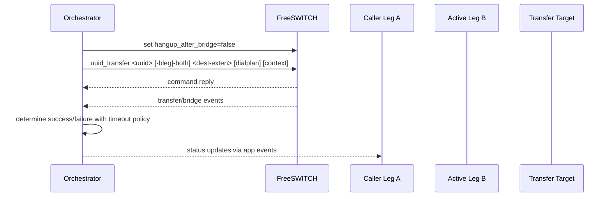
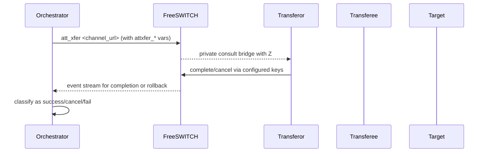
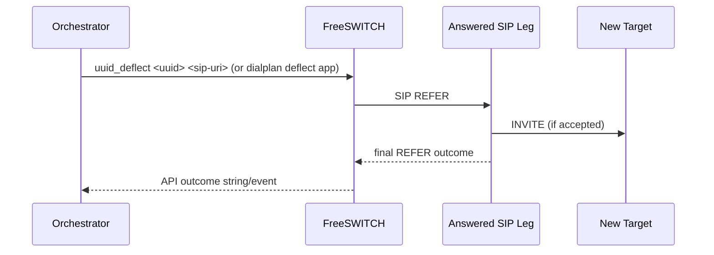

# WS-C Plan: Call Control and Transfer Baseline

Date: 2026-02-23  
Workstream: WS-C  
Status: In Progress (Planning)  
Constraint: Official documentation and standards only

---

## 1. WS-C Goal

Implement a production-safe call control and transfer baseline that supports:
1. Blind transfer.
2. Attended transfer.
3. REFER-based deflect transfer.
4. Deterministic transfer outcome tracking for transferor/transferee.

The output of WS-C is not just "transfer works". It must be:
1. Observable.
2. Recoverable.
3. Standards-aligned.
4. Verifiable with repeatable tests.

---

## 2. Official Source Baseline Used

1. FreeSWITCH `uuid_transfer`, `uuid_phone_event`, `uuid_deflect` in mod_commands:
   - https://developer.signalwire.com/freeswitch/confluence-to-docs-redirector/display/FREESWITCH/mod_commands
2. FreeSWITCH `mod_dptools: att_xfer`:
   - https://developer.signalwire.com/freeswitch/FreeSWITCH-Explained/Modules/mod-dptools/6586411
3. FreeSWITCH `mod_dptools: deflect`:
   - https://developer.signalwire.com/freeswitch/FreeSWITCH-Explained/Modules/mod-dptools/6586629
4. FreeSWITCH Event Socket Outbound:
   - https://developer.signalwire.com/freeswitch/FreeSWITCH-Explained/Client-and-Developer-Interfaces/Event-Socket-Library/Event-Socket-Outbound_3375460
5. FreeSWITCH mod_event_socket:
   - https://developer.signalwire.com/freeswitch/FreeSWITCH-Explained/Modules/mod_event_socket_1048924
6. SIP REFER standard:
   - https://datatracker.ietf.org/doc/rfc3515/
7. SIP transfer best current practice:
   - https://datatracker.ietf.org/doc/rfc5589/
8. SIP Replaces header (attended transfer primitive):
   - https://www.rfc-editor.org/rfc/rfc3891

---

## 3. Standards-Driven Requirements

From RFC 5589 and RFC 3515 for transfer behavior:
1. Transferor must know whether transfer succeeds.
2. REFER success transaction alone does not terminate existing session.
3. Dialog replacement for attended transfer uses Replaces semantics (RFC 3891).

From FreeSWITCH docs for execution semantics:
1. `uuid_transfer` on bridged calls requires `hangup_after_bridge=false` to avoid limbo behavior.
2. `att_xfer` supports cancel/hangup/conference control keys (`attxfer_*` variables).
3. `deflect` applies to answered calls; for unanswered calls use `redirect`.
4. Outbound ESL should use `async` mode and `event-lock` for race-sensitive commands.
5. Use `linger` to avoid losing final channel events at hangup boundaries.

---

## 4. WS-C Scope

In scope:
1. Transfer command policy in Python orchestrator.
2. Transfer state machine and outcome tracking.
3. FreeSWITCH command path hardening for transfer calls.
4. Event correlation and observability for transfer lifecycle.
5. Automated tests for blind/attended/deflect flows.

Out of scope:
1. Multi-party conference orchestration beyond attended transfer baseline.
2. Tenant self-service transfer policy UI (Phase 2 concern).
3. Carrier-specific advanced transfer customizations.

---

## 5. Target Control Flows

### 5.1 Blind Transfer (Primary)

### 5.2 Attended Transfer

### 5.3 REFER Deflect Transfer

---

## 6. Implementation Work Packages (Sequential)

## C1. Transfer Contract Layer

Deliverables:
1. Unified transfer request model:
   - mode (`blind`, `attended`, `deflect`)
   - leg selector (`aleg`, `bleg`, `both`)
   - target URI/extension
2. Strict validation:
   - reject unsupported combinations before command emission.

Acceptance:
1. 100 percent unit coverage of transfer request validator.

## C2. Command Emission and Guardrails

Deliverables:
1. Blind transfer command path using `uuid_transfer`.
2. Pre-transfer guard:
   - ensure `hangup_after_bridge=false` equivalent path applied.
3. Attended transfer command path using `att_xfer` with configurable keys.
4. Deflect transfer path for answered calls only; unanswered route uses `redirect`.

Acceptance:
1. No command emitted without validated preconditions.
2. Command outcomes are captured and normalized.

## C3. Event Correlation State Machine

Deliverables:
1. Transfer attempt ID linked to call UUIDs and legs.
2. Event subscription strategy for ESL:
   - `async` usage.
   - `event-lock` for race-sensitive operations.
   - `linger` at hangup boundary.
3. Terminal states:
   - `success`, `cancelled`, `failed`, `timed_out`.

Acceptance:
1. Every transfer attempt reaches one terminal state.
2. Unknown state rate under 0.5 percent in staging tests.

## C4. Observability and Metrics

Deliverables:
1. Metrics:
   - transfer_attempt_total
   - transfer_success_total
   - transfer_fail_total
   - transfer_cancel_total
   - transfer_duration_ms histogram
2. Structured logs include:
   - tenant_id, call_id, uuid, mode, target, result, reason.

Acceptance:
1. Dashboard shows blind/attended/deflect split with success ratio.

## C5. Verification Suite and Rollback Hooks

Deliverables:
1. WS-C verifier script (`verify_ws_c.sh`) with pass/fail gates.
2. Integration tests for:
   - blind transfer success and failure.
   - attended transfer complete and cancel.
   - deflect success and expected reject cases.
3. Rollback switch:
   - disable transfer feature flag to revert to baseline call flow.

Acceptance:
1. Verifier passes in staging repeatedly.
2. Rollback validated in under 2 minutes.

---

## 7. WS-C Acceptance Gates

All required:
1. Blind transfer success >= 99 percent over 200 staged attempts.
2. Attended transfer complete/cancel states both verified.
3. Deflect on answered calls verified; unanswered path uses redirect.
4. Transferor receives deterministic success/failure status.
5. No orphaned calls or limbo states in verifier runs.
6. Observability and audit fields present for all transfer attempts.

---

## 8. Test Plan

## 8.1 Unit Tests

1. Request model validation.
2. Command builder correctness for each mode.
3. State machine terminal state coverage.

## 8.2 Integration Tests

1. `test_ws_c_blind_transfer_success`
2. `test_ws_c_blind_transfer_invalid_target`
3. `test_ws_c_attended_transfer_complete`
4. `test_ws_c_attended_transfer_cancel`
5. `test_ws_c_deflect_answered_only`
6. `test_ws_c_transfer_status_propagation`

## 8.3 Soak

1. Repeated mixed transfer scenarios for at least 30 minutes.
2. Validate no increasing stuck-channel count.

---

## 9. Risk Register (WS-C Specific)

1. Race conditions in ESL command order.
   - Mitigation: enforce `event-lock` where required.
2. Missing final events near hangup.
   - Mitigation: use `linger` and timeout-safe terminal classification.
3. Bridged transfer limbo.
   - Mitigation: enforce `hangup_after_bridge=false` policy.
4. REFER misuse on unanswered channels.
   - Mitigation: answered-state precondition for deflect.

---

## 10. Exit Criteria and Next Gate

WS-C is complete only when:
1. All acceptance gates pass.
2. WS-C verifier is green.
3. Evidence logged in docs.

Next gate:
1. WS-D remains locked until WS-C signoff is complete.

