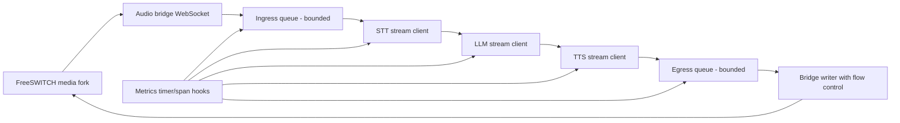

# WS-D Plan: Media Bridge and Latency Baseline

Date: 2026-02-23  
Workstream: WS-D  
Status: Complete (Implemented and Validated)  
Constraint: Production-ready approach using official/primary references.

---

## 1. WS-D Goal

Build a stable, measurable media bridge baseline with deterministic latency telemetry.

WS-D is complete only when:
1. Audio bridge path is stable under sustained load.
2. Audio format policy is standardized end-to-end.
3. Backpressure is bounded and observable.
4. Baseline P50/P95 latency is measured and accepted against gate criteria.

---

## 2. Official Reference Baseline (Validated: 2026-02-23)

1. FreeSWITCH Outbound ESL (`async`, `event-lock`, `linger`):
   - https://developer.signalwire.com/freeswitch/FreeSWITCH-Explained/Client-and-Developer-Interfaces/Event-Socket-Library/Event-Socket-Outbound_3375460/
2. FreeSWITCH `mod_event_socket` (`event`, `myevents`, `linger`):
   - https://developer.signalwire.com/freeswitch/FreeSWITCH-Explained/Modules/mod_event_socket_1048924
3. FreeSWITCH `delay_echo` app (RTP bidirectional validation primitive):
   - https://developer.signalwire.com/freeswitch/FreeSWITCH-Explained/Modules/mod-dptools/6586736
4. FreeSWITCH `mod_bert` (audio-gap/error-rate validation primitive):
   - https://developer.signalwire.com/freeswitch/FreeSWITCH-Explained/Modules/mod_bert_6587749/
5. rtpengine overview (kernel forwarding + fallback):
   - https://rtpengine.readthedocs.io/en/mr12.4/overview.html
6. rtpengine usage flow (kernelization lifecycle and userspace fallback):
   - https://rtpengine.readthedocs.io/en/mr11.3/usage.html
7. RFC 3550 jitter algorithm (interarrival jitter):
   - https://datatracker.ietf.org/doc/rfc3550/
8. Deepgram Flux quickstart (80ms chunk recommendation, /v2/listen):
   - https://developers.deepgram.com/docs/flux/quickstart
9. Deepgram TTS media output settings (`container=none` for telephony static/click prevention):
   - https://developers.deepgram.com/docs/tts-media-output-settings
10. Deepgram STT sample rate + encoding requirements:
   - https://developers.deepgram.com/docs/sample-rate
   - https://developers.deepgram.com/documentation/features/encoding/
11. Prometheus histogram/SLO practice:
   - https://prometheus.io/docs/practices/histograms/
12. Prometheus metric/label naming and cardinality guidance:
   - https://prometheus.io/docs/practices/naming/

---

## 3. WS-D Scope

In scope:
1. Media bridge reliability (FreeSWITCH media fork -> Python gateway -> STT/LLM/TTS -> return audio).
2. Sample-rate/frame-size policy unification.
3. Queue and flow-control hardening.
4. End-to-end latency instrumentation and baseline report.
5. WS-D verifier + tests + acceptance evidence.

Out of scope:
1. Full production canary routing (WS-E).
2. New telephony provider onboarding.
3. Advanced MOS model calibration beyond baseline metrics.

---

## 4. Production Design Principles for WS-D

1. Single source of truth for media contract:
   - encoding, sample rate, frame duration, channel count must be explicit.
2. No unbounded queues:
   - every queue in audio path must have max size and overflow policy.
3. No hidden resampling:
   - resample only at explicit conversion boundaries, never implicitly.
4. Backpressure first:
   - always await drain/flow-control points in network writes.
5. Low-cardinality observability:
   - metrics must avoid per-user unbounded labels.
6. Failure isolation:
   - one bad call/session cannot starve pipeline worker loops.

---

## 5. Target WS-D Architecture

---

## 6. WS-D Work Packages (Strict Sequence)

## D1. Media Contract Freeze

Deliverables:
1. `media_contract.md` section in WS-D report:
   - STT input contract (e.g. linear16 + sample_rate exact match).
   - TTS output contract (telephony-safe container/encoding).
   - frame-size policy per route class.
2. Explicit configuration constants in code (no magic numbers).

Acceptance:
1. Contract document approved.
2. Contract assertions active in runtime logs/tests.

## D2. Bridge Reliability and Flow Control

Deliverables:
1. Harden WebSocket media bridge lifecycle:
   - connect, heartbeat, disconnect, reconnect, shutdown.
2. Enforce bounded ingress/egress queues and timeout handling.
3. Explicit write flow-control handling at transport boundary.

Acceptance:
1. 30-minute continuous synthetic loop with no stalled stream.
2. Zero unhandled exceptions in bridge worker loops.

## D3. Latency Instrumentation

Deliverables:
1. Add histograms and counters:
   - `voice_stt_first_transcript_seconds`
   - `voice_llm_first_token_seconds`
   - `voice_tts_first_chunk_seconds`
   - `voice_response_start_seconds`
   - `voice_pipeline_queue_depth`
   - `voice_pipeline_dropped_frames_total`
2. Metric names/labels aligned with Prometheus best practices:
   - base units in names
   - bounded-cardinality labels only.

Acceptance:
1. Metrics visible during test run.
2. Queries produce stable P50/P95 values.

## D4. Synthetic Validation Matrix

Deliverables:
1. Audio path tests:
   - steady speech
   - fast interruption (barge-in)
   - long response (multi-sentence)
   - silence segments.
2. RTP validation:
   - `delay_echo` path sanity.
   - optional `mod_bert` controlled error-rate scenario for gap detection.

Acceptance:
1. No recurring clipping/static artifacts.
2. Measured queue depth remains within limits.

## D5. Baseline Report and Gate Decision

Deliverables:
1. `telephony/docs/phase1_baseline_latency.md`:
   - test profile
   - P50/P95 metrics
   - configuration used
   - anomaly notes and fixes.
2. `verify_ws_d.sh` script.
3. `telephony/tests/test_telephony_stack.py` WS-D checks.

Acceptance:
1. WS-D gate criteria pass.
2. Checklist updated with evidence.

---

## 7. Latency SLO and Gate Criteria

Primary gate:
1. P95 `voice_response_start_seconds` <= 1.2s on staged synthetic run.

Secondary gates:
1. P95 STT first transcript <= 450ms.
2. P95 LLM first token <= 450ms.
3. P95 TTS first chunk <= 350ms.
4. Dropped frames ratio < 0.1%.
5. No stuck queue or deadlocked writer loop.

Note:
1. Secondary thresholds are operational targets for diagnosis; primary release gate is end-to-end response-start.

---

## 8. Verification Plan

## 8.1 New Script

1. `telephony/scripts/verify_ws_d.sh`
   - runs WS-C verifier as prerequisite.
   - runs backend latency/media unit tests.
   - runs synthetic smoke with metrics assertions.
   - checks docs/evidence file presence.

## 8.2 Tests to Add

1. Backend unit:
   - media frame policy validator.
   - queue overflow policy behavior.
   - latency timer correctness.
2. Telephony integration:
   - WS-D verifier pass in docker mode.

## 8.3 Command Contract (for checklist evidence)

1. `bash telephony/scripts/verify_ws_d.sh telephony/deploy/docker/.env.telephony.example`
2. `TELEPHONY_RUN_DOCKER_TESTS=1 python3 -m unittest -v telephony/tests/test_telephony_stack.py`
3. backend WS-D unit test command (to be defined with new test files).

---

## 9. Risk Register (WS-D)

1. Sample-rate mismatch causing static or speed change.
   - Mitigation: strict contract assertions + single resample boundary.
2. Queue growth under burst traffic.
   - Mitigation: bounded queue + drop policy + alarms.
3. Writer starvation under slow socket.
   - Mitigation: `drain`/flow-control and timeout cancellation.
4. Jitter spikes causing perceived artifacts.
   - Mitigation: monitor RTP jitter trend (RFC3550 method) and correlate with queue depth.
5. Telephony container headers misinterpreted as raw audio.
   - Mitigation: enforce telephony-safe TTS output settings.

---

## 10. Rollback Conditions (During WS-D Validation)

Rollback to last WS-C baseline if:
1. E2E P95 exceeds 1.5s for 15 minutes.
2. Frame drop ratio exceeds 1.0%.
3. No-audio or heavy static incidents repeat in synthetic scenario.
4. Bridge worker deadlocks or requires manual restart.

Rollback action:
1. Disable WS-D tuning flag set.
2. Revert to WS-C media parameters.
3. Preserve telemetry snapshot for RCA.

---

## 11. Exit Criteria

WS-D is complete only when:
1. All WS-D verification commands pass.
2. Baseline latency report is published.
3. Checklist evidence is attached.
4. Sign-off explicitly marks WS-E as unlocked.

---

## 12. Completion Evidence (2026-02-23)

1. WS-D verifier passed:
   - `bash telephony/scripts/verify_ws_d.sh telephony/deploy/docker/.env.telephony.example`
2. Backend WS-D tests passed:
   - `cd backend && ./venv/bin/python -m pytest -q tests/unit/test_browser_media_gateway_ws_d.py tests/unit/test_latency_tracker.py`
3. Telephony integration suite passed with WS-D gate:
   - `TELEPHONY_RUN_DOCKER_TESTS=1 python3 -m unittest -v telephony/tests/test_telephony_stack.py`
4. Baseline report published:
   - `telephony/docs/phase1_baseline_latency.md`
