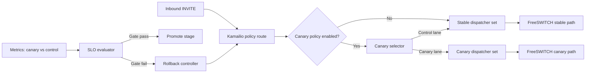

# WS-E Plan: Canary Routing and Rollback Control

Date: 2026-02-23  
Workstream: WS-E  
Status: Complete (Implemented and Validated)  
Constraint: Official documentation and standards only.

---

## 1. WS-E Goal

Implement a production-grade canary and rollback control layer for telephony routing so we can:
1. Shift traffic gradually from stable to canary.
2. Detect bad behavior quickly with SLO-driven signals.
3. Roll back in seconds with deterministic commands.
4. Keep operational risk bounded and auditable.

WS-E is complete only when:
1. Progressive rollout policy is automated and enforced.
2. Rollback paths are tested and documented.
3. Observability gates can stop or revert canary automatically.
4. Integration verifier proves repeatable pass/fail behavior.

---

## 2. Official Source Baseline (Validated: 2026-02-23)

1. Google SRE Workbook, Canarying Releases:
   - https://sre.google/workbook/canarying-releases/
2. Google SRE Workbook, Alerting on SLOs (multiwindow, multi-burn-rate):
   - https://sre.google/workbook/alerting-on-slos/
3. Google SRE Workbook, Configuration Design and Best Practices:
   - https://sre.google/workbook/configuration-design/
4. Kamailio Dispatcher module (6.0):
   - https://www.kamailio.org/docs/modules/6.0.x/modules/dispatcher.html
5. Prometheus histograms guidance:
   - https://prometheus.io/docs/practices/histograms/
6. Prometheus metric/label naming guidance:
   - https://prometheus.io/docs/practices/naming/

---

## 3. Key Constraints from Official Guidance

From Google SRE canary guidance:
1. Canary must be partial and time-limited.
2. Canary evaluation must compare canary vs control.
3. Run one canary deployment at a time to avoid signal contamination.
4. Canary size/duration must be chosen by development velocity and representativeness.

From Google SRE alerting guidance:
1. Use burn-rate alerting tied to error budget, not only fixed duration alerts.
2. Recommended starting points for 99.9% SLO:
   - 14.4 burn over 1h/5m (page)
   - 6 burn over 6h/30m (page)
   - 1 burn over 3d/6h (ticket)
3. Multiwindow + multi-burn-rate is the recommended strategy.

From Kamailio dispatcher docs:
1. Dispatcher supports hashing, round-robin, and weight-based distribution.
2. `dispatcher.set_state` / `dispatcher.set_duid_state` can instantly disable canary destinations.
3. `dispatcher.reload` exists, but is disabled for algorithm 10 (call-load) due active-call references.
4. `dispatcher.add` is in-memory only and removed on reload (emergency use only).
5. Dispatcher events `dispatcher:dst-down` and `dispatcher:dst-up` can drive operational automation.

Design implication:
1. WS-E will use dispatcher algorithms and state transitions that preserve safe reload/rollback behavior.
2. WS-E canary groups must avoid algorithm 10 in the canary path.

---

## 4. WS-E Scope

In scope:
1. Canary routing policy model (stable/control vs canary lane).
2. Progressive rollout stages and hold criteria.
3. Immediate and durable rollback mechanisms.
4. Canary/control observability split and SLO gate automation.
5. WS-E verifier and integration test coverage.

Out of scope:
1. Full multi-region release orchestration.
2. Feature-level runtime flags inside application business logic.
3. Carrier-specific commercial routing optimization.

---

## 5. Target WS-E Architecture

---

## 6. Rollout Model (Production Default)

Single active canary only.

Stages:
1. Stage 0: `0%` (control only, baseline verify).
2. Stage 1: `5%` canary.
3. Stage 2: `20%` canary.
4. Stage 3: `50%` canary.
5. Stage 4: `100%` (promoted to stable).

Stage hold policy:
1. Minimum hold window per stage: 30 minutes (configurable by traffic profile).
2. Promotion requires all SLO gates green for the full hold window.
3. Any page-severity gate breach triggers rollback to previous stable stage.

---

## 7. Rollback Strategy (Three Levels)

## E-RT1: Immediate Runtime Rollback (seconds)

Purpose:
1. Remove canary destinations from selection immediately without full config deploy.

Mechanism:
1. `kamcmd dispatcher.set_state d <group> <canary-address>`
2. Or by DUID:
   - `kamcmd dispatcher.set_duid_state d <group> <canary-duid>`

Expected time:
1. Sub-10 seconds for command + route effect.

## E-RT2: Durable Configuration Rollback (minutes)

Purpose:
1. Make rollback persistent across process restart/reload.

Mechanism:
1. Revert dispatcher source-of-truth (file/DB) to last-known-good snapshot.
2. Apply:
   - `kamcmd dispatcher.reload` (for non-algorithm-10 sets).

Expected time:
1. Under 2 minutes including verification.

## E-RT3: Release Freeze (operational safety lock)

Purpose:
1. Stop any further promotion while incident is open.

Mechanism:
1. Canary controller sets release state to `frozen`.
2. Manual approval required to re-enable progressive stages.

---

## 8. SLO Gates for WS-E

Primary release gate:
1. `response_start_latency` P95 within WS-D accepted bound.

Error-budget gates (starting baseline):
1. Page: 14.4 burn over 1h and 5m windows.
2. Page: 6 burn over 6h and 30m windows.
3. Ticket: 1 burn over 3d and 6h windows.

Call-quality gates:
1. Call setup success ratio does not regress beyond threshold vs control lane.
2. No-audio / stuck-call indicators do not exceed threshold.
3. Transfer success ratio (from WS-C path) does not regress beyond threshold.

Operational gates:
1. No critical growth in dispatcher destination-down events.
2. No sustained queue/backpressure red condition from WS-D metrics.

---

## 9. Metrics and Label Policy

Metrics must:
1. Use base units and stable low-cardinality labels.
2. Include lane dimension only:
   - `lane=control|canary`
3. Never include unbounded identifiers (call_id, user_id, phone number) as labels.

Initial WS-E metric set:
1. `telephony_canary_calls_total{lane,stage}`
2. `telephony_canary_failures_total{lane,reason}`
3. `telephony_canary_rollback_total{reason}`
4. `telephony_canary_stage_duration_seconds{stage}`
5. `telephony_canary_gate_breach_total{gate}`

---

## 10. WS-E Work Packages (Strict Sequence)

## E1. Canary Policy Contract

Deliverables:
1. Typed canary policy model:
   - enable/disable
   - stage percentage
   - hold window
   - rollback mode
2. Default-safe behavior: disabled unless explicitly enabled.

Acceptance:
1. Unit tests for policy validation and boundary checks.

## E2. Dispatcher Routing Control

Deliverables:
1. Stable/canary lane selection logic in Kamailio route path.
2. Dispatcher set/algorithm policy compatible with runtime rollback operations.
3. Guardrails that prevent invalid canary activation when prerequisites fail.

Acceptance:
1. Synthetic INVITE routing shows stage-compliant distribution.
2. No effect on non-canary tenants/routes.

## E3. Rollback Controller

Deliverables:
1. Runtime rollback commands wrapper script.
2. Durable rollback script tied to known-good dispatcher snapshot.
3. Freeze/unfreeze control command path.

Acceptance:
1. Runtime rollback completes under target.
2. Durable rollback validated under restart/reload conditions.

## E4. SLO Gate Evaluator

Deliverables:
1. Canary/control comparative queries and alert rules.
2. Multiwindow multi-burn-rate alert profiles.
3. Stage promotion/abort decision hooks.

Acceptance:
1. Forced-failure simulation triggers rollback as expected.
2. Clean run permits promotion without manual intervention.

## E5. Verifier and Test Harness

Deliverables:
1. `telephony/scripts/verify_ws_e.sh`
2. Telephony integration test entry:
   - `test_ws_e_verifier_passes`
3. WS-E implementation report with executed evidence.

Acceptance:
1. Full pass in docker integration mode.
2. Checklist updated and signed.

---

## 11. Verification Commands (Planned Contract)

1. `bash telephony/scripts/verify_ws_e.sh telephony/deploy/docker/.env.telephony.example`
2. `TELEPHONY_RUN_DOCKER_TESTS=1 python3 -m unittest -v telephony/tests/test_telephony_stack.py`
3. Backend/unit command set for WS-E policy/controller tests (to be added during implementation).

---

## 12. Risk Register (WS-E)

1. Canary/control signal contamination from parallel canaries.
   - Mitigation: enforce single active canary.
2. False rollback due noisy short window.
   - Mitigation: dual-window gate checks and hold-time policy.
3. Runtime rollback command succeeds but durable config still points to canary.
   - Mitigation: mandatory E-RT2 durable rollback verification.
4. Use of dispatcher algorithm 10 blocks safe reload operations.
   - Mitigation: prohibit algorithm-10 sets in WS-E canary path.
5. High-cardinality labels overload metrics backend.
   - Mitigation: strict label contract with CI checks.

---

## 13. Exit Criteria

WS-E is complete only when:
1. WS-E verifier passes in integration mode.
2. Runtime and durable rollback drills both pass.
3. Canary stage promotions are gated by SLO signals.
4. Docs/checklist include command evidence and sign-off.

---

## 14. Completion Evidence (2026-02-23)

1. WS-E verifier passed:
   - `bash telephony/scripts/verify_ws_e.sh telephony/deploy/docker/.env.telephony.example`
2. Full telephony integration suite passed:
   - `TELEPHONY_RUN_DOCKER_TESTS=1 python3 -m unittest -v telephony/tests/test_telephony_stack.py`
3. WS-E implementation record published:
   - `telephony/docs/14_ws_e_canary_rollback_implementation.md`
