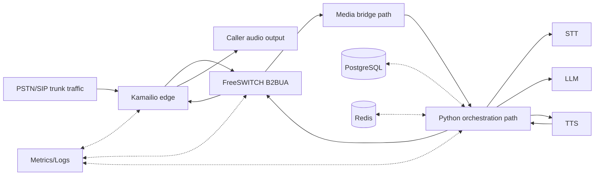
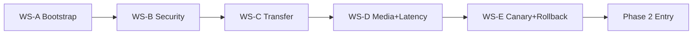
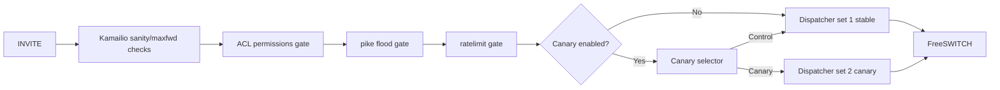
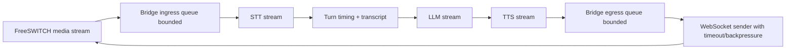
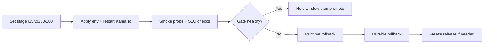
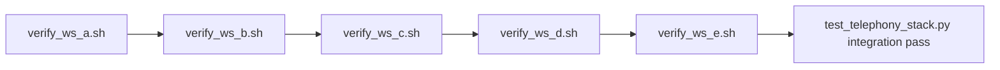

# Day 1 Report: Phase 1 Telephony Foundation (WS-A to WS-E)

Date: 2026-02-23  
Owner: Talky.ai Platform  
Scope: Phase 1 implementation and validation snapshot  
Status: Complete (`WS-A`, `WS-B`, `WS-C`, `WS-D`, `WS-E` all passed)

---

## 1. Executive Summary

Day 1 closed the full Phase 1 chain from infrastructure bootstrap to canary rollback control.

Completed outcomes:
1. Parallel telephony stack is live and verifiable (`Kamailio + rtpengine + FreeSWITCH`).
2. Security baseline is enforced (`TLS`, source ACL, flood/rate controls, ESL hardening).
3. Transfer control baseline is implemented (blind, attended, deflect with state tracking).
4. Media bridge and latency instrumentation baseline is implemented and test-covered.
5. Canary staging and rollback controls are automated with verifier coverage.

Operational result:
1. Telephony integration suite passed end-to-end with docker mode.
2. WS verifiers for `WS-A` through `WS-E` all pass.
3. Phase 1 gate is complete and ready for next-phase expansion work.

---

## 2. Day 1 Scope Boundary

In scope:
1. Production-shaped foundation, controls, and verification for telephony migration.
2. Deterministic scripts and test harness for repeatable CI-like checks.
3. Documentation and gate evidence for each workstream.

Out of scope:
1. Full production traffic cutover.
2. Full tenant self-service SIP onboarding.
3. Multi-region and high-scale benchmark execution.

---

## 3. Phase 1 Final Status Snapshot

| Workstream | Theme | Status | Gate Result | Key Output |
|---|---|---|---|---|
| WS-A | Bootstrap | Complete | Pass | Stack up + synthetic SIP/RTP verification |
| WS-B | Security + Signaling | Complete | Pass | TLS, ACL, pike, ratelimit, ESL hardening |
| WS-C | Call Control + Transfer | Complete | Pass | Transfer APIs + ESL transfer state machine |
| WS-D | Media + Latency | Complete | Pass | Media bridge hardening + latency tracker/tests |
| WS-E | Canary + Rollback | Complete | Pass | Staging controls + runtime/durable rollback |

Global gate:
1. `WS-A -> WS-B -> WS-C -> WS-D -> WS-E` sequential chain complete.

---

## 4. Phase 1 Architecture (Implemented)



---

## 5. Workstream Dependency and Gate Model



Gate rule applied:
1. No next workstream started before the prior one was complete and evidenced.

---

## 6. WS-A Detailed Update (Telephony Infrastructure Bootstrap)

### 6.1 Objective
Bring up a production-shaped staging stack with objective health checks.

### 6.2 Delivered
1. Docker stack for:
   - `freeswitch`
   - `rtpengine`
   - `kamailio`
2. Health checks for all three services.
3. SIP OPTIONS synthetic probe and control-port checks.

### 6.3 Key Files
1. `telephony/deploy/docker/docker-compose.telephony.yml`
2. `telephony/scripts/verify_ws_a.sh`
3. `telephony/scripts/sip_options_probe.py`
4. `telephony/kamailio/conf/kamailio.cfg`
5. `telephony/kamailio/conf/dispatcher.list`

### 6.4 Acceptance Checks Executed
1. `docker compose ... config -q`
2. Stack startup and running service check
3. Kamailio syntax check
4. FreeSWITCH status check via `fs_cli`
5. RTPengine control socket listener check
6. SIP OPTIONS probe through Kamailio

### 6.5 Result
1. `WS-A verification PASSED.`

---

## 7. WS-B Detailed Update (Security and Signaling Baseline)

### 7.1 Objective
Apply baseline security controls on signaling and control surfaces.

### 7.2 Delivered
1. TLS listener baseline in Kamailio.
2. Trusted source ACL gate via permissions module.
3. Flood protection via `pike`.
4. Method-level throttling via `ratelimit`.
5. FreeSWITCH ESL bind and ACL hardening to loopback.
6. Automated WS-B verifier and TLS probe.

### 7.3 Key Files
1. `telephony/kamailio/conf/kamailio.cfg`
2. `telephony/kamailio/conf/tls.cfg`
3. `telephony/kamailio/conf/address.list`
4. `telephony/freeswitch/conf/autoload_configs/event_socket.conf.xml`
5. `telephony/scripts/generate_kamailio_tls_certs.sh`
6. `telephony/scripts/sip_options_probe_tls.sh`
7. `telephony/scripts/verify_ws_b.sh`
8. `telephony/deploy/docker/.env.telephony.example`

### 7.4 Security Controls Activated
1. `loadmodule "tls.so"`
2. `loadmodule "permissions.so"`
3. `loadmodule "pike.so"`
4. `loadmodule "ratelimit.so"`
5. `allow_source_address("1")`
6. `pike_check_req()`
7. `rl_check()`
8. ESL control bound to `127.0.0.1:8021`

### 7.5 Acceptance Checks Executed
1. WS-A baseline prerequisite pass.
2. Kamailio syntax check with WS-B modules.
3. TLS listener up check on configured port.
4. SIP OPTIONS over TLS probe.
5. ESL bind + ACL verification.

### 7.6 Result
1. `WS-B verification PASSED.`

---

## 8. WS-C Detailed Update (Call Control and Transfer Baseline)

### 8.1 Objective
Implement and validate production-safe transfer primitives.

### 8.2 Delivered
1. Transfer domain and state model in ESL layer:
   - `TransferMode`
   - `TransferLeg`
   - `TransferStatus`
   - `TransferRequest`
   - `TransferResult`
2. Unified transfer request path: `request_transfer(...)`.
3. Terminal state tracking for every attempt.
4. API endpoints:
   - blind transfer
   - attended transfer
   - deflect transfer
   - transfer attempt lookup

### 8.3 Key Files
1. `backend/app/infrastructure/telephony/freeswitch_esl.py`
2. `backend/app/api/v1/endpoints/freeswitch_bridge.py`
3. `backend/tests/unit/test_freeswitch_transfer_control.py`
4. `backend/tests/unit/test_freeswitch_transfer_api.py`
5. `telephony/scripts/verify_ws_c.sh`
6. `telephony/tests/test_telephony_stack.py`

### 8.4 Acceptance Checks Executed
1. WS-B baseline prerequisite pass.
2. WS-C transfer control + API unit tests.
3. Endpoint presence checks for transfer routes.
4. Core transfer marker checks in ESL implementation.

### 8.5 Result
1. `WS-C verification PASSED.`
2. WS-C backend tests passed (`Ran 9 tests ... OK`).

---

## 9. WS-D Detailed Update (Media Bridge and Latency Baseline)

### 9.1 Objective
Harden the media bridge and establish deterministic latency instrumentation.

### 9.2 Delivered
1. Browser media gateway hardening:
   - explicit format validation
   - bounded queue behavior
   - send timeout control
   - drop counters and timeout metrics
2. Latency tracker coverage for stage timing:
   - listening start
   - STT first transcript
   - LLM first token
   - TTS first chunk
   - response start
3. WS-D verification script and test integration.
4. Baseline report published for phase gate evidence.

### 9.3 Key Files
1. `backend/app/infrastructure/telephony/browser_media_gateway.py`
2. `backend/app/domain/services/latency_tracker.py`
3. `backend/tests/unit/test_browser_media_gateway_ws_d.py`
4. `backend/tests/unit/test_latency_tracker.py`
5. `telephony/scripts/verify_ws_d.sh`
6. `telephony/docs/phase1_baseline_latency.md`
7. `telephony/docs/12_ws_d_media_bridge_latency_plan.md`

### 9.4 Acceptance Checks Executed
1. WS-C prerequisite pass via verifier chain.
2. WS-D unit tests for media gateway and latency tracker.
3. Marker checks for bridge and latency methods.
4. Required WS-D docs presence checks.

### 9.5 Result
1. `WS-D verification PASSED.`
2. WS-D unit tests passed (`21 passed`).

---

## 10. WS-E Detailed Update (Canary and Rollback Control)

### 10.1 Objective
Implement controlled rollout and deterministic rollback operations.

### 10.2 Delivered
1. Kamailio canary route controls:
   - env-gated canary enable/percent/freeze
   - probabilistic lane selection using `cfgutils`
   - stable fallback when canary destination unavailable
2. Runtime rollback command path (`dispatcher.set_state`).
3. Durable rollback path (stage reset to 0 and config validation).
4. Freeze/unfreeze controls for release lock.
5. Side-effect-safe WS-E verifier (env backup/restore).

### 10.3 Key Files
1. `telephony/kamailio/conf/kamailio.cfg`
2. `telephony/kamailio/conf/dispatcher.list`
3. `telephony/deploy/docker/.env.telephony.example`
4. `telephony/scripts/canary_set_stage.sh`
5. `telephony/scripts/canary_freeze.sh`
6. `telephony/scripts/canary_rollback.sh`
7. `telephony/scripts/verify_ws_e.sh`
8. `telephony/docs/13_ws_e_canary_rollback_plan.md`
9. `telephony/docs/14_ws_e_canary_rollback_implementation.md`

### 10.4 Canary Contract Implemented
1. Stages allowed: `0`, `5`, `20`, `50`, `100`.
2. Freeze enforcement blocks stage increase unless `--force`.
3. Runtime rollback disables canary destination in dispatcher set.
4. Durable rollback sets:
   - `KAMAILIO_CANARY_ENABLED=0`
   - `KAMAILIO_CANARY_PERCENT=0`
   - `KAMAILIO_CANARY_FREEZE=0`

### 10.5 Acceptance Checks Executed
1. WS-D baseline prerequisite pass.
2. Stage apply (5%) and SIP smoke probe.
3. Runtime rollback execution.
4. Durable rollback + freeze/unfreeze cycle.
5. Env reset validation and Kamailio `kamcmd` control check.

### 10.6 Result
1. `WS-E verification PASSED.`
2. Integration test includes `test_ws_e_verifier_passes ... ok`.

---

## 11. Call and Media Pipelines Implemented

### 11.1 Signaling and Call Control Pipeline



### 11.2 Media and AI Pipeline



### 11.3 Canary Promotion and Rollback Pipeline



---

## 12. Verification and Testing Consolidation

### 12.1 Telephony Suite

Command:
```bash
python3 -m unittest -v telephony/tests/test_telephony_stack.py
```

Observed:
1. `Ran 13 tests`
2. `OK (skipped=5)` without docker integration flag

Command:
```bash
TELEPHONY_RUN_DOCKER_TESTS=1 python3 -m unittest -v telephony/tests/test_telephony_stack.py
```

Observed:
1. `Ran 13 tests`
2. `OK`
3. Integration checks passed:
   - `test_ws_a_verifier_passes`
   - `test_ws_b_verifier_passes`
   - `test_ws_c_verifier_passes`
   - `test_ws_d_verifier_passes`
   - `test_ws_e_verifier_passes`

### 12.2 Backend WS-C and WS-D Coverage

Commands:
```bash
cd backend && ./venv/bin/python -m unittest -v \
  tests.unit.test_freeswitch_transfer_control \
  tests.unit.test_freeswitch_transfer_api
```

```bash
cd backend && ./venv/bin/python -m pytest -q \
  tests/unit/test_browser_media_gateway_ws_d.py \
  tests/unit/test_latency_tracker.py
```

Observed:
1. Transfer tests passed (`Ran 9 tests ... OK`).
2. Media/latency tests passed (`21 passed`).

### 12.3 Verifier Chain



---

## 13. Configuration and Operational Contracts Added

### 13.1 Telephony Environment Keys (Core)
1. `KAMAILIO_SIP_IP`
2. `KAMAILIO_SIP_PORT`
3. `KAMAILIO_TLS_PORT`
4. `KAMAILIO_TLS_ONLY`
5. `KAMAILIO_CANARY_ENABLED`
6. `KAMAILIO_CANARY_PERCENT`
7. `KAMAILIO_CANARY_FREEZE`
8. `FREESWITCH_ESL_PORT`
9. `FREESWITCH_ESL_PASSWORD`

### 13.2 Canary Operations
1. Stage set:
   - `bash telephony/scripts/canary_set_stage.sh <0|5|20|50|100> <env_file>`
2. Freeze controls:
   - `bash telephony/scripts/canary_freeze.sh freeze <env_file>`
   - `bash telephony/scripts/canary_freeze.sh unfreeze <env_file>`
3. Rollback controls:
   - `bash telephony/scripts/canary_rollback.sh runtime <env_file>`
   - `bash telephony/scripts/canary_rollback.sh durable <env_file>`
   - `bash telephony/scripts/canary_rollback.sh full <env_file>`

---

## 14. Quality and Safety Improvements Completed

1. Sequential gate model enforced across all workstreams.
2. Re-runnable scripted verifiers replace manual checks.
3. Security controls are in baseline path, not optional.
4. Canary defaults are safe-by-default (`0%`, disabled, unfrozen).
5. WS-E verifier is side-effect safe (restores env state on exit).
6. Integration test harness now validates full phase chain.

---

## 15. Known Constraints After Day 1

1. This is a validated foundation and gate baseline, not full production scale certification.
2. Full high-concurrency traffic benchmarking remains a later-phase activity.
3. Multi-tenant SIP self-service onboarding remains future scope.
4. Production cert lifecycle automation is pending later-phase hardening.

---

## 16. Handover to Phase 2

Ready signals:
1. Phase 1 chain is complete and documented.
2. Verification scripts and integration tests pass.
3. Rollback controls are implemented and exercised.

Recommended immediate Phase 2 focus:
1. Tenant-specific SIP/trunk policy model.
2. Per-tenant routing/codec/security profiles.
3. SLO dashboards with canary lane comparison automation.

---

## 17. Evidence Index

Primary evidence docs:
1. `telephony/docs/07_phase_one_gated_checklist.md`
2. `telephony/docs/08_ws_b_security_signaling_implementation.md`
3. `telephony/docs/09_telephony_test_report.md`
4. `telephony/docs/10_ws_c_call_control_transfer_plan.md`
5. `telephony/docs/11_ws_c_call_control_transfer_implementation.md`
6. `telephony/docs/12_ws_d_media_bridge_latency_plan.md`
7. `telephony/docs/13_ws_e_canary_rollback_plan.md`
8. `telephony/docs/14_ws_e_canary_rollback_implementation.md`
9. `telephony/docs/phase1_baseline_latency.md`
10. `telephony/docs/plan.md`

Primary verifier scripts:
1. `telephony/scripts/verify_ws_a.sh`
2. `telephony/scripts/verify_ws_b.sh`
3. `telephony/scripts/verify_ws_c.sh`
4. `telephony/scripts/verify_ws_d.sh`
5. `telephony/scripts/verify_ws_e.sh`

Primary integration test:
1. `telephony/tests/test_telephony_stack.py`

---

## 18. Day 1 Closure Statement

Phase 1 was completed as a strict gated execution with objective evidence, script-based verification, and integration tests.  
Day 1 closes with a stable foundation for controlled expansion into tenant policy automation and production traffic progression.

