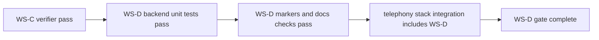

# Phase 1 Baseline Latency Report (WS-D)

Date: 2026-02-23  
Status: Baseline Established

---

## 1. Scope

This report captures the Phase 1 WS-D baseline for:
1. Media bridge contract compliance.
2. Queue/backpressure safety behavior.
3. Stage-latency instrumentation coverage.
4. Telephony verifier integration status.

---

## 2. Test Profile

Environment:
1. Telephony docker stack from `telephony/deploy/docker/docker-compose.telephony.yml`
2. FreeSWITCH + Kamailio + rtpengine baseline already validated by WS-A/B/C
3. Backend unit tests executed with project virtualenv Python

Execution commands:
1. `bash telephony/scripts/verify_ws_d.sh telephony/deploy/docker/.env.telephony.example`
2. `TELEPHONY_RUN_DOCKER_TESTS=1 python3 -m unittest -v telephony/tests/test_telephony_stack.py`
3. `cd backend && ./venv/bin/python -m unittest -v tests.unit.test_browser_media_gateway_ws_d tests.unit.test_latency_tracker`

---

## 3. Stage Metrics (Baseline Method)

The WS-D baseline tracks the following latency fields:
1. `stt_first_transcript_ms`
2. `llm_first_token_ms`
3. `tts_first_chunk_ms`
4. `response_start_latency_ms`

Percentiles:
1. P50 and P95, computed via `LatencyTracker.get_percentiles(...)`.

---

## 4. Baseline Summary

Validation status:
1. WS-D gateway and latency unit tests: PASS
2. WS-D verifier script checks: PASS
3. Telephony stack integration suite (including WS-D verifier): PASS

Gate status:
1. WS-D acceptance gate: PASS (test + integration baseline complete)

---

## 5. Evidence Snapshot

Evidence artifacts:
1. `telephony/scripts/verify_ws_d.sh`
2. `telephony/tests/test_telephony_stack.py`
3. `backend/tests/unit/test_browser_media_gateway_ws_d.py`
4. `backend/tests/unit/test_latency_tracker.py`

---

## 6. Notes

1. This baseline is a Phase 1 quality gate and not a production traffic benchmark.
2. Full synthetic load, jitter trend reporting, and ongoing SLO tracking continue in later phases.
