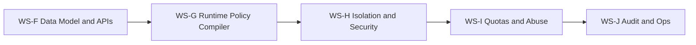
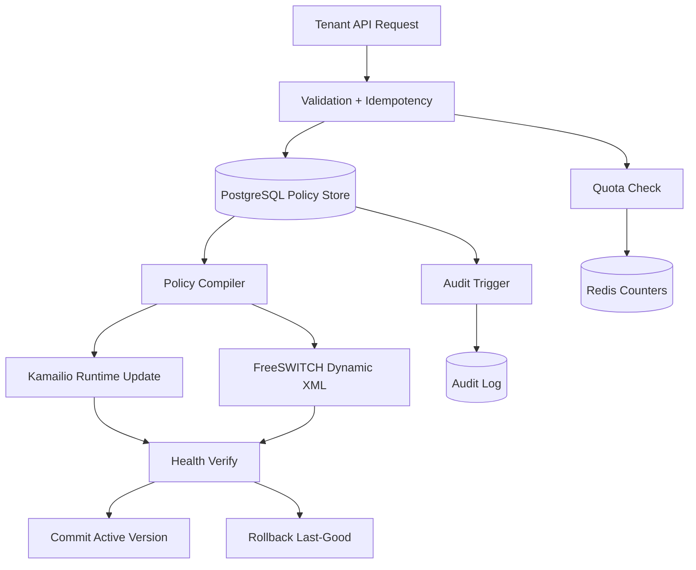

# Phase 2 Execution Plan (Tenant Self-Service + Policy Automation)

Status note:
1. This WS-based execution plan is historical.
2. Active execution authority is `telephony/docs/phase_3/19_talk_lee_frozen_integration_plan.md`.
3. Use `telephony/docs/phase_3/20_status_against_frozen_talk_lee_plan.md` for current tracking.

Date prepared: February 24, 2026  
Phase status: Complete  
Precondition: Phase 1 fully accepted (WS-A through WS-E complete)

---

## 1) Objective

Deliver a production-safe tenant control plane for telephony that:
1. Onboards SIP trunks per tenant through APIs.
2. Applies routing and codec policies as validated data.
3. Enforces quotas/abuse controls per tenant.
4. Produces auditable, reversible operational changes.

---

## 2) Non-Negotiable Constraints

1. No static-manual telephony edits for tenant onboarding.
2. Every policy write is schema-validated and idempotent.
3. Every policy activation supports safe rollback.
4. DB-level tenant isolation is mandatory (RLS).
5. API responses for failures use RFC 9457 problem details.
6. No Phase 3 work starts before Phase 2 gates are green.

---

## 3) Workstreams

## WS-F: Tenant SIP Data Model + API Contracts

Scope:
1. Define normalized tenant entities:
   - `tenant_trunks`
   - `tenant_routes`
   - `tenant_codec_policies`
   - `tenant_limits`
2. Define API contracts for create/update/activate/deactivate operations.
3. Implement strict request validation and idempotency keys.

Deliverables:
1. Migration scripts and DB constraints.
2. OpenAPI schemas with explicit error model (RFC 9457).
3. Unit and integration tests for CRUD + idempotency.

Gate:
- Duplicate POST with same idempotency key must not duplicate active config.

## WS-G: Runtime Policy Compiler (DB -> Kamailio / FreeSWITCH)

Scope:
1. Build compiler service that converts tenant policy records into runtime artifacts.
2. Use Kamailio DB-backed modules and RPC reload flow (`dispatcher.reload`).
3. Use FreeSWITCH dynamic config path (`mod_xml_curl`) for tenant-driven XML.
4. Add dry-run validation before activation.

Deliverables:
1. Deterministic compiler with versioned output.
2. Activation workflow with precheck, apply, verify, commit.
3. Rollback command that reactivates last-good policy version.

Gate:
- Invalid policy cannot reach active runtime.

## WS-H: Isolation + Security Enforcement

Scope:
1. Enforce PostgreSQL RLS on tenant policy tables.
2. Apply per-tenant trust controls using Kamailio permissions model.
3. Harden token validation with RFC 8725 guidance.
4. Build negative tests for cross-tenant data access and route hijack attempts.

Deliverables:
1. RLS policies and test matrix.
2. Tenant authorization middleware integration.
3. Security regression test suite.

Gate:
- Cross-tenant read/write attempts consistently denied in API and DB layers.

## WS-I: Quotas + Abuse Controls

Scope:
1. Implement API and call-control quotas using Redis atomic counters (`INCR` + `EXPIRE`).
2. Add SIP-edge abuse controls using Kamailio `pike` + `ratelimit`.
3. Add per-tenant threshold policies with graduated actions:
   - warn
   - soft throttle
   - temporary block
4. Emit structured events for quota and abuse actions.

Deliverables:
1. Runtime limiter service + policy tables.
2. Alerting hooks for threshold breaches.
3. Tenant-facing status APIs for quota visibility.

Gate:
- Abuse simulation triggers expected controls without false global impact.

## WS-J: Auditability + Operations

Scope:
1. Build immutable audit log table with trigger-based capture.
2. Log actor, tenant, action, before/after payload, correlation ID.
3. Provide operator runbook for activation failure, partial apply, and rollback.
4. Add dashboards for policy activation success rate, error rate, and rollback latency.

Deliverables:
1. Audit schema + retention policy.
2. Operational runbook and on-call checklist.
3. Acceptance report with evidence links.

Gate:
- Every policy mutation has complete audit metadata and searchable trace.

---

## 4) Sequence and Dependencies

No parallel gate closure. Each workstream must be signed off before the next starts.

---

## 5) Implementation Blueprint

---

## 6) Data and API Standards

1. Problem responses:
   - `application/problem+json` (RFC 9457)
2. Tenant policy payloads:
   - JSONB stored with schema-version field.
3. Versioning:
   - every activation writes `policy_version`.
4. Idempotency:
   - `Idempotency-Key` required on mutating endpoints.
5. Correlation:
   - `X-Request-ID` propagated through API, compiler, SIP control, and audit.

---

## 7) Acceptance Criteria (Phase 2 Exit)

All must pass:
1. Self-service tenant onboarding works end-to-end without server file edits.
2. RLS and auth controls prevent cross-tenant access in all tested paths.
3. Policy activation success rate >= 99.9% in staging runs.
4. Rollback to last-good policy version <= 60 seconds.
5. Quota and abuse controls enforce tenant-specific limits correctly.
6. Audit completeness = 100% for policy mutations.

---

## 8) Risk Register and Mitigations

1. Risk: policy compiler emits invalid runtime artifact.
   - Mitigation: dry-run parser checks + activation preflight.
2. Risk: partial apply across Kamailio and FreeSWITCH.
   - Mitigation: two-phase activation (prepare then commit) with automatic rollback.
3. Risk: tenant policy cardinality growth hurts lookup performance.
   - Mitigation: JSONB indexing strategy + bounded query plans + periodic performance tests.
4. Risk: abuse controls affect healthy tenants.
   - Mitigation: per-tenant keys, scoped counters, and staged threshold tuning.

---

## 9) Verification Plan

1. Contract tests:
   - API payload and error-shape conformance.
2. Integration tests:
   - onboarding -> compile -> activate -> verify -> rollback.
3. Security tests:
   - cross-tenant access attempts, token tampering, replay behavior.
4. Load tests:
   - high-frequency policy updates and call setup under throttling.
5. Chaos tests:
   - dependency outage during activation path.

---

## 10) Official References

1. `telephony/docs/phase_2/00_phase_two_official_reference.md`
2. Kamailio dispatcher:
   - https://kamailio.org/docs/modules/stable/modules/dispatcher.html
3. Kamailio domain:
   - https://kamailio.org/docs/modules/stable/modules/domain.html
4. Kamailio permissions:
   - https://kamailio.org/docs/modules/stable/modules/permissions.html
5. Kamailio pike:
   - https://www.kamailio.org/docs/modules/stable/modules/pike.html
6. Kamailio ratelimit:
   - https://www.kamailio.org/docs/modules/stable/modules/ratelimit.html
7. Kamailio htable:
   - https://www.kamailio.org/docs/modules/stable/modules/htable.html
8. FreeSWITCH mod_xml_curl:
   - https://developer.signalwire.com/freeswitch/FreeSWITCH-Explained/Modules/mod_xml_curl_1049001/
9. FreeSWITCH mod_commands:
   - https://developer.signalwire.com/freeswitch/confluence-to-docs-redirector/display/FREESWITCH/mod_commands
10. PostgreSQL row security:
   - https://www.postgresql.org/docs/current/ddl-rowsecurity.html
11. PostgreSQL CREATE TRIGGER:
   - https://www.postgresql.org/docs/current/sql-createtrigger.html
12. PostgreSQL JSONB:
   - https://www.postgresql.org/docs/current/datatype-json.html
13. Redis INCR:
   - https://redis.io/docs/latest/commands/incr/
14. Redis EXPIRE:
   - https://redis.io/docs/latest/commands/expire/
15. RFC 9457:
   - https://www.rfc-editor.org/rfc/rfc9457.html
16. RFC 8725:
   - https://www.rfc-editor.org/rfc/rfc8725
