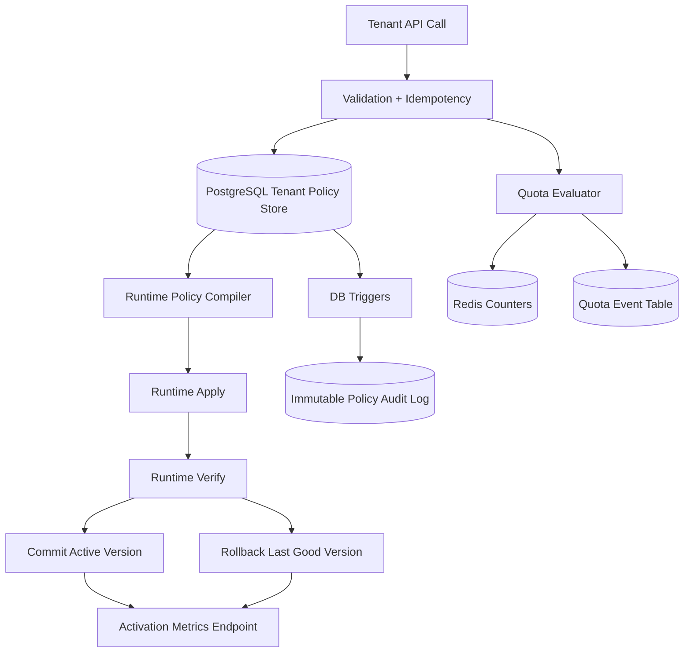
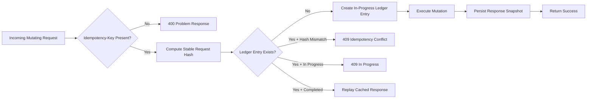
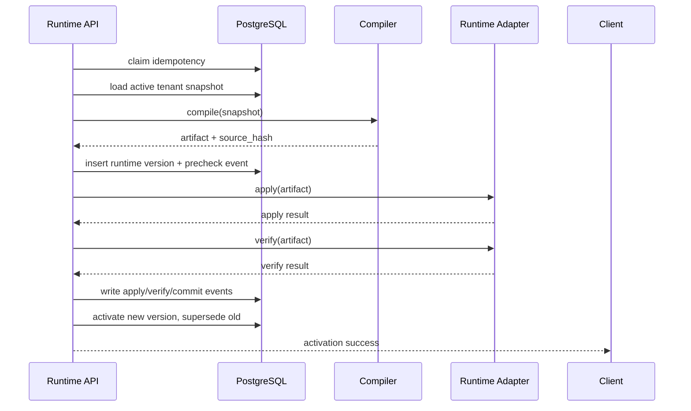
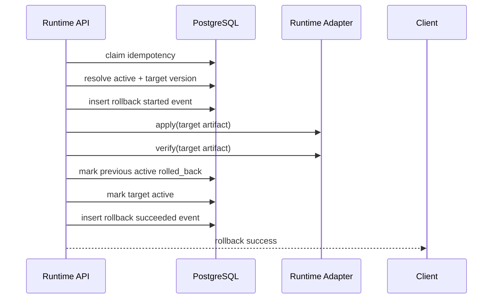
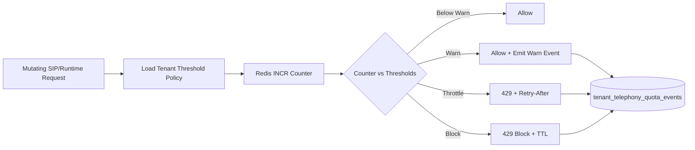

# Day 2 Report - Phase 2 Execution and Closure

Date: Tuesday, February 24, 2026  
Project: Talky.ai Telephony Modernization  
Phase: 2 (Tenant Self-Service + Policy Automation)  
Status: Complete

---

## 1) Executive Summary

Day 2 completed the full Phase 2 scope from WS-F through WS-J and formally closed the phase with verification evidence and sign-off.

What was delivered end-to-end:
1. Tenant self-service policy data model and APIs (WS-F).
2. Deterministic runtime policy compiler with activation and rollback orchestration (WS-G).
3. Security hardening with RLS + JWT controls + tenant trust policy model (WS-H).
4. Tenant-scoped quota and abuse controls with Redis and SIP-edge protection (WS-I).
5. Immutable policy mutation audit trail + runtime SLO observability + operations runbook (WS-J).

Phase closure artifacts are now in place, including the final sign-off record and closed exit gate checklist.

---

## 2) Day 2 Objectives

Day 2 objectives were to:
1. Finish all remaining Phase 2 workstreams in sequence.
2. Ensure production-safe behavior (not workaround-level behavior).
3. Validate each gate with tests and scripted verification.
4. Close Phase 2 formally with documentation and sign-off.

---

## 3) Starting Point and Constraints

Starting point at Day 2 entry:
1. Phase 2 workstreams were planned and partially implemented.
2. Quality bar required sequential gate closure (no skipping).
3. Requirements enforced:
   - tenant isolation at DB layer
   - idempotent mutations
   - deterministic policy compilation
   - rollback capability
   - audit completeness

Key constraints:
1. Preserve backward compatibility of existing route structure.
2. Keep tenant boundaries strict for every policy path.
3. Maintain RFC 9457 problem response format on mutation failures.
4. Use official references for security and data integrity choices.

---

## 4) Phase 2 End-State Architecture



---

## 5) Workstream-by-Workstream Execution

## WS-F: Tenant Data Model + API Contracts

### Goal
Enable tenants to manage SIP trunks, codec policies, and route policies through safe APIs.

### What was implemented
1. Core tables:
   - `tenant_sip_trunks`
   - `tenant_codec_policies`
   - `tenant_route_policies`
   - `tenant_telephony_idempotency`
2. Full API operations:
   - list/create/update/activate/deactivate across trunk/codec/route resources
3. Idempotency requirement on mutating operations.
4. RFC 9457 problem responses for conflicts/validation errors.

### How it was implemented
1. Added schema and constraints in onboarding migration.
2. Added endpoint-level request normalization and stable request hashing.
3. Added replay-safe idempotency ledger behavior:
   - hash mismatch -> `409`
   - in-progress -> `409`
   - exact replay -> cached response
4. Added encryption handling for trunk auth secrets.

### Evidence
1. `backend/tests/unit/test_telephony_sip_api.py`
2. `backend/database/migrations/20260224_add_tenant_sip_onboarding.sql`
3. `telephony/docs/phase_2/04_ws_f_completion.md`

---

## WS-G: Runtime Policy Compiler + Activation/Rollback

### Goal
Convert active tenant policy records into deterministic runtime artifacts and safely activate them.

### What was implemented
1. Compiler service to generate runtime artifacts.
2. Validation before activation (regex, references, active-link checks, direction checks).
3. Activation lifecycle:
   - precheck
   - apply
   - verify
   - commit
4. Rollback lifecycle:
   - explicit target or prior eligible version fallback
5. Runtime version and event ledger tables.

### How it was implemented
1. Pulled active tenant snapshot from policy tables.
2. Canonicalized/sorted inputs to produce stable source hash.
3. Wrote version rows into `tenant_runtime_policy_versions`.
4. Logged staged events in `tenant_runtime_policy_events`.
5. Executed runtime adapter commands:
   - Kamailio dispatcher reload path
   - FreeSWITCH XML reload path
6. Updated active/last-good state transactionally.

### Evidence
1. `backend/tests/unit/test_telephony_runtime_policy_compiler.py`
2. `backend/tests/unit/test_telephony_runtime_api.py`
3. `backend/database/migrations/20260224_add_tenant_runtime_policy_versions.sql`
4. `telephony/scripts/verify_ws_g.sh`
5. `telephony/docs/phase_2/05_ws_g_completion.md`

---

## WS-H: Isolation + Security Enforcement

### Goal
Guarantee tenant isolation and harden auth/token validation.

### What was implemented
1. RLS enabled and forced on tenant policy tables.
2. Connection-scoped tenant/user context propagation into DB session settings.
3. JWT hardening aligned to RFC 8725:
   - allow-list algorithm enforcement
   - required claim checks
   - stricter decode/validate flow
4. SIP trust policy model and runtime mapping.

### How it was implemented
1. Added `tenant_sip_trust_policies` and policy-level controls.
2. Centralized JWT security logic in dedicated module.
3. Wired auth/dependency/middleware to common validation behavior.
4. Applied RLS policies for select/insert/update/delete with tenant matching.

### Evidence
1. `backend/tests/unit/test_jwt_security.py`
2. `backend/tests/unit/test_tenant_rls.py`
3. `backend/tests/unit/test_tenant_middleware.py`
4. `backend/database/migrations/20260224_add_tenant_policy_security_ws_h.sql`
5. `telephony/scripts/verify_ws_h.sh`
6. `telephony/docs/phase_2/06_ws_h_completion.md`

---

## WS-I: Quotas + Abuse Controls

### Goal
Prevent tenant-level abuse and enforce configurable thresholds without cross-tenant impact.

### What was implemented
1. Redis-atomic quota logic (`INCR` + `EXPIRE`).
2. Graduated actions:
   - warn
   - throttle
   - block
3. Quota policy table and event table:
   - `tenant_telephony_threshold_policies`
   - `tenant_telephony_quota_events`
4. Tenant status API:
   - `GET /api/v1/telephony/sip/quotas/status`
5. SIP-edge protections in Kamailio:
   - `pike`
   - `ratelimit`
   - `htable`

### How it was implemented
1. Added threshold policy lookup by tenant/scope/metric.
2. Evaluated quota decision before mutating runtime/SIP actions.
3. Persisted quota events for auditability and operational visibility.
4. Integrated rate-limiter checks into both SIP and runtime mutation paths.

### Evidence
1. `backend/tests/unit/test_telephony_rate_limiter.py`
2. `backend/tests/unit/test_telephony_sip_api.py`
3. `backend/tests/unit/test_telephony_runtime_api.py`
4. `backend/database/migrations/20260224_add_tenant_quota_abuse_controls_ws_i.sql`
5. `telephony/scripts/verify_ws_i.sh`
6. `telephony/docs/phase_2/07_ws_i_completion.md`

---

## WS-J: Auditability + Operations

### Goal
Provide immutable audit traces for policy mutations and measurable runtime operational SLOs.

### What was implemented
1. Immutable audit table:
   - `tenant_policy_audit_log`
2. Trigger-based policy mutation capture:
   - `log_tenant_policy_mutation()`
3. Mutation-block trigger for audit table immutability:
   - `prevent_tenant_policy_audit_log_mutation()`
4. Request correlation propagation into DB context:
   - `app.current_request_id`
5. Runtime observability endpoint:
   - `GET /api/v1/telephony/sip/runtime/metrics/activation`
6. Rollback latency instrumentation using started and terminal rollback events.
7. Retention helper:
   - `prune_tenant_policy_audit_log(limit)`
8. Operations runbook for failure and rollback drills.

### How it was implemented
1. Added WS-J migration with table/indexes/functions/triggers/RLS.
2. Updated canonical schema to include WS-J objects.
3. Extended tenant RLS context helper to always set tenant/user/request settings.
4. Updated runtime rollback flow to write `status='started'` event before apply.
5. Added SQL aggregation for activation success/failure and rollback latency p50/p95/max.
6. Added verifier script to enforce WS-J markers and docs evidence.

### Evidence
1. `backend/database/migrations/20260224_add_tenant_policy_audit_ws_j.sql`
2. `backend/app/core/tenant_rls.py`
3. `backend/app/api/v1/endpoints/telephony_runtime.py`
4. `telephony/scripts/verify_ws_j.sh`
5. `telephony/docs/phase_2/08_ws_j_completion.md`
6. `telephony/docs/phase_2/09_ws_j_operations_runbook.md`

---

## 6) Core Workflow Diagrams

## 6.1 Idempotent Mutation Flow



## 6.2 Runtime Activation Flow



## 6.3 Runtime Rollback Flow



## 6.4 Audit Capture Flow

```mermaid
flowchart TB
    A[INSERT/UPDATE/DELETE on Policy Table] --> B[AFTER Trigger Fires]
    B --> C[log_tenant_policy_mutation()]
    C --> D[Read tenant_id, actor, request_id]
    D --> E[Compute changed fields]
    E --> F[Insert into tenant_policy_audit_log]
    F --> G[Immutable Storage]

    H[UPDATE/DELETE on Audit Table] --> I[prevent_tenant_policy_audit_log_mutation()]
    I --> J[Exception Raised]
```

## 6.5 Quota and Abuse Control Flow



---

## 7) Verification and Quality Gates

Primary sequential verifier executed:

```bash
bash telephony/scripts/verify_ws_j.sh
```

What this validated:
1. WS-F baseline tests.
2. WS-G compiler/runtime API tests.
3. WS-H security/isolation tests.
4. WS-I quota and abuse tests.
5. WS-J runtime/audit/docs markers.

Observed results in verification chain:
1. WS-G suite passed.
2. WS-H suite passed.
3. WS-I suite passed.
4. WS-J suite passed.

Additional static harness validation:

```bash
python3 -m unittest -v telephony/tests/test_telephony_stack.py
```

Result:
1. static checks passed.
2. integration checks are intentionally skip-gated by `TELEPHONY_RUN_DOCKER_TESTS=1`.

---

## 8) Security and Reliability Decisions

Key decisions and why they were chosen:

1. DB-enforced tenant isolation (RLS + FORCE RLS)
Reason:
- Prevents accidental bypass from application query mistakes.

2. Idempotency ledger for every mutation path
Reason:
- Protects against duplicate client retries and race conditions.

3. Deterministic compile output and source hash
Reason:
- Enables stable version tracking and exact rollback targeting.

4. Trigger-based immutable audit log
Reason:
- Captures every policy mutation at DB boundary.
- Not dependent on endpoint-level manual logging discipline.

5. Request correlation in DB session settings
Reason:
- Makes audit records queryable by request lifecycle.

6. Explicit rollback-started event
Reason:
- Enables measurable rollback latency instead of inferred timing.

7. Redis atomic counters for quota
Reason:
- Correct under high concurrency and low latency for enforcement.

---

## 9) Phase 2 Closure Actions

Phase 2 closure files updated/added:
1. `telephony/docs/phase_2/02_phase_two_gated_checklist.md` (exit gate closed)
2. `telephony/docs/phase_2/10_phase_two_signoff.md` (final sign-off)
3. `telephony/docs/phase_2/01_phase_two_execution_plan.md` (status set to complete)
4. `telephony/docs/phase_2/README.md` (index updated)

Closure state:
1. WS-F through WS-J gates marked complete.
2. Final sign-off record present.
3. Phase 2 status marked complete.

---

## 10) Deliverable Inventory (Phase 2)

## Documentation
1. `telephony/docs/phase_2/00_phase_two_official_reference.md`
2. `telephony/docs/phase_2/01_phase_two_execution_plan.md`
3. `telephony/docs/phase_2/02_phase_two_gated_checklist.md`
4. `telephony/docs/phase_2/03_ws_f_tenant_sip_onboarding_step1.md`
5. `telephony/docs/phase_2/04_ws_f_completion.md`
6. `telephony/docs/phase_2/05_ws_g_completion.md`
7. `telephony/docs/phase_2/06_ws_h_completion.md`
8. `telephony/docs/phase_2/07_ws_i_completion.md`
9. `telephony/docs/phase_2/08_ws_j_completion.md`
10. `telephony/docs/phase_2/09_ws_j_operations_runbook.md`
11. `telephony/docs/phase_2/10_phase_two_signoff.md`
12. `telephony/docs/phase_2/day2.md`
13. `telephony/docs/phase_2/README.md`

## Scripts
1. `telephony/scripts/verify_ws_g.sh`
2. `telephony/scripts/verify_ws_h.sh`
3. `telephony/scripts/verify_ws_i.sh`
4. `telephony/scripts/verify_ws_j.sh`

## Backend APIs and Services
1. `backend/app/api/v1/endpoints/telephony_sip.py`
2. `backend/app/api/v1/endpoints/telephony_runtime.py`
3. `backend/app/domain/services/telephony_runtime_policy.py`
4. `backend/app/domain/services/telephony_rate_limiter.py`
5. `backend/app/infrastructure/telephony/runtime_policy_adapter.py`
6. `backend/app/core/jwt_security.py`
7. `backend/app/core/tenant_rls.py`

## Backend Migrations
1. `backend/database/migrations/20260224_add_tenant_sip_onboarding.sql`
2. `backend/database/migrations/20260224_add_tenant_runtime_policy_versions.sql`
3. `backend/database/migrations/20260224_add_tenant_policy_security_ws_h.sql`
4. `backend/database/migrations/20260224_add_tenant_quota_abuse_controls_ws_i.sql`
5. `backend/database/migrations/20260224_add_tenant_policy_audit_ws_j.sql`

## Backend Tests
1. `backend/tests/unit/test_telephony_sip_api.py`
2. `backend/tests/unit/test_telephony_runtime_policy_compiler.py`
3. `backend/tests/unit/test_telephony_runtime_api.py`
4. `backend/tests/unit/test_telephony_rate_limiter.py`
5. `backend/tests/unit/test_jwt_security.py`
6. `backend/tests/unit/test_tenant_rls.py`

---

## 11) Operational Playbook Snapshot

Minimum on-call checks for runtime policy incidents:
1. Check `tenant_runtime_policy_events` by `request_id`.
2. Confirm active version uniqueness in `tenant_runtime_policy_versions`.
3. If needed, execute rollback with a new idempotency key and request id.
4. Validate `rollback started` and `rollback succeeded` events.
5. Validate WS-J metrics endpoint for rollback latency.
6. Confirm expected entries in `tenant_policy_audit_log`.

Retention operation:

```sql
SELECT prune_tenant_policy_audit_log(5000);
```

---

## 12) Handover Status

Phase 2 is complete and handover-ready.

Handover-ready means:
1. functional scope complete
2. gates closed
3. rollback and observability present
4. immutable auditability present
5. runbook published

This report is the Day 2 comprehensive execution record for Phase 2.
