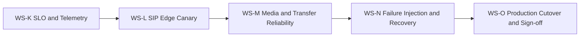
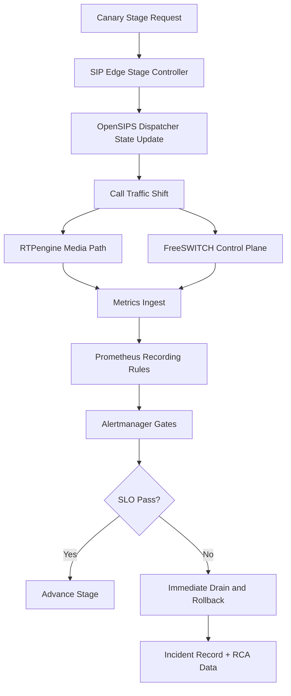

# Phase 3 Execution Plan (Production Rollout + Resiliency)

Status note:
1. This WS-based execution plan is historical.
2. Active execution authority is `telephony/docs/phase_3/19_talk_lee_frozen_integration_plan.md`.
3. Use `telephony/docs/phase_3/20_status_against_frozen_talk_lee_plan.md` for current tracking.

Date prepared: February 25, 2026  
Phase status: Planned  
Precondition: Phase 2 fully signed off (`telephony/docs/phase_2/10_phase_two_signoff.md`)

---

## 1) Objective

Deliver a production-ready telephony rollout framework that:
1. Migrates live traffic in controlled steps with strict SLO gates.
2. Preserves SIP/media stability during failures and maintenance operations.
3. Guarantees transfer reliability and long-call continuity.
4. Enables one-step rollback with complete observability and audit evidence.

---

## 2) Non-Negotiable Constraints

1. No jump to high-traffic canary stages without passing explicit gates.
2. No usage of dispatcher patterns with reload caveats in canary routing.
3. No production rollout without health-checked startup dependencies.
4. No gate closure without evidence from metrics, logs, and synthetic calls.
5. No Phase 4 planning until WS-K through WS-O are closed.

---

## 3) Workstreams

## WS-K: SLO Contract and Telemetry Hardening

Scope:
1. Define SLOs for:
   - call setup success
   - answer latency (p95)
   - RTP quality (packet loss/jitter)
   - transfer success (blind + attended)
2. Standardize metric names/labels per Prometheus best practices.
3. Add recording rules for canary-vs-baseline comparisons.
4. Add alert routes, inhibition, and dedup in Alertmanager.

Deliverables:
1. `telephony/observability/` metrics contract.
2. Recording and alert rules for rollout gates.
3. SLO dashboard with stage-by-stage visibility.

Gate:
- SLO queries and alert rules validate in staging with no ambiguous labels.

## WS-L: SIP Edge Canary Orchestration

Scope:
1. Implement weighted route progression at SIP edge.
2. Add drain/freeze command for immediate rollback.
3. Validate probing behavior and destination state transitions.
4. Add canary stage controller (5% -> 25% -> 50% -> 100%).

Deliverables:
1. Stage controller script and runbook.
2. Canary decision records per stage.
3. Verified rollback operation (single command path).

Gate:
- Rollback from any stage to baseline completes within agreed operational target.

## WS-M: Media and Transfer Reliability

Scope:
1. Validate RTP path behavior (kernel and userspace modes).
2. Add synthetic call suites for:
   - long-call stability
   - blind transfer
   - attended transfer
   - DTMF survivability
3. Validate FreeSWITCH outbound ESL handling under load.
4. Enforce `mod_xml_curl` timeout/retry boundaries for call safety.

Deliverables:
1. Media quality drill scripts and pass/fail thresholds.
2. Transfer reliability report with error taxonomy.
3. Long-call stability report with session timer validation.

Gate:
- Transfer and long-call targets pass at canary load with no unresolved P1 defects.

## WS-N: Failure Injection and Automated Recovery

Scope:
1. Run controlled failure drills:
   - OpenSIPS node outage
   - rtpengine degradation
   - FreeSWITCH worker disruption
2. Validate automated recovery and operator rollback paths.
3. Ensure alerting signal quality during fault windows.
4. Capture RCA-grade evidence for each drill.

Deliverables:
1. Failure drill catalog and replay scripts.
2. Recovery timeline evidence per failure mode.
3. Updated on-call playbook and command sheet.

Gate:
- All planned failure drills complete with deterministic recovery/rollback behavior.

## WS-O: Production Cutover and Sign-off

Scope:
1. Execute staged production progression to 100%.
2. Freeze legacy path as hot standby during stabilization window.
3. Finalize go/no-go checklist and sign-off record.
4. Define decommission criteria for legacy telephony path.

Deliverables:
1. Final cutover report with stage outcomes.
2. Formal sign-off document for Phase 3.
3. Legacy decommission readiness checklist.

Gate:
- 100% production routing stable for stabilization window with SLO compliance.

---

## 4) Sequence and Dependencies

No parallel gate closure. Workstreams close in strict order.

---

## 5) Execution Blueprint

---

## 6) Acceptance Criteria (Phase 3 Exit)

All must pass:
1. Canary progression is deterministic and reversible at every stage.
2. Call setup and media quality SLOs remain within defined thresholds through 100% cutover.
3. Blind and attended transfer success meet production targets under load.
4. Failure drills demonstrate recovery/rollback with complete observability evidence.
5. Final sign-off record includes operational readiness and decommission criteria.

---

## 7) Risk Register and Mitigations

1. Risk: routing imbalance causes hot spots.
   - Mitigation: weighted canary increments and per-destination health probing.
2. Risk: media artifacts during relay mode transitions.
   - Mitigation: explicit kernel/userspace validation and audio quality thresholds.
3. Risk: noisy alerts block decisions.
   - Mitigation: recording rules + alert grouping/dedup/inhibition tuning.
4. Risk: rollback path drifts from reality.
   - Mitigation: mandatory rollback drill in each stage window.

---

## 8) Verification Plan

1. Contract checks:
   - metric names/labels and problem-detail API responses.
2. Synthetic traffic:
   - call setup, long-call, transfer, and DTMF scenarios.
3. Fault drills:
   - component outage and degradation replay.
4. Canary checks:
   - stage evidence pack for each progression decision.
5. Final sign-off:
   - WS-K through WS-O gate checklist completed.

---

## 9) Official References

1. `telephony/docs/phase_3/00_phase_three_official_reference.md`
2. OpenSIPS dispatcher module:
   - https://opensips.org/html/docs/modules/3.4.x/dispatcher.html
3. OpenSIPS rtpengine module:
   - https://opensips.org/html/docs/modules/3.4.x/rtpengine.html
4. rtpengine docs:
   - https://rtpengine.readthedocs.io/en/mr13.4/overview.html
5. FreeSWITCH Event Socket docs:
   - https://developer.signalwire.com/freeswitch/FreeSWITCH-Explained/Modules/mod_event_socket_1048924/
6. FreeSWITCH outbound ESL docs:
   - https://developer.signalwire.com/freeswitch/FreeSWITCH-Explained/Client-and-Developer-Interfaces/Event-Socket-Library/Event-Socket-Outbound_3375460/
7. Prometheus best practices:
   - https://prometheus.io/docs/practices/naming/
   - https://prometheus.io/docs/practices/rules/
8. Alertmanager docs:
   - https://prometheus.io/docs/alerting/latest/alertmanager/
9. Docker Compose startup order:
   - https://docs.docker.com/compose/how-tos/startup-order/
