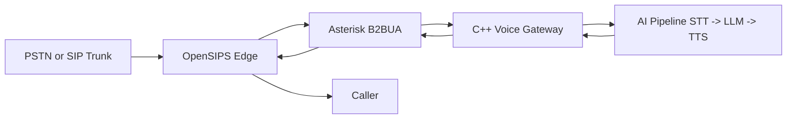

# Talk-Leee Voice Pipeline Integration Plan (Frozen)

Date: 2026-02-26  
Owner: Talky.ai Telephony Team  
Status: Frozen Baseline (v1.0)

---

## 1) Golden Path (Frozen)

This is the only active production path for this plan:

Frozen decisions:
1. One active path only: `OpenSIPS -> Asterisk -> C++ Gateway -> AI`.
2. Single codec baseline for sprint execution: `PCMU` only.
3. No hybrid active media path during this plan.
4. Kamailio and FreeSWITCH remain backup assets only.

---

## 2) 10-Day Execution Plan (Frozen)

## Day 0: Freeze the Golden Path
Goal:
1. Remove architectural ambiguity and lock a single runtime path.

Deliverables:
1. Golden path diagram and call-path baseline.
2. Confirmed repository locations:
   - `telephony/opensips`
   - `telephony/asterisk`
   - `services/voice-gateway-cpp`

Acceptance:
1. Team agrees one call path, one codec, one runtime owner set.
2. Kamailio and FreeSWITCH are explicitly backup-only (non-primary path).

## Day 1: LAN Infra and Clean Networking
Goal:
1. Stable LAN hosts with deterministic network controls.

Deliverables:
1. `inventory.md` with fixed IP/hostnames/ports.
2. Firewall posture documented (`ufw status`).

Acceptance:
1. Host reachability and SSH key login verified.
2. No unnecessary ports exposed.

## Day 2: Asterisk Bring-Up and First Calls
Goal:
1. Confirm call ingress and clean SIP dialog lifecycle in Asterisk.

Deliverables:
1. `pjsip.conf` and `extensions.conf` baseline.
2. `runbook_asterisk.md` for test extension calling.

Acceptance:
1. Repeated call setup/teardown succeeds.
2. SIP sequence observed: `INVITE -> 200 OK -> BYE`.

## Day 3: OpenSIPS Edge Routing to Asterisk
Goal:
1. Force all SIP ingress through OpenSIPS before Asterisk.

Deliverables:
1. OpenSIPS routing config and ACL enforcement notes.

Acceptance:
1. Calls succeed via OpenSIPS.
2. Direct bypass to Asterisk is blocked.

## Day 4: C++ Gateway Skeleton and RTP Echo Unit Validation
Goal:
1. Validate RTP mechanics in isolation before PBX coupling.

Deliverables:
1. `services/voice-gateway-cpp` with CMake build and Dockerfile.
2. APIs: `StartSession`, `StopSession`, `Stats`.
3. Health endpoints: `/health`, `/stats`.

Acceptance:
1. RTP loopback/echo tests pass.
2. Sequence/timestamp pacing is stable.

## Day 5: Asterisk <-> C++ End-to-End Echo
Goal:
1. Caller can hear deterministic echo through full media path.

Deliverables:
1. Integration dialplan or ARI flow docs.
2. Pcap/debug-pack format.

Acceptance:
1. Repeated echo calls complete without silent sessions.
2. Sessions cleanly end on hangup.

## Day 6: Media Resilience Features in C++
Goal:
1. Production-safe media session behavior.

Deliverables:
1. No-RTP timeout logic and reason codes.
2. Basic jitter buffer.
3. Per-call session state machine.

Acceptance:
1. Fault injection (RTP loss) exits cleanly.
2. No unbounded memory/session growth.

## Day 7: STT Streaming
Goal:
1. Reliable speech recognition from production media path.

Deliverables:
1. PCMU to PCM16 conversion path.
2. Transcript format tied to `talklee_call_id`.

Acceptance:
1. Transcript generated per call in batch tests.
2. p95 STT latency captured and stable.

## Day 8: TTS + Barge-In
Goal:
1. Natural audible AI loop with interruption handling.

Deliverables:
1. TTS synthesis and paced RTP playback.
2. Barge-in interruption policy.
3. Prompt/fallback v1 documentation.

Acceptance:
1. Consistent audible playback.
2. Barge-in behavior passes controlled tests.

## Day 9: Transfer and Tenant Controls
Goal:
1. Reliable transfer flow plus tenant-level runtime controls.

Deliverables:
1. Blind transfer flow v1.
2. Tenant concurrency control schema.

Acceptance:
1. Transfer success under repeated test runs.
2. No ghost sessions after transfer.

## Day 10: Concurrency and Soak Validation
Goal:
1. Prove production readiness under sustained load.

Deliverables:
1. Capacity report with CPU/memory/network.
2. Safe concurrency threshold and headroom.
3. Go/No-Go checklist.

Acceptance:
1. Stable concurrent load target reached.
2. Soak run passes.
3. Recovery validated across service restarts.

---

## 3) Official Reference Baseline (Authoritative Only)

OpenSIPS:
1. Modules index: https://opensips.org/Documentation/Modules-3-4
2. Dispatcher module: https://opensips.org/html/docs/modules/3.4.x/dispatcher.html
3. RTPengine module (OpenSIPS side): https://opensips.org/html/docs/modules/3.4.x/rtpengine.html
4. Rate limit module: https://opensips.org/docs/modules/3.3.x/ratelimit
5. TLS management module: https://opensips.org/docs/modules/3.3.x/tls_mgm.html

Asterisk:
1. res_pjsip overview: https://docs.asterisk.org/Configuration/Channel-Drivers/SIP/Configuring-res_pjsip/
2. PJSIP with proxies: https://docs.asterisk.org/Configuration/Channel-Drivers/SIP/Configuring-res_pjsip/PJSIP-with-Proxies/
3. ARI overview: https://docs.asterisk.org/Configuration/Interfaces/Asterisk-REST-Interface-ARI/
4. ARI channels intro: https://docs.asterisk.org/Configuration/Interfaces/Asterisk-REST-Interface-ARI/Introduction-to-ARI-and-Channels/
5. WebSocket channel + ARI external media context: https://docs.asterisk.org/Configuration/Channel-Drivers/WebSocket/

RTPengine:
1. Project repository: https://github.com/sipwise/rtpengine
2. NG control protocol: https://rtpengine.readthedocs.io/en/latest/ng_control_protocol.html

IETF standards:
1. SIP core: https://www.rfc-editor.org/info/rfc3261
2. SIP session timers: https://www.rfc-editor.org/info/rfc4028
3. RTP DTMF payload: https://www.rfc-editor.org/rfc/rfc4733

---

## 4) Change Control for Frozen Plan

Rules:
1. Any change to architecture, codec baseline, or acceptance criteria requires explicit update to this file.
2. New work cannot bypass day order without written exception and rollback plan.
3. Implementation must cite official references from Section 3.
4. Non-official blog/forum guidance cannot override official docs.

---

## 5) Freeze Approval

Decision:
1. This plan is frozen as the execution baseline for the next implementation cycle.

Approvals:
1. Architecture: Approved
2. Workstream order: Approved
3. Official-doc-only rule: Approved
