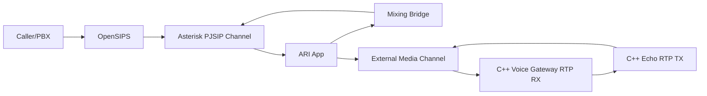
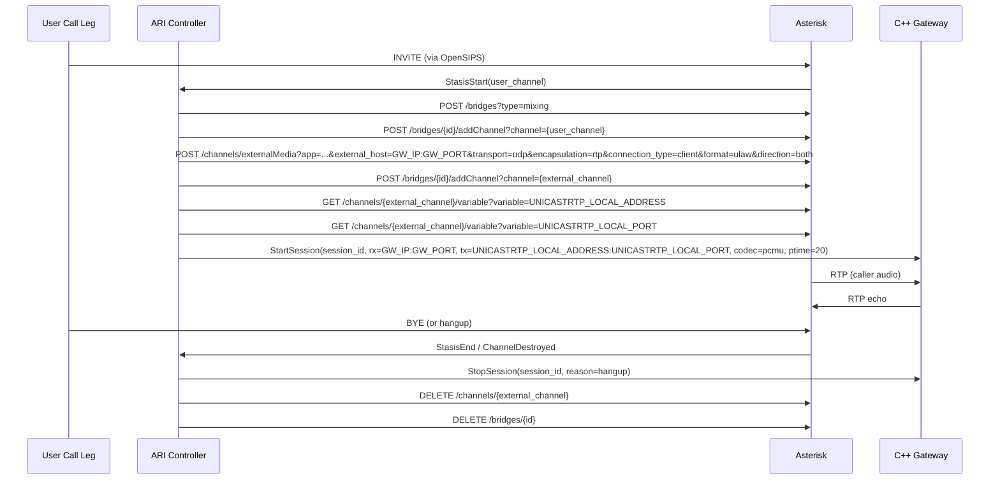

# Day 5 Execution Plan: Asterisk <-> C++ End-to-End Echo

Date: 2026-03-02  
Plan authority: `telephony/docs/phase_3/19_talk_lee_frozen_integration_plan.md`  
Day scope: Day 5 only (Asterisk/C++ media integration gate)

---

## 1) Objective

Deliver a production-grade Day 5 integration where a live call hears deterministic echo through the frozen path:

`OpenSIPS -> Asterisk -> C++ Gateway -> Asterisk -> OpenSIPS -> Caller`

Mandatory Day 5 outcomes:
1. Asterisk bridges caller media to the C++ gateway using official ARI External Media flow.
2. C++ gateway receives RTP from Asterisk and returns RTP back to the same session.
3. 20 consecutive calls pass with audible echo and clean teardown.
4. No silent sessions and no stuck sessions after hangup.

---

## 2) Scope and Non-Scope

In scope:
1. ARI control-plane orchestration for bridge and external media channel.
2. Asterisk <-> C++ RTP path for PCMU (`ulaw`) echo.
3. Session lifecycle alignment (`start -> active -> stop`) between Asterisk and C++.
4. Repeatability evidence (logs, stats, pcap, verifier output).

Out of scope (explicitly blocked for Day 5):
1. Jitter buffer production policy (Day 6).
2. No-RTP timeout policy (Day 6).
3. STT/TTS/LLM coupling (Day 7+).
4. Transfer controls (Day 9).

---

## 3) Official Reference Baseline (Authoritative Only)

Source validation date: 2026-03-02

Asterisk official documentation:
1. ARI External Media example and behavior (`/channels/externalMedia`, `UNICASTRTP_LOCAL_*` variables):  
   https://docs.asterisk.org/Development/Reference-Information/Asterisk-Framework-and-API-Examples/External-Media-and-ARI/
2. ARI Channels REST API (Latest; includes `externalMedia`, `getChannelVar`, `hangup`, `rtp_statistics`):  
   https://docs.asterisk.org/Latest_API/API_Documentation/Asterisk_REST_Interface/Channels_REST_API/
3. ARI Channels REST API (Certified Asterisk 22.8; runtime compatibility anchor):  
   https://docs.asterisk.org/Certified-Asterisk_22.8_Documentation/API_Documentation/Asterisk_REST_Interface/Channels_REST_API/
4. ARI Bridges REST API (create bridge, add/remove channel, destroy):  
   https://docs.asterisk.org/Latest_API/API_Documentation/Asterisk_REST_Interface/Bridges_REST_API/
5. ARI channel lifecycle intro (`StasisStart`, `StasisEnd` behavior):  
   https://docs.asterisk.org/Configuration/Interfaces/Asterisk-REST-Interface-ARI/Introduction-to-ARI-and-Channels/

RTP standards (IETF/RFC):
1. RFC 3550 (RTP core: sequence and timestamp rules):  
   https://www.rfc-editor.org/rfc/rfc3550
2. RFC 3551 (RTP A/V profile: static PT mapping, PT 0 PCMU at 8 kHz):  
   https://www.rfc-editor.org/rfc/rfc3551

OpenSIPS official docs (context preserved, no Day 5 config drift):
1. Dispatcher module docs: https://opensips.org/docs/modules/3.5.x/dispatcher.html
2. Permissions module docs: https://opensips.org/docs/modules/3.6.x/permissions.html

Version policy:
1. Runtime compatibility target remains Certified Asterisk 22.8.
2. API behavior is cross-checked against `Latest_API` to catch drift early.
3. RTP behavior is normative per RFC 3550/3551.

---

## 4) Day 5 Design Principles (Why This Is Production-Ready)

1. Uses Asterisk-supported ARI External Media path; no undocumented media hooks.
2. Keeps codec fixed to `PCMU/ulaw` (`PT=0`, 8 kHz) to honor frozen sprint baseline.
3. Uses explicit lifecycle ownership and idempotent cleanup on every failure path.
4. Separates call-control (Asterisk ARI) from media-plane (C++ gateway) with clear contracts.
5. Produces deterministic evidence artifacts and a single pass/fail verifier.

---

## 5) Target Runtime Topology (Day 5)

Call-control owner: ARI app  
Media owner: C++ gateway RTP session

---

## 6) ARI-Controlled Call Flow (Official API Sequence)

---

## 7) Media Contract (Frozen)

1. Codec: `ulaw` / `PCMU` only.
2. RTP payload type: `0` (RFC 3551 static mapping).
3. Sample clock: `8000 Hz`.
4. Packetization: `20 ms` per packet.
5. Samples per RTP packet: `160`.

C++ gateway behavior for Day 5:
1. Echo payload without transcoding.
2. Maintain RTP continuity and pacing from Day 4 baseline.
3. Track per-session `packets_in`, `packets_out`, `last_packet_at`, `stop_reason`.

---

## 8) Integration Contract: ARI App <-> C++ Gateway

StartSession (required fields):
1. `session_id` (stable unique ID)
2. `call_id` (maps to telephony call identity)
3. `rx_listen_ip`
4. `rx_listen_port`
5. `tx_remote_ip` (from `UNICASTRTP_LOCAL_ADDRESS`)
6. `tx_remote_port` (from `UNICASTRTP_LOCAL_PORT`)
7. `codec=pcmu`
8. `ptime_ms=20`

StopSession:
1. `session_id`
2. `reason` (`hangup`, `ari_cleanup`, `error`)

Required invariants:
1. One active C++ session per external media channel.
2. StopSession is idempotent.
3. ARI teardown is attempted even when StopSession fails (and vice versa).

---

## 9) Planned Implementation Steps (Day 5)

Step 1: Pre-flight gate
1. Confirm Day 1-4 gates are green (inventory, Asterisk/OpenSIPS path, Day 4 RTP verifier).
2. Confirm codec remains PCMU-only in config and tests.

Step 2: ARI call orchestration
1. Ensure inbound call enters Stasis application.
2. Create a mixing bridge.
3. Add caller channel to bridge.

Step 3: External media channel setup
1. Create external media channel via official `POST /channels/externalMedia`.
2. Parameters fixed for Day 5:
   - `transport=udp`
   - `encapsulation=rtp`
   - `connection_type=client`
   - `format=ulaw`
   - `direction=both`
3. Add external media channel to same bridge.

Step 4: Return-path discovery and C++ session start
1. Read `UNICASTRTP_LOCAL_ADDRESS` and `UNICASTRTP_LOCAL_PORT` using ARI channel-variable endpoint.
2. Start C++ session with discovered return address and pre-allocated receive socket.

Step 5: Runtime monitoring
1. Observe RTP counters on C++ side.
2. Observe bridge/channel state from ARI events.
3. Detect and fail on silent-path conditions.

Step 6: Teardown discipline
1. On any call end/error event, invoke StopSession first.
2. Delete external media channel.
3. Remove/destroy bridge.
4. Verify no orphan channels/sessions remain.

Step 7: Repeatability test run
1. Execute 20 sequential calls (same route).
2. Persist logs/stats/pcap evidence.

---

## 10) Test and Verification Plan (Day 5 Gate)

Functional tests:
1. Single-call echo test: caller hears own voice loopback.
2. 20-call repeat test: all calls must have audible echo.
3. Hangup cleanup test: each call releases bridge/channel/session resources.

Control-plane tests:
1. ARI bridge creation and add/remove API responses are success-only.
2. External media creation always receives valid channel ID.
3. `UNICASTRTP_LOCAL_*` variables are present and parsable.

Media-plane tests:
1. C++ `packets_in > 0` and `packets_out > 0` for each successful call.
2. No RTP stream starts before session state is `active`.
3. Echo path remains stable for full call duration in all 20 runs.

Failure-path tests:
1. If external media creation fails, call is torn down cleanly without leaked bridge.
2. If C++ StartSession fails, ARI destroys external media channel and bridge.
3. If BYE occurs mid-start, teardown remains idempotent.

---

## 11) Acceptance Criteria (Day 5 Complete)

Day 5 is complete only when all pass:
1. 20/20 consecutive calls have audible echo.
2. 0 silent calls.
3. 0 stuck sessions/channels/bridges after hangup.
4. Every call emits deterministic start/stop logs with matching `session_id`.
5. Evidence artifacts are stored under `telephony/docs/phase_3/evidence/day5/`.
6. A single verifier script returns pass/fail deterministically.

If any condition fails:
1. Day 5 remains open.
2. Day 6 is blocked.

---

## 12) Evidence Pack Requirements

Required artifacts:
1. `telephony/docs/phase_3/evidence/day5/day5_ari_event_trace.log`
2. `telephony/docs/phase_3/evidence/day5/day5_asterisk_cli.log`
3. `telephony/docs/phase_3/evidence/day5/day5_gateway_stats.json`
4. `telephony/docs/phase_3/evidence/day5/day5_pcap_summary.txt`
5. `telephony/docs/phase_3/evidence/day5/day5_20_calls_result.json`
6. `telephony/docs/phase_3/evidence/day5/day5_verifier_output.txt`

Verifier target:
1. `telephony/scripts/verify_day5_asterisk_cpp_echo.sh`

---

## 13) Risk Controls and Rollback

Risks addressed:
1. Silent media due to missing return RTP target discovery.
2. Orphan resources from partial teardown.
3. Codec mismatch drift away from PCMU baseline.

Controls:
1. Require `UNICASTRTP_LOCAL_*` fetch before StartSession.
2. Enforce strict cleanup order and idempotent stop handlers.
3. Reject non-PCMU session start requests in Day 5 flow.

Rollback policy:
1. If Day 5 fails gate, revert to Day 4 isolated RTP validation path only.
2. Do not begin Day 6 until Day 5 evidence is complete and signed off.

---

## 14) Day 5 Deliverables Checklist

1. ARI orchestration implementation for bridge + external media channel lifecycle.
2. C++ session bootstrapping from ARI-discovered return RTP address.
3. Deterministic teardown behavior for normal and error exits.
4. Day 5 verifier script and evidence pack.
5. Day 5 completion report with acceptance verdict.

---

## 15) Execution Decision

This is the approved Day 5 implementation baseline.

No non-official guidance is accepted for Day 5 execution. Any deviation requires explicit change-control update to this document and to the frozen plan.
