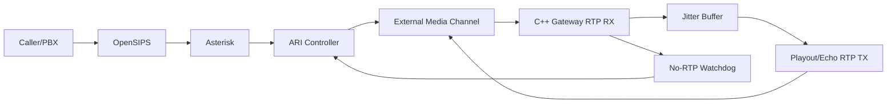

# Day 6 Execution Plan: C++ Media Resilience (No-RTP Timeout + Jitter Buffer + Session State Machine)

Date: 2026-03-03  
Plan authority: `telephony/docs/phase_3/19_talk_lee_frozen_integration_plan.md`  
Day scope: Day 6 only (media resilience gate on top of Day 5)

---

## 1) Objective

Deliver a production-safe Day 6 media layer for `services/voice-gateway-cpp` that adds:
1. Deterministic no-RTP timeout behavior with explicit reason codes.
2. A basic, bounded jitter buffer suitable for PCMU/20ms call traffic.
3. A per-call lifecycle state machine with strict transition and cleanup rules.

Mandatory Day 6 outcomes:
1. Media faults (loss, silence, reordering bursts) end sessions cleanly or degrade predictably.
2. No leaked sessions/channels/bridges after normal or fault teardown.
3. No unbounded queue/buffer growth in the C++ gateway.

---

## 2) Scope and Non-Scope

In scope:
1. C++ gateway resilience logic for RTP receive/playout path.
2. ARI-to-gateway stop-reason propagation and idempotent cleanup alignment.
3. Day 6 verifier, fault injection scenarios, and evidence pack.

Out of scope (explicitly blocked for Day 6):
1. STT stream coupling and transcript generation (Day 7).
2. TTS playback and barge-in policy (Day 8).
3. Transfer control flows (Day 9).
4. Capacity/soak signoff gate (Day 10).

---

## 3) Official Reference Baseline (Authoritative + Proven OSS Patterns)

Source validation date: 2026-03-03

IETF/RFC:
1. RTP core + jitter estimator rules (RFC 3550, Section 6.4.1 and Appendix A.8):  
   https://datatracker.ietf.org/doc/html/rfc3550.html
2. RTP/AVP payload mapping (PT=0 is PCMU at 8 kHz):  
   https://datatracker.ietf.org/doc/html/rfc3551

Asterisk official docs:
1. ARI External Media behavior and `UNICASTRTP_LOCAL_*` channel variables:  
   https://docs.asterisk.org/Development/Reference-Information/Asterisk-Framework-and-API-Examples/External-Media-and-ARI/
2. ARI Channels REST API (`externalMedia`, `rtp_statistics`, channel variables):  
   https://docs.asterisk.org/Latest_API/API_Documentation/Asterisk_REST_Interface/Channels_REST_API/
3. `res_pjsip` endpoint RTP timeout controls (`rtp_keepalive`, `rtp_timeout`, `rtp_timeout_hold`):  
   https://docs.asterisk.org/Asterisk_20_Documentation/API_Documentation/Module_Configuration/res_pjsip/
4. Asterisk 22 endpoint field names for runtime visibility (`PJSIP_ENDPOINT`):  
   https://docs.asterisk.org/Asterisk_22_Documentation/API_Documentation/Dialplan_Functions/PJSIP_ENDPOINT/

Proven open-source media implementations (reference patterns, not copy/paste):
1. PJMEDIA jitter buffer behavior (adaptive prefetch, bounded discard policies):  
   https://docs.pjsip.org/en/2.14/specific-guides/audio/jitter_buffer.html
2. PJMEDIA jitter buffer API/discard strategy (`PJMEDIA_JB_DISCARD_PROGRESSIVE` etc.):  
   https://docs.pjsip.org/en/2.14/api/generated/pjmedia/group/group__PJMED__JBUF.html
3. aiortc jitter buffer ring strategy (power-of-two capacity, prefetch, misorder guard):  
   https://raw.githubusercontent.com/aiortc/aiortc/main/src/aiortc/jitterbuffer.py
4. Sipwise rtpengine timeout model (`timeout`, `silent-timeout`, `final-timeout`):  
   https://rtpengine.readthedocs.io/en/latest/rtpengine.html

---

## 4) Day 6 Design Principles

1. Keep media contract fixed to Day 5 baseline (`PCMU`, 8 kHz, 20 ms) while adding resilience.
2. Use bounded buffers and bounded timers everywhere; no unbounded memory growth paths.
3. Separate warning/degraded state from hard-stop state to improve observability.
4. Use reason-coded terminal states for every stop path (normal, timeout, internal error).
5. Make gateway timeouts primary, and keep Asterisk endpoint RTP timeouts as coarse failsafe.

---

## 5) Runtime Topology (Day 6)

Control ownership: ARI  
Resilience ownership: C++ gateway session runtime

---

## 6) Day 6 Feature Set

### 6.1 No-RTP Timeout Policy

Baseline policy (Day 6 defaults):
1. `startup_no_rtp_timeout_ms=5000` (session started but no first RTP packet).
2. `active_no_rtp_timeout_ms=8000` (session previously active, now no incoming RTP).
3. `hold_no_rtp_timeout_ms=45000` (hold/silent path tolerance window).
4. `session_final_timeout_ms=7200000` (hard max session lifetime).
5. `watchdog_tick_ms=200`.

Terminal timeout reasons:
1. `start_timeout`
2. `no_rtp_timeout`
3. `no_rtp_timeout_hold`
4. `final_timeout`

Recommended Asterisk fallback alignment (coarser than gateway):
1. `rtp_timeout` > gateway active timeout.
2. `rtp_timeout_hold` > gateway hold timeout.
3. `rtp_keepalive` only if NAT behavior needs it; avoid masking real no-RTP faults.

### 6.2 Basic Jitter Buffer Policy

PCMU frame baseline:
1. 20 ms packets.
2. 160 samples/packet at 8 kHz.
3. 160-byte payload per packet.

Day 6 jitter buffer defaults:
1. Ring capacity: `64` frames (power-of-two).
2. Prefetch: `3` frames before normal playout.
3. Target playout depth: `4-6` frames.
4. Overflow handling: progressive drop toward target depth with bounded drop rate.
5. Misorder guard: packets far outside the active window trigger controlled reset, not unbounded waiting.
6. Duplicate/too-old packets are dropped and counted.

Jitter estimation:
1. Track interarrival jitter using RFC 3550 Section 6.4.1 formula.
2. Keep jitter metrics in RTP timestamp units and export ms-normalized view in stats.

### 6.3 Per-Call State Machine

Canonical session states:
1. `created`
2. `starting`
3. `buffering`
4. `active`
5. `degraded`
6. `stopping`
7. `stopped`
8. `failed`

Transition rules:
1. `created -> starting` on successful `StartSession`.
2. `starting -> buffering` on first valid RTP packet.
3. `buffering -> active` when prefetch threshold is met.
4. `active -> degraded` when no-RTP warning threshold is crossed.
5. `degraded -> active` if RTP resumes before hard timeout.
6. `active/degraded -> stopping -> stopped` on hangup/cleanup/timeout.
7. Any internal unrecoverable error goes to `failed`, then deterministic cleanup to `stopped`.

---

## 7) API and Config Contract Changes (Day 6)

`POST /v1/sessions/start` additions:
1. `startup_no_rtp_timeout_ms` (optional, defaulted).
2. `active_no_rtp_timeout_ms` (optional, defaulted).
3. `hold_no_rtp_timeout_ms` (optional, defaulted).
4. `session_final_timeout_ms` (optional, defaulted).
5. `jitter_buffer_enabled` (default `true`).
6. `jitter_buffer_capacity_frames` (default `64`).
7. `jitter_buffer_prefetch_frames` (default `3`).

Stats additions (`/v1/sessions/{session_id}/stats`, `/stats`):
1. `state`
2. `stop_reason`
3. `rx_interarrival_jitter_ts_units`
4. `rx_interarrival_jitter_ms`
5. `jitter_buffer_depth_frames`
6. `jitter_buffer_overflow_drops`
7. `jitter_buffer_late_drops`
8. `duplicate_packets`
9. `out_of_order_packets`
10. `timeout_events_total`

---

## 8) Reason-Code Contract (Gateway <-> ARI Controller)

Required stop reasons exposed by gateway:
1. `hangup`
2. `ari_cleanup`
3. `start_timeout`
4. `no_rtp_timeout`
5. `no_rtp_timeout_hold`
6. `final_timeout`
7. `socket_error`
8. `internal_error`

Controller invariants:
1. `StopSession` remains idempotent.
2. ARI must still attempt channel/bridge teardown even if gateway stop RPC fails.
3. Every session end emits exactly one terminal reason in evidence logs.

---

## 9) Planned Implementation Steps (Day 6)

Step 1: Extend session model
1. Add explicit state enum and transition guard helpers.
2. Add timeout/jitter config fields to `SessionConfig`.

Step 2: Implement bounded jitter buffer
1. Add per-session packet buffer structure with power-of-two ring behavior.
2. Add prefetch gate, reorder window checks, and bounded discard policy.

Step 3: Add no-RTP watchdog
1. Add periodic watchdog loop using monotonic time.
2. Trigger state transitions and stop reasons on timeout expiry.

Step 4: Wire metrics and reason codes
1. Extend per-session and process snapshots with Day 6 counters.
2. Expose new metrics on existing stats endpoints.

Step 5: ARI controller alignment
1. Map timeout reasons into controller logs and cleanup logic.
2. Keep cleanup idempotent when timeout races with BYE.

Step 6: Day 6 verifier and evidence
1. Add `telephony/scripts/verify_day6_media_resilience.sh`.
2. Add a fault-injection probe for RTP loss/jitter/silence windows.

---

## 10) Fault Injection and Verification Plan

Mandatory scenarios:
1. `RTP Stop`: cut RTP ingress mid-call; expect `no_rtp_timeout` and clean teardown.
2. `Startup Silence`: create call with no RTP ingress; expect `start_timeout`.
3. `Hold Silence`: hold/inactive stream beyond hold threshold; expect `no_rtp_timeout_hold`.
4. `Burst Reorder/Loss`: inject reorder and loss bursts; call remains stable or degrades without leak.
5. `Queue Pressure`: sustained burst above target depth; bounded drops with stable memory.

Regression guard:
1. Day 4 and Day 5 verifiers must still pass unchanged after Day 6 merge.

---

## 11) Acceptance Criteria (Day 6 Complete)

Day 6 is complete only when all pass:
1. All Day 6 fault scenarios terminate with expected reason code.
2. `active_sessions` returns to `0` after each scenario run.
3. No orphan ARI external media channels remain after verifier completion.
4. Jitter buffer depth stays bounded (no unbounded growth pattern).
5. Memory trend remains bounded across repeated fault runs.
6. Evidence artifacts are stored under `telephony/docs/phase_3/evidence/day6/`.
7. Single verifier script returns deterministic pass/fail.

If any condition fails:
1. Day 6 remains open.
2. Day 7 is blocked.

---

## 12) Evidence Pack Requirements

Required artifacts:
1. `telephony/docs/phase_3/evidence/day6/day6_verifier_output.txt`
2. `telephony/docs/phase_3/evidence/day6/day6_fault_injection_results.json`
3. `telephony/docs/phase_3/evidence/day6/day6_timeout_reason_summary.json`
4. `telephony/docs/phase_3/evidence/day6/day6_jitter_buffer_metrics.json`
5. `telephony/docs/phase_3/evidence/day6/day6_gateway_runtime.log`
6. `telephony/docs/phase_3/evidence/day6/day6_ari_event_trace.log`
7. `telephony/docs/phase_3/evidence/day6/day6_memory_profile.txt`
8. `telephony/docs/phase_3/day6_media_resilience_evidence.md`

Verifier target:
1. `telephony/scripts/verify_day6_media_resilience.sh`

---

## 13) Risk Controls and Rollback

Risks addressed:
1. Silent media sessions persisting indefinitely.
2. Latency growth due to unchecked jitter queue expansion.
3. Ambiguous stop causes across ARI and gateway layers.

Controls:
1. Bounded timers plus bounded buffers in all session code paths.
2. Strict state transitions and single terminal reason enforcement.
3. Coarse Asterisk RTP timeout fallback kept above gateway thresholds.

Rollback policy:
1. If Day 6 gate fails, revert runtime operation to Day 5 behavior (external media echo path without Day 6 coupling changes).
2. Do not begin Day 7 until Day 6 evidence is complete and signed off.

---

## 14) Day 6 Deliverables Checklist

1. C++ no-RTP watchdog and timeout reason codes.
2. C++ bounded jitter buffer implementation with telemetry.
3. Per-call state machine with deterministic transitions.
4. Day 6 verifier script + fault-injection probe.
5. Day 6 evidence report and acceptance verdict.

---

## 15) Execution Decision

This is the approved Day 6 implementation baseline.

No non-official guidance may override the references in this document. Any deviation requires explicit update to this file and to the frozen plan.
