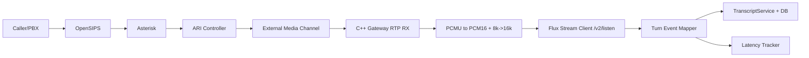

# Day 7 Execution Plan: STT Streaming (PCMU -> PCM16 + Transcript Contract)

Date: 2026-03-03  
Plan authority: `telephony/docs/phase_3/19_talk_lee_frozen_integration_plan.md`  
Day scope: Day 7 only (STT streaming gate on top of Day 6)

---

## 1) Objective

Deliver a production-safe Day 7 STT path for the frozen telephony runtime:

`OpenSIPS -> Asterisk -> ARI External Media -> C++ Gateway -> STT Provider (Deepgram Flux) -> Transcript Store`

Mandatory Day 7 outcomes:
1. Deterministic `PCMU (8 kHz)` to `PCM16 (16 kHz)` conversion path with bounded buffering.
2. Transcript records are persisted per call with strict `talklee_call_id` binding.
3. p95 STT latency is captured and stable across repeated batch runs.
4. Day 5/Day 6 call and cleanup behavior remains regression-safe.

---

## 2) Scope and Non-Scope

In scope:
1. Day 7 media-to-STT coupling on top of the Day 6 gateway baseline.
2. PCMU decode + resample contract for Deepgram Flux input (`/v2/listen`).
3. Flux turn-event handling (`Update`, `StartOfTurn`, `EagerEndOfTurn`, `TurnResumed`, `EndOfTurn`).
4. Transcript persistence contract (`calls.transcript`, `calls.transcript_json`, `transcripts` table) tied to `talklee_call_id`.
5. Day 7 verifier, batch-call evidence, and latency stability report.

Out of scope (explicitly blocked for Day 7):
1. TTS playback and barge-in policy closure (Day 8 gate).
2. Transfer control flows and tenant runtime controls (Day 9 gate).
3. Concurrency/soak signoff (Day 10 gate).

---

## 3) Official Reference Baseline (Authoritative + Proven OSS Patterns)

Source validation date: 2026-03-03

IETF/RFC:
1. RTP core behavior and timing model (RTP timestamps, jitter semantics):  
   https://datatracker.ietf.org/doc/html/rfc3550
2. RTP payload profile (`PT=0` is `PCMU` at 8 kHz, mono):  
   https://datatracker.ietf.org/doc/html/rfc3551

Asterisk official docs:
1. ARI External Media contract and `UNICASTRTP_LOCAL_*` behavior:  
   https://docs.asterisk.org/Development/Reference-Information/Asterisk-Framework-and-API-Examples/External-Media-and-ARI/
2. ARI Channels API (`/channels/externalMedia`, `/channels/{id}/variable`, `/channels/{id}/rtp_statistics`):  
   https://docs.asterisk.org/Latest_API/API_Documentation/Asterisk_REST_Interface/Channels_REST_API/

Deepgram official docs (Flux):
1. Flux quickstart and `/v2/listen` connection requirements:  
   https://developers.deepgram.com/docs/flux/quickstart
2. End-of-turn parameters and validation constraints:  
   https://developers.deepgram.com/docs/flux/configuration
3. Flux state machine event semantics:  
   https://developers.deepgram.com/docs/flux/state
4. Flux control message: `Configure`:  
   https://developers.deepgram.com/docs/flux/configure
5. Flux control message: `CloseStream`:  
   https://developers.deepgram.com/docs/flux/close-stream

Python/backend runtime references:
1. FastAPI WebSocket lifecycle behavior (`accept`, receive loop, disconnect handling):  
   https://fastapi.tiangolo.com/advanced/websockets/
2. `websockets` keepalive/heartbeat (`ping_interval`, `ping_timeout`) guidance:  
   https://websockets.readthedocs.io/en/stable/topics/keepalive.html
3. `audioop` deprecation/removal schedule (avoid new dependencies on deprecated stdlib path):  
   https://peps.python.org/pep-0594/#audioop

Proven open-source implementation patterns (reference only, no copy/paste):
1. Asterisk official external media transcription sample:  
   https://github.com/asterisk/asterisk-external-media
2. LiveKit Agents Deepgram STT integration (`STTv2` for Flux `/v2/listen`):  
   https://docs.livekit.io/agents/models/stt/deepgram/
3. Pipecat Deepgram/Flux STT service patterns (turn events, finalize, stream lifecycle):  
   https://docs.pipecat.ai/server/services/stt/deepgram

---

## 4) Day 7 Design Principles

1. Keep signaling/media ingress unchanged from Day 5/Day 6 (`ARI externalMedia`, `PCMU`, 20 ms packets).
2. Normalize audio exactly once at STT boundary:
   - `PCMU 8 kHz` -> `PCM16 8 kHz` -> `PCM16 16 kHz` -> Flux.
3. Use Flux simple mode first (EndOfTurn-focused) for deterministic baseline; treat eager mode as explicit opt-in.
4. Preserve bounded memory behavior end-to-end (bounded queues, explicit drop policy, explicit counters).
5. Persist transcripts only through canonical transcript services and DB schema paths already in repo.
6. Enforce strict call correlation: every persisted transcript turn is traceable by `call_id` and `talklee_call_id`.
7. No workaround routes:
   - no bypassing externalMedia path;
   - no offline transcript reconstruction from logs/pcap;
   - no undocumented STT connection parameters.

---

## 5) Runtime Topology (Day 7)

Call-control ownership: ARI  
Media resilience ownership: C++ gateway (Day 6 baseline)  
STT/transcript ownership: backend voice pipeline services

---

## 6) Day 7 STT and Transcript Contract

### 6.1 Audio Contract

Ingress (frozen):
1. RTP payload type `0` (`PCMU`) at `8000 Hz`.
2. Packetization target `20 ms` (`160` samples / packet).

STT provider input contract:
1. Flux endpoint: `wss://api.deepgram.com/v2/listen`.
2. Model: `flux-general-en`.
3. Encoding: `linear16`.
4. Sample rate: `16000`.
5. Stream chunk target: `~80 ms` (`2560` bytes at mono 16-bit 16 kHz).

### 6.2 Flux Event Contract

Day 7 default mode:
1. `eot_threshold=0.7`
2. `eot_timeout_ms=5000`
3. `eager_eot_threshold` unset by default

Required event handling:
1. `Update`: optional partial transcript updates.
2. `StartOfTurn`: start-of-user-speech marker (tracked, no Day 8 interruption policy yet).
3. `EndOfTurn`: terminal user-turn event for Day 7 transcript persistence gate.
4. If eager mode enabled later, `EagerEndOfTurn` and `TurnResumed` must be handled as a pair.

### 6.3 Transcript Record Contract (`talklee_call_id` Binding)

Every persisted user-turn transcript must include:
1. `call_id` (internal immutable call UUID)
2. `talklee_call_id` (human-friendly `tlk_<hex>` contract key)
3. `turn_index`
4. `event_type` (`update`, `end_of_turn`, optional eager/resumed markers)
5. `text`
6. `is_final`
7. `confidence` (if provided by provider)
8. `audio_window_start` / `audio_window_end` (if provided)
9. `created_at`

Persistence targets (existing schema, no workaround tables):
1. `calls.transcript`
2. `calls.transcript_json`
3. `transcripts.turns` and derived word/turn counters

### 6.4 STT Failure/Stop Reason Contract

Day 7 stop/failure reasons (minimum set):
1. `stt_stream_closed`
2. `stt_provider_error`
3. `stt_auth_error`
4. `stt_backpressure_drop_threshold`
5. `stt_internal_error`

Rules:
1. Reason must be deterministic and emitted exactly once for terminal STT session failure.
2. Call teardown must remain idempotent when STT failure races with channel hangup.

---

## 7) API and Config Contract Changes (Day 7)

Gateway/session start contract additions (Day 7):
1. `stt_enabled` (bool, default `true` for Day 7 test route).
2. `stt_target_sample_rate_hz` (default `16000`).
3. `stt_chunk_ms` (default `80`).
4. `stt_max_queue_frames` (bounded, default Day 7 value to be enforced).

Backend STT config defaults (Flux):
1. `model=flux-general-en`
2. `encoding=linear16`
3. `sample_rate=16000`
4. `eot_threshold=0.7`
5. `eot_timeout_ms=5000`
6. `eager_eot_threshold` disabled by default

Metrics additions (minimum):
1. `stt_frames_in_total`
2. `stt_frames_dropped_total`
3. `stt_stream_reconnect_total`
4. `stt_first_transcript_ms` (per turn)
5. `stt_turn_finalize_ms` (per turn)
6. `transcript_turns_persisted_total`

---

## 8) Planned Implementation Steps (Day 7)

Step 1: Freeze Day 7 media-to-STT boundary
1. Confirm Day 6 verifier remains green before changes.
2. Pin Day 7 stream contract to `PCMU 8k -> PCM16 16k`.
3. Add explicit validation errors for unsupported codec/rate combinations.

Step 2: Implement deterministic conversion and framing path
1. Decode `PCMU` to PCM16 using project-owned codec helpers.
2. Resample `8k -> 16k` with deterministic, bounded processing.
3. Frame and emit 80 ms chunks to STT stream queue.

Step 3: Wire Flux streaming session manager
1. Use `/v2/listen` with Flux-required model and params.
2. Process `TurnInfo` events into internal transcript events.
3. Use protocol keepalive/heartbeat settings and explicit `CloseStream` on call end.

Step 4: Bind transcript persistence to call identity
1. Ensure `call_id` + `talklee_call_id` are attached to each persisted transcript turn.
2. Flush transcript increments during call and finalize on teardown.
3. Add integrity checks that reject transcript writes missing either ID.

Step 5: Add latency instrumentation and stability reporting
1. Capture per-turn first-transcript and final-turn latency.
2. Export batch p50/p95/p99 summary.
3. Persist machine-readable latency report under Day 7 evidence.

Step 6: Add Day 7 verifier and probe
1. Add `telephony/scripts/day7_stt_stream_probe.py`.
2. Add `telephony/scripts/verify_day7_stt_streaming.sh`.
3. Produce deterministic pass/fail with artifact generation.

Step 7: Regression guard
1. Re-run Day 5 and Day 6 verifiers unchanged.
2. Day 7 gate is blocked if cleanup/session invariants regress.

---

## 9) Test and Verification Plan

Mandatory Day 7 scenarios:
1. `Batch Speech`: N-call batch with scripted speech; each call must produce final transcript rows.
2. `Silence Window`: call with no meaningful speech; no false final transcript noise, clean close.
3. `Loss/Reorder Stress`: reuse Day 6 fault profile with STT enabled; no unbounded queue growth.
4. `Provider Disconnect`: force STT stream close; deterministic reason code and clean call teardown.
5. `Identity Audit`: verify one-to-one mapping of transcript entries to `call_id` + `talklee_call_id`.

Latency stability method:
1. Run at least 3 identical Day 7 batches.
2. Capture per-run p95 `stt_first_transcript_ms`.
3. Mark stable when p95 spread is within agreed tolerance (`<= 20%` run-to-run drift) and no monotonic degradation pattern.

Regression requirement:
1. Day 5 and Day 6 verifiers remain pass after Day 7 merge.

---

## 10) Acceptance Criteria (Day 7 Complete)

Day 7 is complete only when all pass:
1. Transcript output exists for every speech call in batch verification.
2. Every transcript record is linked to both `call_id` and `talklee_call_id`.
3. STT latency summary is captured and marked stable per Day 7 method.
4. No leaked active sessions/channels/bridges after verifier completion.
5. STT queues remain bounded (no unbounded growth signatures).
6. Day 7 evidence artifacts are present under `telephony/docs/phase_3/evidence/day7/`.
7. Day 7 verifier returns deterministic pass/fail.

If any condition fails:
1. Day 7 remains open.
2. Day 8 is blocked.

---

## 11) Evidence Pack Requirements

Required artifacts:
1. `telephony/docs/phase_3/evidence/day7/day7_verifier_output.txt`
2. `telephony/docs/phase_3/evidence/day7/day7_batch_call_results.json`
3. `telephony/docs/phase_3/evidence/day7/day7_transcript_integrity_report.json`
4. `telephony/docs/phase_3/evidence/day7/day7_stt_latency_summary.json`
5. `telephony/docs/phase_3/evidence/day7/day7_deepgram_stream_trace.log`
6. `telephony/docs/phase_3/evidence/day7/day7_gateway_runtime.log`
7. `telephony/docs/phase_3/evidence/day7/day7_ari_event_trace.log`
8. `telephony/docs/phase_3/day7_stt_streaming_evidence.md`

Verifier targets:
1. `telephony/scripts/verify_day7_stt_streaming.sh`
2. `telephony/scripts/day7_stt_stream_probe.py`

---

## 12) Risk Controls and Rollback

Risks addressed:
1. Transcript drift/unreliable turn-finalization under jitter and packet disorder.
2. STT latency growth caused by queue pressure or reconnect loops.
3. Identity mismatch between transcript rows and telephony call records.

Controls:
1. Bounded queue and explicit drop counters in STT ingress path.
2. Flux simple-mode baseline first; eager mode only after explicit enablement.
3. Strict persistence validation for `call_id` + `talklee_call_id`.
4. Protocol keepalive + deterministic close behavior (`CloseStream` at teardown).

Rollback policy:
1. If Day 7 gate fails, return runtime operation to Day 6 behavior (media resilience + echo path, no Day 7 STT coupling).
2. Do not begin Day 8 until Day 7 evidence is complete and signed off.

---

## 13) Day 7 Deliverables Checklist

1. PCMU->PCM16 conversion and 8k->16k STT framing path.
2. Flux streaming session integration with deterministic event handling.
3. Transcript persistence path with strict `talklee_call_id` correlation.
4. STT latency capture and stability evidence.
5. Day 7 verifier + probe scripts and acceptance report.

---

## 14) Execution Decision

This is the approved Day 7 implementation baseline.

No non-official guidance may override the references in this document. Any deviation requires explicit update to this file and to the frozen plan.
