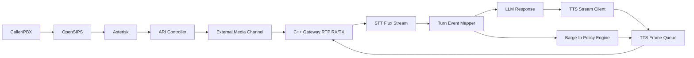

# Day 8 Execution Plan: TTS + Barge-In (Paced RTP Playback + Deterministic Interruption Policy)

Date: 2026-03-03  
Plan authority: `telephony/docs/phase_3/19_talk_lee_frozen_integration_plan.md`  
Day scope: Day 8 only (TTS + barge-in gate on top of Day 7)

---

## 1) Objective

Deliver a production-safe Day 8 audible response loop for the frozen telephony runtime:

`OpenSIPS -> Asterisk -> ARI External Media -> C++ Gateway -> AI Pipeline (LLM + TTS) -> C++ Gateway -> Caller`

Mandatory Day 8 outcomes:
1. Deterministic TTS synthesis and paced RTP playback on the Day 5/6/7 media path.
2. Deterministic barge-in interruption policy (speech and DTMF) with explicit stop reasons.
3. Prompt/fallback v1 behavior documented and enforced by verifier scenarios.
4. Day 5/6/7 cleanup and latency stability behavior remains regression-safe.

---

## 2) Scope and Non-Scope

In scope:
1. Day 8 TTS playback on the same externalMedia + C++ gateway path used in Day 7.
2. Barge-in handling policy driven by Flux turn events with explicit fallback triggers.
3. Day 8 verifier, controlled interruption tests, and evidence pack.
4. Day 8 metrics for playback quality and interruption reaction timing.

Out of scope (explicitly blocked for Day 8):
1. Transfer control flows and tenant policy controls (Day 9 gate).
2. Concurrency/soak production sign-off (Day 10 gate).
3. Architecture changes that bypass the frozen path (no direct alternate media owner).

---

## 3) Official Reference Baseline (Authoritative + Proven OSS Patterns)

Source validation date: 2026-03-03

IETF/RFC:
1. RTP core timing and sequence model:  
   https://datatracker.ietf.org/doc/html/rfc3550
2. RTP payload profile (`PT=0` for PCMU, 8 kHz):  
   https://datatracker.ietf.org/doc/html/rfc3551
3. RTP telephony events (DTMF event signaling):  
   https://www.rfc-editor.org/rfc/rfc4733

Asterisk official docs:
1. ARI External Media and injection path (`UNICASTRTP_LOCAL_ADDRESS` / `UNICASTRTP_LOCAL_PORT`):  
   https://docs.asterisk.org/Development/Reference-Information/Asterisk-Framework-and-API-Examples/External-Media-and-ARI/
2. ARI Channels API (`/channels/externalMedia`, channel variables, channel control):  
   https://docs.asterisk.org/Latest_API/API_Documentation/Asterisk_REST_Interface/Channels_REST_API/
3. ARI Playbacks API (playback resource control and deterministic stop):  
   https://docs.asterisk.org/Asterisk_20_Documentation/API_Documentation/Asterisk_REST_Interface/Playbacks_REST_API/
4. TALK_DETECT dialplan function (speech activity notifications available to ARI/AMI listeners):  
   https://docs.asterisk.org/Asterisk_22_Documentation/API_Documentation/Dialplan_Functions/TALK_DETECT/
5. ARI media manipulation reference (`POST /channels/{channelId}/play` behavior):  
   https://docs.asterisk.org/Configuration/Interfaces/Asterisk-REST-Interface-ARI/Introduction-to-ARI-and-Channels/ARI-and-Channels-Simple-Media-Manipulation/

Deepgram official docs (STT + TTS):
1. Flux quickstart (`/v2/listen`, turn-event model):  
   https://developers.deepgram.com/docs/flux/quickstart
2. Flux end-of-turn parameter tuning (`eot_threshold`, `eager_eot_threshold`, `eot_timeout_ms`):  
   https://developers.deepgram.com/docs/flux/configuration
3. Flux `CloseStream` control message and terminal event behavior:  
   https://developers.deepgram.com/docs/flux/close-stream
4. Streaming TTS WebSocket (`/v1/speak`) with `Flush`/`Close`:  
   https://developers.deepgram.com/reference/text-to-speech/speak-streaming
5. TTS media output settings (`linear16`, `mulaw`, sample-rate combinations):  
   https://developers.deepgram.com/docs/tts-media-output-settings

Cartesia official docs:
1. TTS WebSocket API (generation + cancel context):  
   https://docs.cartesia.ai/api-reference/tts/websocket
2. WebSocket context cancellation semantics (barge-in-aligned control):  
   https://docs.cartesia.ai/api-reference/tts/working-with-web-sockets/contexts
3. TTS bytes API output formats (raw + telephony-relevant encodings):  
   https://docs.cartesia.ai/api-reference/tts/bytes

WebSocket runtime behavior:
1. Python `websockets` keepalive/heartbeat tuning for long-lived media streams:  
   https://websockets.readthedocs.io/en/13.0/topics/keepalive.html
2. FastAPI WebSocket disconnect handling:  
   https://fastapi.tiangolo.com/advanced/websockets/

Proven open-source implementation patterns (reference only, no copy/paste):
1. Asterisk official external-media sample app:  
   https://github.com/asterisk/asterisk-external-media
2. Asterisk ARI examples (playback, DTMF, channel control):  
   https://github.com/asterisk/ari-examples
3. Pipecat interruption strategy framework (speech interruption policy patterns):  
   https://github.com/pipecat-ai/pipecat  
   https://docs.pipecat.ai/server/utilities/turn-management/interruption-strategies
4. LiveKit interruption model and explicit `interrupt()` control semantics:  
   https://github.com/livekit/agents  
   https://docs.livekit.io/agents/v1/build/turn-detection/configuration

---

## 4) Day 8 Design Principles

1. Keep one active production path only: `OpenSIPS -> Asterisk -> C++ gateway -> AI`.
2. Keep codec baseline fixed to `PCMU/8k/20ms` for transport determinism.
3. Pace all TTS RTP egress at 20 ms cadence (no burst send to socket).
4. Barge-in behavior must be deterministic and reason-coded, never implicit.
5. Interruption path must be idempotent (safe if triggered twice).
6. Keep queues bounded and observable (no unbounded playback backlog).
7. No workaround routing:
   - no bypass path that skips C++ media owner;
   - no ad-hoc direct playback path as Day 8 primary flow;
   - no undocumented provider parameters.

---

## 5) Runtime Topology (Day 8)

Control ownership: ARI controller  
Media ownership: C++ gateway session runtime  
Barge-in decision ownership: Day 8 policy engine (Flux-first, deterministic fallback)

---

## 6) Day 8 TTS + Barge-In Contract

### 6.1 TTS Output and RTP Playback Contract

Transport target (frozen):
1. RTP payload type `0` (`PCMU`) at `8000 Hz`.
2. Packetization target `20 ms` (`160` samples / `160` bytes payload).

Provider output policy:
1. Preferred: provider emits telephony-compatible raw output (`mulaw/8000`) directly.
2. Allowed fallback: provider emits linear PCM; convert/resample once before RTP packetization.
3. Playback queue stores bounded frame units (`20 ms` each), not arbitrary byte blobs.

Playback invariants:
1. Sequence and timestamp continuity preserved during normal playback.
2. On interruption, queue flush happens before next user-turn processing.
3. End-of-playback emits one terminal reason code exactly once.

### 6.2 Barge-In Trigger and Action Contract

Primary trigger:
1. Flux turn event `StartOfTurn` while `tts_active=true`.

Secondary triggers (explicit fallback):
1. DTMF interruption event (RFC 4733 path).
2. Optional Asterisk `TALK_DETECT` event when enabled for specific routes.

Interruption actions (strict order):
1. Mark playback state as `interrupting`.
2. Stop provider generation stream/context (`cancel`/`close` semantics).
3. Flush pending playback frames.
4. Emit terminal `tts_stop_reason`.
5. Return session to listening state.

### 6.3 Prompt/Fallback v1 Contract

Prompt policy:
1. Keep assistant responses short and speech-safe (no markdown/control artifacts).
2. Limit sentence count per turn before TTS generation.

Fallback policy:
1. If provider stream fails before first audio chunk, emit `tts_provider_error` and retry once per turn.
2. If retry fails, emit deterministic fallback text path for next turn (no silent hang).
3. All fallback decisions are logged with `call_id` + `talklee_call_id`.

### 6.4 Day 8 Stop Reason Contract

Minimum terminal reason set:
1. `tts_complete`
2. `barge_in_start_of_turn`
3. `barge_in_dtmf`
4. `barge_in_talk_detect`
5. `tts_provider_error`
6. `tts_timeout`
7. `call_hangup`
8. `internal_error`

Rules:
1. Exactly one terminal reason per TTS segment.
2. Terminal reason must survive race conditions (hangup vs barge-in vs provider error).

---

## 7) API and Config Contract Changes (Day 8)

Gateway/session config additions:
1. `tts_enabled` (bool, default `true` for Day 8 route).
2. `tts_chunk_ms` (default `20`).
3. `tts_max_queue_frames` (bounded queue cap).
4. `barge_in_enabled` (bool, default `true`).
5. `barge_in_min_speech_ms` (debounce threshold for false interruptions).
6. `barge_in_sources` (ordered list: `flux_start_of_turn`, `dtmf`, `talk_detect`).

Day 8 metrics additions (minimum):
1. `tts_segments_started_total`
2. `tts_segments_completed_total`
3. `tts_segments_interrupted_total`
4. `tts_first_chunk_ms`
5. `tts_playback_duration_ms`
6. `barge_in_reaction_ms`
7. `barge_in_false_positive_total`
8. `tts_frames_queued`
9. `tts_frames_dropped_total`

---

## 8) Planned Implementation Steps (Day 8)

Step 1: Freeze Day 8 media contract
1. Confirm Day 7 verifier remains green before Day 8 changes.
2. Pin playback target to `PCMU/8k/20ms` across all Day 8 tests.

Step 2: Add deterministic TTS playback engine
1. Add bounded TTS frame queue and paced RTP egress in gateway session runtime.
2. Enforce one-way conversion path (provider output -> transport format).
3. Add first-chunk timing and playback-complete metrics.

Step 3: Add barge-in policy manager
1. Wire Flux `StartOfTurn` as primary interrupt signal.
2. Add DTMF interrupt path.
3. Add optional `TALK_DETECT` integration toggle.
4. Implement idempotent stop/flush on interruption.

Step 4: Add prompt/fallback v1 controls
1. Normalize assistant text pre-TTS.
2. Add bounded retry and deterministic fallback branch.
3. Ensure every fallback event is reason-coded and observable.

Step 5: Add verifier and probe
1. Add `telephony/scripts/day8_tts_bargein_probe.py`.
2. Add `telephony/scripts/verify_day8_tts_bargein.sh`.
3. Store evidence under `telephony/docs/phase_3/evidence/day8/`.

Step 6: Regression guard
1. Re-run Day 6 and Day 7 verifiers unchanged after Day 8 merge.
2. Block Day 9 if cleanup, transcript binding, or latency regresses.

---

## 9) Test and Verification Plan

Mandatory Day 8 scenarios:
1. `Baseline Playback`: repeated calls; each call must produce audible TTS playback with expected RTP egress.
2. `Speech Barge-In`: inject user speech mid-TTS; playback stops and listening resumes cleanly.
3. `DTMF Barge-In`: send DTMF during TTS; playback interruption path fires with DTMF reason.
4. `False Interruption Control`: short backchannel/noise should not exceed false-interrupt threshold.
5. `Provider Failure`: force provider stream error; deterministic fallback and clean call continuation/termination.
6. `Hangup During TTS`: caller hangs up mid-playback; no leaked sessions/channels.

Reaction-time method:
1. Capture `barge_in_trigger_ts` and `tts_last_packet_tx_ts`.
2. Compute per-event `barge_in_reaction_ms`.
3. Gate target: `p95 barge_in_reaction_ms <= 250`.

Regression requirement:
1. Day 6 and Day 7 verifiers remain pass after Day 8 merge.

---

## 10) Acceptance Criteria (Day 8 Complete)

Day 8 is complete only when all pass:
1. Controlled batch calls produce consistent audible TTS playback on the frozen path.
2. Barge-in controlled tests pass with deterministic stop reasons.
3. `p95 barge_in_reaction_ms <= 250` in verifier output.
4. TTS queue remains bounded (no unbounded growth signatures).
5. No leaked active sessions/channels/bridges after verifier completion.
6. Day 8 evidence artifacts exist under `telephony/docs/phase_3/evidence/day8/`.
7. Day 8 verifier returns deterministic pass/fail.

If any condition fails:
1. Day 8 remains open.
2. Day 9 is blocked.

---

## 11) Planned Day 8 Evidence Artifacts

1. `telephony/docs/phase_3/evidence/day8/day8_batch_tts_results.json`
2. `telephony/docs/phase_3/evidence/day8/day8_barge_in_reaction_summary.json`
3. `telephony/docs/phase_3/evidence/day8/day8_tts_playback_trace.log`
4. `telephony/docs/phase_3/evidence/day8/day8_tts_stop_reason_summary.json`
5. `telephony/docs/phase_3/evidence/day8/day8_gateway_runtime.log`
6. `telephony/docs/phase_3/evidence/day8/day8_ari_event_trace.log`
7. `telephony/docs/phase_3/evidence/day8/day8_verifier_output.txt`
8. `telephony/docs/phase_3/day8_tts_bargein_evidence.md`
