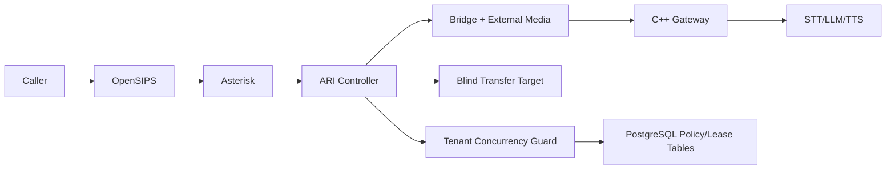

# Day 9 Execution Plan: Blind Transfer v1 + Tenant Concurrency Controls

Date: 2026-03-03  
Plan authority: `telephony/docs/phase_3/19_talk_lee_frozen_integration_plan.md`  
Day scope: Day 9 only (transfer + tenant control gate on top of Day 8)

---

## 1) Objective

Deliver a production-safe Day 9 transfer and tenant control layer for the frozen telephony runtime:

`OpenSIPS -> Asterisk -> ARI External Media -> C++ Gateway -> AI Pipeline`

Mandatory Day 9 outcomes:
1. Blind transfer flow v1 is deterministic and repeatable on the Asterisk-primary path.
2. Tenant concurrency control schema is enforced with transactional safety and tenant isolation.
3. Transfer lifecycle emits explicit reason codes and does not leak channels, bridges, or media sessions.
4. Day 8 TTS/barge-in behavior remains regression-safe for non-transfer turns.

---

## 2) Scope and Non-Scope

In scope:
1. Blind transfer flow v1 from active AI call leg to configured transfer target.
2. ARI controller transfer lifecycle and cleanup guarantees for external media resources.
3. Tenant concurrency control schema (policy, lease, event trail) with RLS alignment.
4. Day 9 verifier/probe and evidence pack for transfer success and ghost-session checks.

Out of scope (explicitly blocked for Day 9):
1. Attended transfer production rollout (can remain synthetic/legacy only).
2. New media paths that bypass the C++ gateway or bypass Asterisk as B2BUA.
3. Day 10 concurrency-soak and capacity sign-off targets.

---

## 3) Official Reference Baseline (Authoritative Only)

Source validation date: 2026-03-03

IETF/RFC:
1. SIP core protocol:  
   https://www.rfc-editor.org/rfc/rfc3261
2. SIP REFER method (transfer signaling primitive):  
   https://www.rfc-editor.org/rfc/rfc3515
3. SIP call-control transfer guidance and best current practice:  
   https://www.rfc-editor.org/rfc/rfc5589
4. SIP Replaces header (dialog replacement semantics):  
   https://www.rfc-editor.org/rfc/rfc3891

Asterisk official docs:
1. Feature-code call transfers (`blindxfer`, `atxfer`, `disconnect`) and transfer feature map:  
   https://docs.asterisk.org/Configuration/Features/Feature-Code-Call-Transfers/
2. Built-in dynamic features (Asterisk transfer feature behavior):  
   https://docs.asterisk.org/Configuration/Features/Built-in-Dynamic-Features/
3. ARI Channels REST API (`/channels/{channelId}/redirect`, `/continue`, `/transfer_progress`, `/externalMedia`):  
   https://docs.asterisk.org/Latest_API/API_Documentation/Asterisk_REST_Interface/Channels_REST_API/
4. ARI Bridges REST API (bridge membership and cleanup operations):  
   https://docs.asterisk.org/Latest_API/API_Documentation/Asterisk_REST_Interface/Bridges_REST_API/
5. ARI External Media behavior and unicast RTP channel variables:  
   https://docs.asterisk.org/Development/Reference-Information/Asterisk-Framework-and-API-Examples/External-Media-and-ARI/

PostgreSQL official docs:
1. Row-level security model and policy semantics:  
   https://www.postgresql.org/docs/current/ddl-rowsecurity.html
2. Advisory locks for application-defined concurrency control:  
   https://www.postgresql.org/docs/current/explicit-locking.html#ADVISORY-LOCKS
3. Advisory lock function set (`pg_advisory_lock`, `pg_advisory_xact_lock`, unlock APIs):  
   https://www.postgresql.org/docs/current/functions-admin.html#FUNCTIONS-ADVISORY-LOCKS
4. Transaction isolation behavior (`READ COMMITTED`, `REPEATABLE READ`, `SERIALIZABLE`):  
   https://www.postgresql.org/docs/current/transaction-iso.html

Redis official docs:
1. Atomic counters and `INCR` + `EXPIRE` rate-limit/counter pattern:  
   https://redis.io/docs/latest/commands/incr/

---

## 4) Day 9 Design Principles

1. Keep one production call path only; transfer logic is integrated into the same ARI externalMedia flow.
2. Keep transfer ownership in a single controller path; no split-brain transfer actors.
3. Enforce idempotent transfer operations so retries do not create duplicate legs.
4. Treat tenant concurrency as a hard safety gate, not a best-effort hint.
5. Use PostgreSQL as source of truth for concurrency leases; Redis remains optional fast-path telemetry.
6. Keep cleanup deterministic and reason-coded for every terminal transfer outcome.
7. No workaround routing or bypass behavior is allowed.

---

## 5) Runtime Topology (Day 9)

Control ownership: ARI controller  
Concurrency ownership: tenant runtime policy + lease service  
Media ownership (pre-transfer): C++ gateway session runtime

---

## 6) Day 9 Blind Transfer Contract

### 6.1 Trigger and Precheck Contract

1. Transfer request must contain `call_id`, `talklee_call_id`, `tenant_id`, and validated target identifier.
2. Transfer request must carry idempotency key semantics equal to existing telephony mutation paths.
3. Before transfer leg creation, concurrency guard must approve an additional transfer slot for that tenant.

### 6.2 ARI Transfer Flow v1 (Primary + Controlled Fallback)

Primary control flow:
1. Mark call state `transfer_pending`.
2. Stop/flush TTS playback and finalize STT turn capture for current interaction.
3. Emit transfer progress signal through ARI when applicable.
4. Execute `POST /channels/{channelId}/redirect` to transfer target endpoint.
5. Perform bridge/externalMedia cleanup sequence and release media session resources.

Controlled fallback flow (official ARI only):
1. If redirect is rejected by channel state or endpoint constraints, execute `POST /channels/{channelId}/continue` to dedicated transfer dialplan context.
2. Continue uses pre-declared Day 9 transfer context only, not ad-hoc dialplan branching.

### 6.3 Transfer Result Contract

Minimum Day 9 terminal result set:
1. `transfer_completed`
2. `transfer_busy`
3. `transfer_no_answer`
4. `transfer_unreachable`
5. `transfer_rejected_policy`
6. `transfer_failed_runtime`
7. `transfer_cancelled_hangup`

Rules:
1. Exactly one terminal transfer result per transfer attempt.
2. Transfer result must be linked to `call_id`, `talklee_call_id`, `tenant_id`, and attempt id.

### 6.4 Ghost-Session Prevention Contract

1. Transfer terminal path must call gateway `StopSession` idempotently.
2. External media channels created for AI leg must not remain active after transfer completion/failure.
3. ARI bridge count after verifier run must return to pre-run baseline.
4. Lease release must be guaranteed even when transfer and hangup race.

---

## 7) Tenant Concurrency Control Schema Contract

Day 9 schema additions (naming aligned to existing tenant telephony tables):
1. `tenant_telephony_concurrency_policies`
2. `tenant_telephony_concurrency_leases`
3. `tenant_telephony_concurrency_events`

Policy table minimum fields:
1. `tenant_id`
2. `policy_name`
3. `max_active_calls`
4. `max_transfer_inflight`
5. `lease_ttl_seconds`
6. `is_active`
7. `metadata`

Lease table minimum fields:
1. `tenant_id`
2. `call_id`
3. `talklee_call_id`
4. `lease_kind` (`call`, `transfer`)
5. `state` (`active`, `releasing`, `released`, `expired`)
6. `acquired_at`
7. `last_heartbeat_at`
8. `released_at`
9. `release_reason`

Event table minimum fields:
1. `tenant_id`
2. `policy_id`
3. `lease_id`
4. `event_type` (`acquire`, `reject`, `release`, `expire`)
5. `details`
6. `created_at`

Concurrency acquisition rule:
1. Start transaction.
2. Apply tenant RLS context.
3. Acquire tenant-scoped advisory transaction lock.
4. Count active leases for scope.
5. Insert lease only if under limit; otherwise reject deterministically.
6. Commit and emit event.

Isolation and tenant rules:
1. RLS must be enabled/forced on all Day 9 tables.
2. Policies must match existing `app.current_tenant_id` pattern already used in telephony policy tables.

---

## 8) API and Config Contract Changes (Day 9)

API contract additions:
1. Blind transfer request contract in telephony control API (tenant-scoped, idempotent).
2. Transfer attempt status endpoint with terminal result and timestamps.
3. Tenant concurrency status endpoint exposing active leases and limit state.

Session/runtime config additions:
1. `transfer_enabled` (bool)
2. `transfer_target_allowlist` (tenant-scoped patterns or explicit targets)
3. `tenant_max_active_calls` (resolved from Day 9 policy)
4. `tenant_max_transfer_inflight` (resolved from Day 9 policy)
5. `concurrency_lease_ttl_seconds`
6. `concurrency_heartbeat_interval_seconds`

Metrics additions (minimum):
1. `transfer_attempts_total`
2. `transfer_success_total`
3. `transfer_failure_total`
4. `transfer_duration_ms`
5. `transfer_cleanup_leak_total`
6. `tenant_concurrency_active_leases`
7. `tenant_concurrency_reject_total`
8. `tenant_concurrency_expire_total`

---

## 9) Planned Implementation Steps (Day 9)

Step 1: Freeze Day 9 transfer baseline
1. Keep Day 8 verifier green before introducing Day 9 changes.
2. Freeze blind transfer as Day 9 scope; attended remains out of scope.

Step 2: Implement transfer lifecycle in ARI controller path
1. Add transfer attempt state object with deterministic transition graph.
2. Wire ARI redirect primary path and continue fallback path.
3. Add terminal transfer reason mapping.

Step 3: Implement tenant concurrency schema and data access
1. Add migration for Day 9 policy/lease/event tables.
2. Add indexes and uniqueness constraints for active leases.
3. Add RLS enable/force + tenant policies in line with existing model.

Step 4: Enforce concurrency at call and transfer boundaries
1. Acquire lease at call activation.
2. Acquire transfer lease before transfer execution.
3. Release all active leases on hangup, transfer terminal, timeout, or error.

Step 5: Add verifier + probe for transfer and tenant limits
1. Add `telephony/scripts/day9_transfer_tenant_probe.py`.
2. Add `telephony/scripts/verify_day9_transfer_tenant_controls.sh`.
3. Generate deterministic pass/fail artifacts under Day 9 evidence folder.

Step 6: Regression guard
1. Re-run Day 8 verifier after Day 9 changes.
2. Block Day 10 work if transfer cleanup or tenant guard invariants fail.

---

## 10) Test and Verification Plan

Mandatory Day 9 scenarios:
1. `Repeated Blind Transfer`: repeated calls where blind transfer is triggered and completed.
2. `Transfer Target Failure`: busy/no-answer/unreachable target outcomes map to correct terminal reasons.
3. `Concurrency Limit Hit`: tenant exceeds `max_active_calls` or `max_transfer_inflight` and receives deterministic rejection.
4. `Transfer-Hangup Race`: caller hangs up during transfer attempt; cleanup remains leak-free.
5. `Lease Expiry Recovery`: stale lease is expired/reconciled and does not permanently block tenant traffic.
6. `Idempotency Replay`: same transfer request with same idempotency key returns stable replay response.

Ghost-session validation method:
1. Capture baseline counts for active gateway sessions, ARI external channels, and ARI bridges.
2. Run transfer batch scenarios.
3. Capture post-run counts and compute leaked delta.
4. Gate requires zero leaked delta.

Regression requirement:
1. Day 8 verifier must remain pass after Day 9 merge.

---

## 11) Acceptance Criteria (Day 9 Complete)

Day 9 is complete only when all pass:
1. Blind transfer v1 passes repeated controlled runs with deterministic outcomes.
2. Tenant concurrency schema is applied, RLS-protected, and enforced at runtime.
3. Concurrency rejects are deterministic and observable with policy-linked events.
4. No leaked gateway sessions, external channels, or ARI bridges after Day 9 verifier.
5. Day 9 evidence artifacts exist under `telephony/docs/phase_3/evidence/day9/`.
6. Day 9 verifier returns deterministic pass/fail.

If any condition fails:
1. Day 9 remains open.
2. Day 10 is blocked.

---

## 12) Evidence Pack Requirements

Required artifacts:
1. `telephony/docs/phase_3/evidence/day9/day9_verifier_output.txt`
2. `telephony/docs/phase_3/evidence/day9/day9_transfer_batch_results.json`
3. `telephony/docs/phase_3/evidence/day9/day9_transfer_reason_summary.json`
4. `telephony/docs/phase_3/evidence/day9/day9_concurrency_policy_snapshot.json`
5. `telephony/docs/phase_3/evidence/day9/day9_concurrency_events.json`
6. `telephony/docs/phase_3/evidence/day9/day9_ari_event_trace.log`
7. `telephony/docs/phase_3/evidence/day9/day9_gateway_runtime.log`
8. `telephony/docs/phase_3/evidence/day9/day9_gateway_session_report.json`
9. `telephony/docs/phase_3/evidence/day9/day9_ghost_session_report.json`
10. `telephony/docs/phase_3/day9_transfer_tenant_controls_evidence.md`

Verifier targets:
1. `telephony/scripts/verify_day9_transfer_tenant_controls.sh`
2. `telephony/scripts/day9_transfer_tenant_probe.py`

---

## 13) Risk Controls and Rollback

Risks addressed:
1. Transfer attempt races causing orphan media channels or bridges.
2. Over-admission of calls/transfer legs per tenant due to non-atomic counters.
3. Stale concurrency leases blocking valid traffic.

Controls:
1. Atomic tenant-scoped lease acquisition with PostgreSQL advisory transaction locks.
2. Idempotent transfer and cleanup APIs with explicit terminal reasons.
3. Lease heartbeat + expiry reconciliation with event trail.
4. RLS enforcement on Day 9 policy/lease/event tables.

Rollback policy:
1. If Day 9 gate fails, operate in Day 8 mode with transfer disabled for production routes.
2. Keep tenant policy tables intact; disable activation flags instead of deleting schema.
3. Do not start Day 10 until Day 9 evidence is complete and signed off.

---

## 14) Day 9 Deliverables Checklist

1. Blind transfer flow v1 integrated with ARI externalMedia lifecycle.
2. Tenant concurrency schema migration with RLS and audit events.
3. Runtime lease acquisition/release logic at call and transfer boundaries.
4. Day 9 verifier + probe scripts with deterministic outcome checks.
5. Day 9 evidence report and acceptance verdict.

---

## 15) Execution Decision

This is the approved Day 9 implementation baseline.

No non-official guidance may override the references in this document. Any deviation requires explicit update to this file and to the frozen plan.
