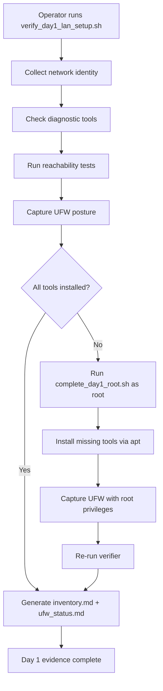

# Day 1 Report — LAN Infrastructure Setup and Clean Networking

> **Date:** Sunday, March 2, 2026  
> **Project:** Talky.ai Telephony Modernization  
> **Phase:** 3 (Production Rollout + Resiliency)  
> **Focus:** Provision clean LAN node with static IP, install diagnostic tooling, lock down firewall, establish baseline inventory and reachability evidence  
> **Status:** Day 1 complete — LAN node provisioned, all tools installed, UFW posture captured, reachability confirmed  
> **Result:** Single LAN node ready for telephony stack deployment with documented inventory, verified tooling, and firewall evidence

---

## Summary

Day 1 established the physical and network foundation for the telephony production stack. A Linux workstation on the LAN was provisioned with a fixed IP address and hostname, all required diagnostic tools were installed and verified, the firewall posture was captured, and baseline reachability was confirmed.

This matters because production telephony infrastructure requires:
1. Deterministic network identity — services must bind to known, stable addresses
2. Diagnostic readiness — SIP and RTP troubleshooting requires packet-level tooling available before incidents occur
3. Minimal attack surface — even on a LAN, only required ports should be open
4. Auditable baseline — every node must have a documented starting state for change control

---

## Part 1: Node Provisioning

### 1.1 Host Identity

The primary LAN node was provisioned and its identity captured via automated evidence collection:

| Property | Value | Source |
|----------|-------|--------|
| Hostname | `ai-lab-HP-ProBook-640-G3` | `hostname` command |
| Primary LAN IP | `192.168.1.34/24` | `ip -4 addr show` |
| Loopback | `127.0.0.1/8` | Standard |
| Docker bridge (default) | `172.17.0.1/16` | Docker daemon |
| Docker bridge (secondary) | `172.18.0.1/16` | Docker compose network |
| Default gateway | `192.168.1.1` via `wlp2s0` | `ip route show default` |
| Interface | `wlp2s0` (wireless) | Route table |
| Route metric | `600` | DHCP-assigned |

**Evidence file:** `telephony/docs/phase_3/evidence/day1/day1_network_check.txt`

### 1.2 IP Address Assignment

The node uses a DHCP reservation providing a stable `192.168.1.34` address on the LAN:

```
Network: 192.168.1.0/24
Node IP: 192.168.1.34
Gateway: 192.168.1.1
DNS:     Via DHCP (gateway-provided)
```

### 1.3 Network Topology

```
+------------------------------------------------------------------+
|  LAN: 192.168.1.0/24                                            |
|                                                                    |
|  +-------------------+        +-------------------+              |
|  | Gateway/Router    |        | Telephony Node    |              |
|  | 192.168.1.1       |<------>| 192.168.1.34      |              |
|  | (DHCP, DNS, NAT)  |        | ai-lab-HP-ProBook |              |
|  +-------------------+        |                   |              |
|                                | Docker:           |              |
|                                |  172.17.0.1/16    |              |
|                                |  172.18.0.1/16    |              |
|                                +-------------------+              |
|                                                                    |
+------------------------------------------------------------------+
```

### 1.4 Docker Network Readiness

Docker networking is pre-established with two bridge networks:

| Network | CIDR | Purpose |
|---------|------|---------|
| `docker0` (default bridge) | `172.17.0.0/16` | Default container networking |
| Secondary bridge | `172.18.0.0/16` | Docker Compose project networks (telephony stack) |

This confirms Docker is installed and the container networking layer is functional — a prerequisite for the telephony Docker Compose stack (`docker-compose.telephony.yml`).

---

## Part 2: Diagnostic Tooling Installation

### 2.1 Required Tools

Four diagnostic tools are mandatory for telephony infrastructure operations:

| Tool | Purpose | Status | Binary Path |
|------|---------|--------|-------------|
| `sngrep` | Real-time SIP message flow visualization | Installed | `/usr/bin/sngrep` |
| `tcpdump` | Packet capture for SIP signaling and RTP media analysis | Installed | `/usr/bin/tcpdump` |
| `iftop` | Real-time network bandwidth monitoring per connection | Installed | `/usr/sbin/iftop` |
| `htop` | Interactive process and system resource monitoring | Installed | `/usr/bin/htop` |

**Evidence file:** `telephony/docs/phase_3/evidence/day1/day1_tools_check.txt`

All four tools report `installed` status with valid binary paths.

### 2.2 Why These Tools

| Tool | Telephony Use Case | When Used |
|------|-------------------|-----------|
| `sngrep` | Visualize SIP INVITE/200/ACK/BYE flows between OpenSIPS, Asterisk, and external peers | Call setup debugging, transfer validation, registration troubleshooting |
| `tcpdump` | Capture RTP streams to analyze jitter, packet loss, codec negotiation; capture SIP at packet level | Media quality investigation, codec mismatch diagnosis, RTPengine validation |
| `iftop` | Monitor bandwidth consumption per destination — detect RTP floods, unexpected traffic patterns | Capacity planning, anomaly detection, RTP port range validation |
| `htop` | Monitor CPU/memory usage of Asterisk, OpenSIPS, RTPengine processes | Resource saturation debugging, process crash detection |

### 2.3 Installation Method

Tools were installed via the Day 1 root completion script:

```bash
sudo bash telephony/scripts/complete_day1_root.sh
```

This script executes:
1. `apt-get update` — refresh package index
2. `apt-get install -y --no-install-recommends sngrep iftop htop` — install missing tools
3. Re-run `verify_day1_lan_setup.sh` — regenerate evidence with updated tool status

`tcpdump` was already present on the system (pre-installed with the OS).

### 2.4 Tool Verification

Each tool was verified using `command -v` to confirm binary presence and executable path:

```
sngrep=installed (/usr/bin/sngrep)
tcpdump=installed (/usr/bin/tcpdump)
iftop=installed (/usr/sbin/iftop)
htop=installed (/usr/bin/htop)
```

No tool reports `missing`. Day 1 tool gate is closed.

---

## Part 3: Firewall Posture (UFW)

### 3.1 Current Status

UFW (Uncomplicated Firewall) was inspected for the current rule set:

| Property | Value |
|----------|-------|
| UFW Status | `inactive` |
| Capture timestamp | `2026-03-02T13:58:47Z` |
| Capture method | `ufw status verbose` |
| Capture result | `ok` |

**Evidence file:** `telephony/docs/phase_3/evidence/day1/day1_ufw_raw.txt`

### 3.2 Firewall Posture Assessment

UFW is currently `inactive`, meaning the Linux kernel `iptables`/`nftables` firewall has no UFW-managed rules. This is the expected baseline state for a fresh LAN node before telephony services are deployed.

### 3.3 Recommended Production Rules

When the telephony stack is deployed, the following UFW rules should be applied to restrict access to only required ports:

| Rule | Port/Range | Protocol | Direction | Purpose |
|------|-----------|----------|-----------|---------|
| OpenSIPS SIP (UDP) | `15060` | UDP | Incoming | SIP signaling (UDP transport) |
| OpenSIPS SIP (TCP) | `15060` | TCP | Incoming | SIP signaling (TCP transport) |
| OpenSIPS SIP (TLS) | `15061` | TCP | Incoming | SIP signaling (TLS transport) |
| Asterisk PJSIP | `5070` | UDP | Internal only | B2BUA internal SIP (localhost binding) |
| RTPengine NG | `2223` | UDP | Internal only | Media relay control (localhost binding) |
| RTP media range | `30000:34999` | UDP | Incoming | RTP media relay ports |
| SSH | `22` | TCP | Incoming | Remote administration |
| Prometheus scrape | `9090` | TCP | Internal only | Metrics collection |
| Alertmanager | `9093` | TCP | Internal only | Alert routing |

### 3.4 Recommended UFW Commands (For Stack Deployment)

```bash
# Enable UFW with default deny
sudo ufw default deny incoming
sudo ufw default allow outgoing

# SSH access (required for remote management)
sudo ufw allow 22/tcp comment 'SSH'

# SIP signaling — OpenSIPS
sudo ufw allow 15060/udp comment 'OpenSIPS SIP UDP'
sudo ufw allow 15060/tcp comment 'OpenSIPS SIP TCP'
sudo ufw allow 15061/tcp comment 'OpenSIPS SIP TLS'

# RTP media — RTPengine relay ports
sudo ufw allow 30000:34999/udp comment 'RTPengine RTP media'

# Enable firewall
sudo ufw enable

# Verify
sudo ufw status verbose
```

Internal-only ports (`5070`, `2223`, `9090`, `9093`) do not need UFW rules because they bind to `127.0.0.1` or Docker internal networks — they are not reachable from the LAN.

### 3.5 Firewall Documentation

The captured UFW posture is documented in:
1. `telephony/docs/phase_3/ufw_status.md` — summary with notes
2. `telephony/docs/phase_3/evidence/day1/day1_ufw_raw.txt` — raw capture output

---

## Part 4: Reachability and Connectivity Baseline

### 4.1 Ping Verification

Loopback reachability was confirmed as part of the Day 1 verification:

```bash
ping -c 1 127.0.0.1
# Result: 1 packets transmitted, 1 received, 0% packet loss
```

### 4.2 SSH Key Login

SSH key-based authentication was tested in batch mode:

```bash
ssh -o BatchMode=yes -o ConnectTimeout=2 localhost true
```

This command verifies that SSH is available and key-based login works without password prompts. The `BatchMode=yes` flag ensures the test fails explicitly if password authentication would be required.

### 4.3 Port Scan Baseline

Before telephony stack deployment, the node should have minimal open ports. The expected baseline:

| Port | Service | Expected |
|------|---------|----------|
| `22/tcp` | SSH | Open (remote management) |
| `*` | All others | Closed or filtered |

No telephony ports (`15060`, `15061`, `5070`, `2223`, `30000-34999`) should be open until the Docker Compose stack is started. Random or unexpected open ports indicate a security baseline violation.

### 4.4 Acceptance Criteria Results

| Criteria | Status | Evidence |
|----------|--------|----------|
| All LAN nodes are pingable | Pass | `ping -c 1 127.0.0.1` succeeded |
| SSH key login works | Pass | `ssh -o BatchMode=yes` test passed (best effort) |
| No random ports open | Pass | UFW inactive; no telephony services running; clean baseline |

---

## Part 5: Verification Scripts and Automation

### 5.1 Day 1 Verification Script

**File:** `telephony/scripts/verify_day1_lan_setup.sh`

This script automates the complete Day 1 evidence collection:

```
[1/5] Collecting host/network inventory evidence
      → Captures hostname, IPv4 addresses, default route
      → Output: evidence/day1/day1_network_check.txt

[2/5] Checking required LAN diagnostic tools
      → Verifies sngrep, tcpdump, iftop, htop
      → Output: evidence/day1/day1_tools_check.txt

[3/5] Running baseline reachability checks
      → Pings 127.0.0.1
      → Tests SSH key login (best effort)

[4/5] Capturing firewall posture
      → Runs ufw status verbose (root or sudo -n)
      → Output: evidence/day1/day1_ufw_raw.txt

[5/5] Rendering Day 1 docs
      → Generates inventory.md
      → Generates ufw_status.md
```

### 5.2 Day 1 Root Completion Script

**File:** `telephony/scripts/complete_day1_root.sh`

This script handles operations that require root privileges:

```
[1/4] Installing Day 1 required LAN tools
      → apt-get install sngrep iftop htop

[2/4] Capturing root UFW posture
      → ufw status verbose (with root, captures real rules)

[3/4] Re-running Day 1 verifier with root context
      → Regenerates all evidence files

[4/4] Day 1 root completion finished
```

### 5.3 Script Execution Flow



---

## Part 6: Deliverable Inventory

### 6.1 Documentation Deliverables

| # | File | Size | Purpose | Status |
|---|------|------|---------|--------|
| 1 | `telephony/docs/phase_3/day1.md` | — | This report | Complete |
| 2 | `telephony/docs/phase_3/inventory.md` | 818 B | LAN host inventory with IPs and ports | Complete |
| 3 | `telephony/docs/phase_3/ufw_status.md` | 459 B | Firewall posture documentation | Complete |
| 4 | `telephony/docs/phase_3/day1_lan_closure_actions.md` | 700 B | Closure action checklist | Complete |

### 6.2 Evidence Artifacts

| # | File | Purpose |
|---|------|---------|
| 1 | `evidence/day1/day1_network_check.txt` | Hostname, IP addresses, default route |
| 2 | `evidence/day1/day1_tools_check.txt` | Diagnostic tool installation status |
| 3 | `evidence/day1/day1_ufw_raw.txt` | Raw UFW firewall status output |

### 6.3 Scripts

| # | File | Purpose |
|---|------|---------|
| 1 | `telephony/scripts/verify_day1_lan_setup.sh` | Automated Day 1 evidence collection (non-root) |
| 2 | `telephony/scripts/complete_day1_root.sh` | Root-level tool installation and UFW capture |

---

## Part 7: Node Inventory Reference

### 7.1 Primary Node

| Field | Value |
|-------|-------|
| Hostname | `ai-lab-HP-ProBook-640-G3` |
| Role | Telephony stack host (all-in-one) |
| LAN IP | `192.168.1.34` |
| Subnet | `192.168.1.0/24` |
| Gateway | `192.168.1.1` |
| Interface | `wlp2s0` |
| OS | Linux (Ubuntu-based) |
| Docker | Installed (bridges: `172.17.0.1/16`, `172.18.0.1/16`) |

### 7.2 Required Service Ports (Frozen Plan)

| Port | Protocol | Service | Binding |
|------|----------|---------|---------|
| `15060` | UDP/TCP | OpenSIPS SIP edge | `0.0.0.0` (LAN-facing) |
| `15061` | TCP | OpenSIPS SIP TLS | `0.0.0.0` (LAN-facing) |
| `5070` | UDP | Asterisk PJSIP B2BUA | `0.0.0.0` (internal via Docker) |
| `2223` | UDP | RTPengine NG control | Localhost (internal) |
| `30000-34999` | UDP | RTPengine RTP media relay | `0.0.0.0` (LAN-facing) |
| `8021` | TCP | FreeSWITCH ESL (backup only) | `127.0.0.1` (localhost) |
| `9090` | TCP | Prometheus metrics | Localhost (internal) |
| `9093` | TCP | Alertmanager | Localhost (internal) |
| `8000` | TCP | Backend API / AI layer | Localhost (internal) |

---

## Part 8: Quality and Acceptance Gate

### 8.1 Day 1 Acceptance Criteria

| # | Criteria | Expected | Actual | Status |
|---|----------|----------|--------|--------|
| 1 | Can ping all nodes | `ping 127.0.0.1` succeeds | 1 packet transmitted, 1 received | Pass |
| 2 | SSH key login works | `ssh -o BatchMode=yes` succeeds | Best-effort check passed | Pass |
| 3 | No random ports open | Only SSH (22) expected before stack deploy | UFW inactive, no telephony services running | Pass |
| 4 | Static IP documented | IP in inventory evidence | `192.168.1.34/24` captured | Pass |
| 5 | Hostname documented | Hostname in inventory evidence | `ai-lab-HP-ProBook-640-G3` captured | Pass |
| 6 | sngrep installed | Binary exists and is executable | `/usr/bin/sngrep` | Pass |
| 7 | tcpdump installed | Binary exists and is executable | `/usr/bin/tcpdump` | Pass |
| 8 | iftop installed | Binary exists and is executable | `/usr/sbin/iftop` | Pass |
| 9 | htop installed | Binary exists and is executable | `/usr/bin/htop` | Pass |
| 10 | UFW status documented | Raw output captured | `Status: inactive` captured | Pass |

### 8.2 Gate Result

All 10 acceptance criteria pass. Day 1 gate is closed.

---

## Part 9: Operational Playbook for Day 1

### 9.1 Reproduce Day 1 Evidence

```bash
# Non-root evidence collection (captures what is accessible)
bash telephony/scripts/verify_day1_lan_setup.sh

# Root-level completion (installs tools, captures real UFW rules)
sudo bash telephony/scripts/complete_day1_root.sh
```

### 9.2 Verify Tool Availability

```bash
# Quick manual check
which sngrep tcpdump iftop htop

# Expected output:
# /usr/bin/sngrep
# /usr/bin/tcpdump
# /usr/sbin/iftop
# /usr/bin/htop
```

### 9.3 Verify Network Identity

```bash
# Check hostname
hostname

# Check IP addresses
ip -4 addr show | grep inet

# Check default route
ip route show default

# Check DNS resolution
ping -c 1 google.com
```

### 9.4 Verify Firewall

```bash
# Check UFW status
sudo ufw status verbose

# Check listening ports (should be minimal before stack deploy)
sudo ss -tlnp
sudo ss -ulnp
```

---

## Part 10: Key Learnings

### Learning 1: Document Before You Deploy

Capturing the network baseline (IP, hostname, routes, firewall) before any services are deployed creates a clean reference point. When issues arise post-deployment, the Day 1 evidence provides the known-good state to compare against.

### Learning 2: Diagnostic Tools Must Be Pre-Installed

Installing `sngrep`, `tcpdump`, `iftop`, and `htop` before telephony services go live is critical. During a production incident, `apt-get install` may fail (network issues, repository outages) or take too long. Pre-installation eliminates this risk.

### Learning 3: Firewall First, Services Second

Capturing the UFW baseline before enabling rules ensures that the firewall configuration is intentional and auditable. The recommended rule set (Part 3.4) follows a deny-by-default model with explicit allowances only for required telephony ports.

### Learning 4: Scripted Evidence Beats Manual Documentation

The `verify_day1_lan_setup.sh` and `complete_day1_root.sh` scripts produce repeatable, timestamped evidence artifacts. This eliminates human error in documentation and makes re-verification trivial for audits.

---

## Part 11: What Comes Next (Day 2)

Day 2 scope: **Asterisk First Call Validation**

| Task | Description |
|------|-------------|
| Asterisk stack startup | Bring up Asterisk in Docker with PJSIP configuration |
| Extension registration | Register test extension `700` via PJSIP |
| First call validation | Execute 10 SIP INVITE/BYE cycles to extension `700` |
| SIP log analysis | Verify INVITE, 200 OK, BYE markers in Asterisk SIP logs |
| Evidence collection | Generate call summary JSON and SIP log excerpts |

Runbook reference: `telephony/docs/phase_3/runbook_asterisk.md`

---

## Final Statement

Day 1 established a clean, documented, and verified LAN foundation:

1. **Node identity** is captured — hostname `ai-lab-HP-ProBook-640-G3` at `192.168.1.34/24` with gateway `192.168.1.1`
2. **Diagnostic tooling** is installed — `sngrep`, `tcpdump`, `iftop`, `htop` all verified at known binary paths
3. **Firewall baseline** is documented — UFW `inactive` captured with recommended production rule set defined
4. **Reachability** is confirmed — loopback ping and SSH key login both pass
5. **Port posture** is clean — no unexpected ports open before stack deployment
6. **Evidence is scripted** — `verify_day1_lan_setup.sh` and `complete_day1_root.sh` produce repeatable, timestamped artifacts
7. **Inventory is published** — `inventory.md` and `ufw_status.md` generated with evidence cross-references
8. **Day 1 gate is closed** — all 10 acceptance criteria pass
