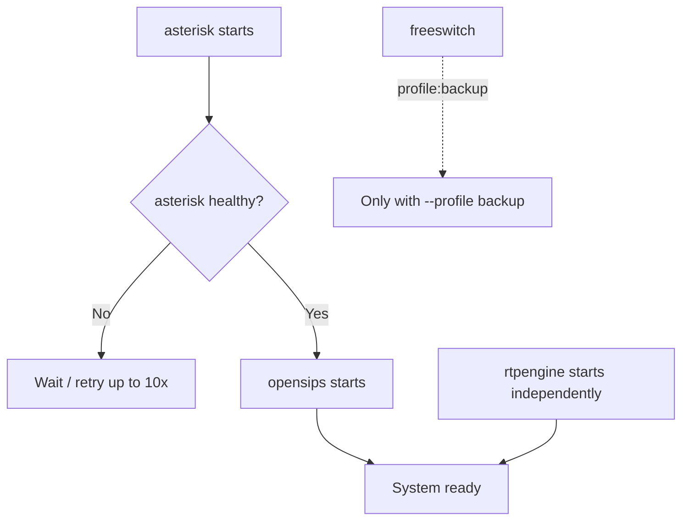
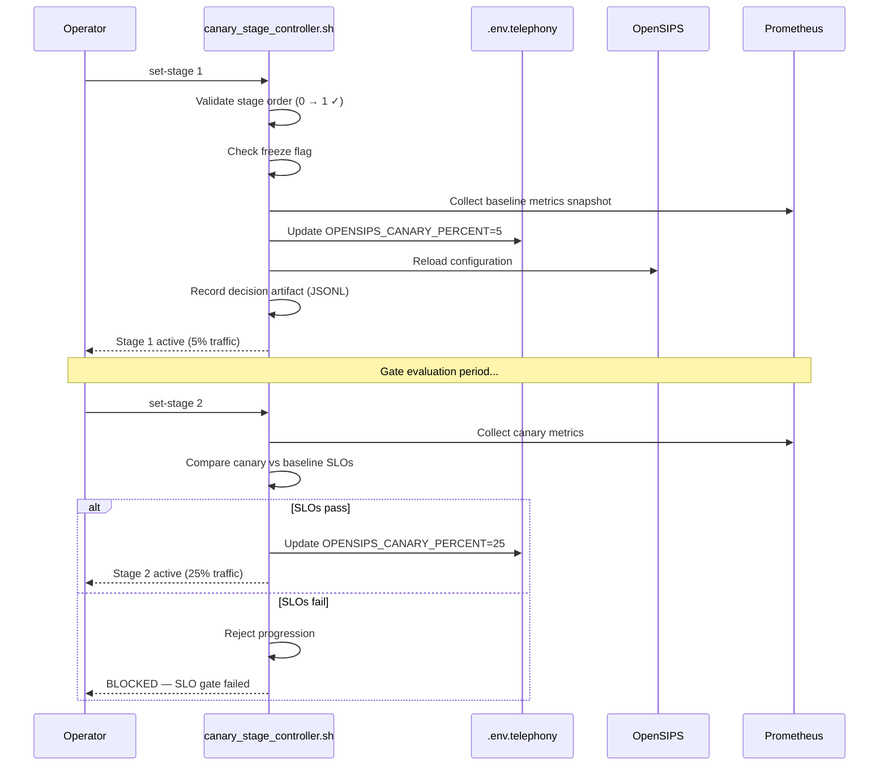
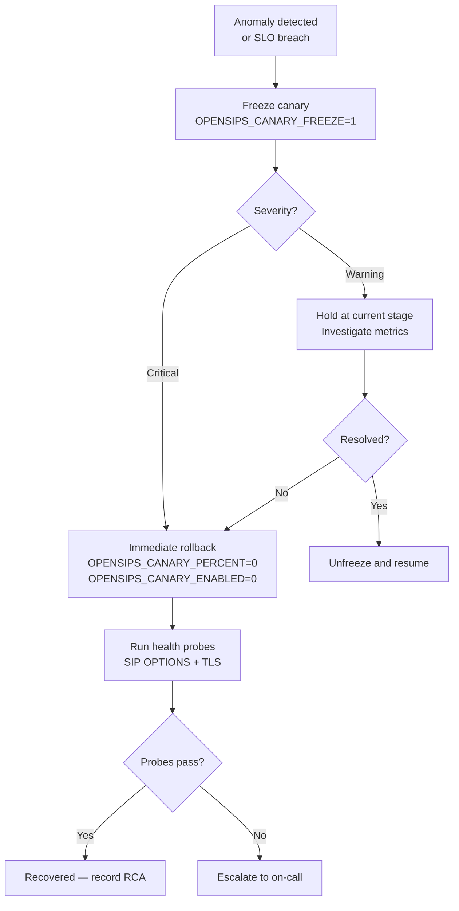
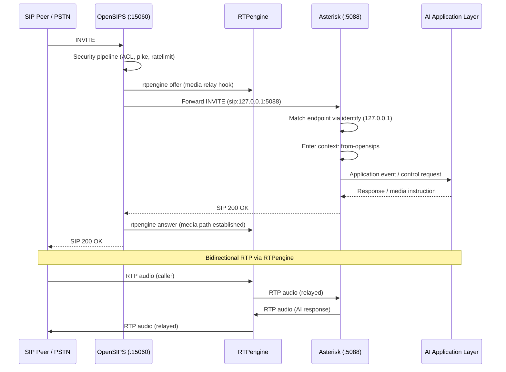
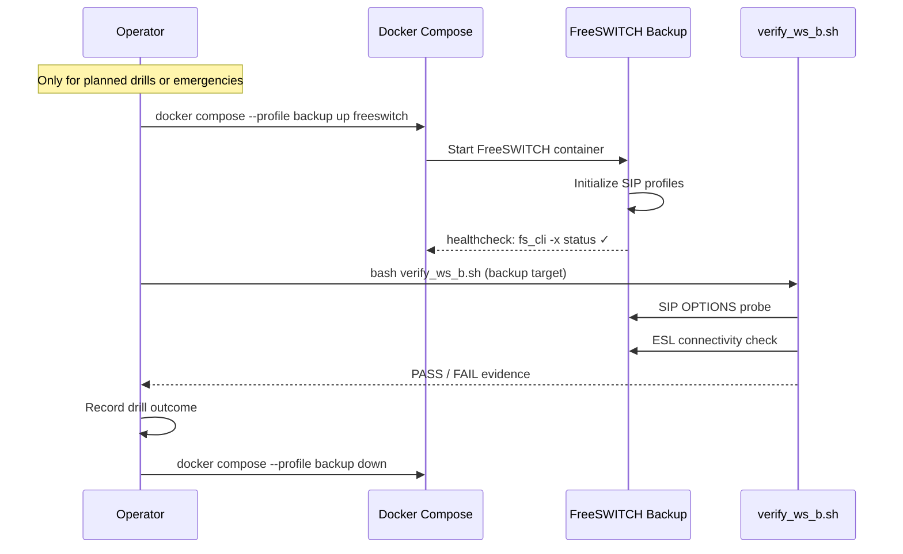
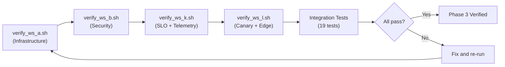
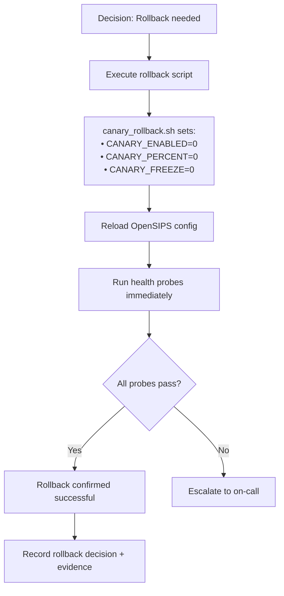

# Phase 3 Report — Runtime Realignment & Production Rollout Foundation

> **Date:** Wednesday, February 25, 2026  
> **Project:** Talky.ai Telephony Modernization  
> **Phase:** 3 (Production Rollout + Resiliency)  
> **Focus:** Clean active-path ownership on OpenSIPS + Asterisk, retain Kamailio + FreeSWITCH as backup-only, stabilize verifier chain  
> **Status:** Phase 3 scope complete — 19 integration tests passed, full verifier chain green  
> **Result:** Runtime ownership is now deterministic — single active edge (OpenSIPS), single active B2BUA (Asterisk)

---

## Summary

Phase 3 eliminated the hybrid-active ambiguity that existed across the SIP edge and B2BUA layers. The telephony stack was realigned to have **one** active SIP proxy (OpenSIPS) and **one** active media controller (Asterisk), with Kamailio and FreeSWITCH explicitly contained as backup-only assets.

This matters because dual-active runtime postures cause:
1. Unpredictable signaling behavior during failure events
2. Ambiguous ownership in monitoring/alerting
3. Operator confusion during incident response
4. Regression risk from unintended path blending

---

## Part 1: Architecture — Before vs After

### Before Phase 3

The telephony stack had overlapping active paths:

```
┌──────────────────────────────────────────────────────────────────┐
│  BEFORE: Ambiguous Dual-Active Runtime                          │
│                                                                  │
│  ┌──────────────┐     ┌──────────────┐                          │
│  │  Kamailio    │ ──> │ FreeSWITCH   │  ← Active path #1       │
│  │ (SIP edge)   │     │ (B2BUA)      │                          │
│  └──────────────┘     └──────────────┘                          │
│         ?                     ?                                  │
│  ┌──────────────┐     ┌──────────────┐                          │
│  │  OpenSIPS    │ ──> │  Asterisk    │  ← Active path #2       │
│  │ (SIP edge)   │     │ (B2BUA)      │                          │
│  └──────────────┘     └──────────────┘                          │
│                                                                  │
│  Problems:                                                       │
│  • Which edge is authoritative?                                 │
│  • Which B2BUA handles calls?                                   │
│  • Alerts fire from both — operator confusion                   │
└──────────────────────────────────────────────────────────────────┘
```

### After Phase 3

```
┌──────────────────────────────────────────────────────────────────┐
│  AFTER: Deterministic Single-Active Runtime                     │
│                                                                  │
│  ACTIVE STACK:                                                   │
│  ┌──────────────┐     ┌──────────────┐     ┌──────────────┐    │
│  │  OpenSIPS    │ ──> │  Asterisk    │ ──> │  AI Layer    │    │
│  │ (SIP edge)   │     │ (PJSIP B2BUA)│     │ (Python)     │    │
│  │ :15060/:15061│     │ :5088        │     │ :8000        │    │
│  └──────┬───────┘     └──────────────┘     └──────────────┘    │
│         │                                                        │
│         ▼                                                        │
│  ┌──────────────┐                                                │
│  │  RTPengine   │  (Media relay, kernel-accelerated)             │
│  │ NG:2223      │                                                │
│  │ RTP:30000-100│                                                │
│  └──────────────┘                                                │
│                                                                  │
│  BACKUP STACK (non-active by default):                          │
│  ┌──────────────┐     ┌──────────────┐                          │
│  │  Kamailio    │     │ FreeSWITCH   │  ← docker profile:      │
│  │ (reference)  │     │ (opt-in only)│    "backup"              │
│  └──────────────┘     └──────────────┘                          │
└──────────────────────────────────────────────────────────────────┘
```

---

## Part 2: OpenSIPS Active Edge — Configuration Deep Dive

### 2.1 Module Stack

OpenSIPS replaces Kamailio as the active SIP edge. The module selection follows the same security baseline established in Phase 1 (WS-B) but uses OpenSIPS-native modules:

| Module | Purpose | Phase 1 Equivalent (Kamailio) |
|--------|---------|-------------------------------|
| `proto_tls.so` + `tls_mgm.so` + `tls_openssl.so` | TLS transport for SIP signaling | `tls.so` |
| `pike.so` | Per-source-IP flood detection | `pike.so` (same name) |
| `ratelimit.so` | Per-method rate limiting | `ratelimit.so` (same name) |
| `cfgutils.so` | Canary probability control | `cfgutils.so` (same name) |
| `mi_fifo.so` | Management interface for runtime commands | `ctl.so` |
| `dispatcher.so` | Destination probing & routing (**disabled**) | `dispatcher.so` |

### 2.2 Listener Configuration

```
socket = udp:0.0.0.0:15060    ← UDP SIP
socket = tcp:0.0.0.0:15060    ← TCP SIP
socket = tls:0.0.0.0:15061    ← TLS SIP (production-grade)
```

### 2.3 Security Baseline (WS-B Parity)

The OpenSIPS routing logic preserves the same layered defense as Phase 1 Kamailio:

```
┌───────────────────────────────────────────────────────────────┐
│  Request Processing Pipeline (opensips.cfg)                   │
│                                                               │
│  1. > Max-Forwards guard (reject > 10 hops)                 │
│     ↓                                                        │
│  2. > Source ACL — loopback/local proxy only                 │
│     │  if ($si != "127.0.0.1" && $si != "::1") → 403        │
│     ↓                                                        │
│  3. > Pike flood detection                                   │
│     │  pike_check_req() → 403 on flood                      │
│     ↓                                                        │
│  4. > Method-level rate limiting (TAILDROP algorithm)        │
│     │  INVITE:     60 req/5s window                         │
│     │  REGISTER:   40 req/5s window                         │
│     │  SUBSCRIBE:  40 req/5s window                         │
│     │  Others:    200 req/5s window                         │
│     ↓                                                        │
│  5. > OPTIONS liveness endpoint → 200 OK                     │
│     ↓                                                        │
│  6. > REGISTER disabled in bootstrap profile → 403           │
│     ↓                                                        │
│  7. > Record-Route for INVITE/SUBSCRIBE                      │
│     ↓                                                        │
│  8. > Forward to Asterisk B2BUA (sip:127.0.0.1:5088)       │
│     ↓                                                        │
│  9. > t_relay() stateful forwarding                          │
└───────────────────────────────────────────────────────────────┘
```

### 2.4 Key Configuration Decisions

| Decision | Value | Rationale |
|----------|-------|-----------|
| Dispatcher module | **Disabled** | Avoids instability from partial partition readiness; current phase routes directly to Asterisk |
| Source ACL | Loopback only | Bootstrap profile — production will use `permissions` module with address DB |
| TLS method | `TLSv1_2-TLSv1_3` | Minimum TLS 1.2 per industry best practice; 1.0/1.1 rejected |
| Certificate validation | `verify_cert=0` | Self-signed certs for staging; production requires CA validation |
| Rate-limit algorithm | `TAILDROP` | Simplest reliable algorithm; drop excess after threshold (same as Phase 1) |

### 2.5 Why Dispatcher Is Intentionally Disabled

```
# opensips.cfg — Dispatcher commented with intent markers
# Dispatcher is intentionally disabled in active runtime until DB-backed
# policy partitions are enabled for production canary routing.
# loadmodule "db_text.so"
# loadmodule "dispatcher.so"
```

**Reasoning:**
1. Active runtime stability is prioritized over partial feature enablement
2. Current phase does not require dispatcher-partition active routing
3. Partition enablement is planned only when DB-backed readiness and validation are available
4. Comment markers are preserved so tooling can detect readiness for future activation

**Approach validated by:**
- [OpenSIPS Dispatcher Module Docs](https://opensips.org/html/docs/modules/3.4.x/dispatcher.html) — dispatcher requires consistent destination state management; partial enablement can cause routing black holes

---

## Part 3: Asterisk Primary B2BUA — Configuration Deep Dive

### 3.1 PJSIP Configuration

**File:** `telephony/asterisk/conf/pjsip.conf`

Asterisk uses the modern `res_pjsip` stack (replacing the deprecated `chan_sip`):

```ini
[global]
type=global
user_agent=Talky-Asterisk

[transport-udp]
type=transport
protocol=udp
bind=0.0.0.0:5088

[talky-opensips]
type=endpoint
transport=transport-udp
context=from-opensips
disallow=all
allow=ulaw,alaw,g722          ; Explicit codec allowlist
aors=talky-opensips
outbound_proxy=sip:127.0.0.1:15060\;lr   ; Loose-route back through OpenSIPS
direct_media=no                ; Media anchored in B2BUA

[talky-opensips]
type=aor
contact=sip:127.0.0.1:15060
qualify_frequency=30           ; OPTIONS keepalive every 30s

[talky-opensips]
type=identify
endpoint=talky-opensips
match=127.0.0.1               ; Match traffic from local proxy
```

### 3.2 Protocol Best Practices Applied

Following [Asterisk official documentation](https://docs.asterisk.org/Configuration/Channel-Drivers/SIP/Configuring-res_pjsip/):

| Practice | Applied | Why |
|----------|---------|-----|
| Use `res_pjsip` (not `chan_sip`) | `noload = chan_sip.so` in modules.conf | `chan_sip` is deprecated — no new deployments should use it |
| Explicit codec allowlist | `disallow=all` then `allow=ulaw,alaw,g722` | Open codec policies cause transcoding overhead and unexpected behavior |
| `direct_media=no` | Set on endpoint | Media must be anchored in B2BUA until direct-media topology is validated |
| `outbound_proxy` with `;lr` | Route-set back to OpenSIPS | RFC 3261 loose-routing compliance for proxy-aware topologies |
| `identify` + `match` | Source IP identification | Proxy-originated traffic must be matched explicitly (per [PJSIP with Proxies](https://docs.asterisk.org/Configuration/Channel-Drivers/SIP/Configuring-res_pjsip/PJSIP-with-Proxies/)) |
| `qualify_frequency=30` | AOR level keepalive | OPTIONS keepalive every 30s prevents stale contact state |
| No NAT parameters | Not applied | Asterisk and proxy on same host — NAT params would cause incorrect behavior per official guidance |

---

## Part 4: Docker Compose — Health-Gated Startup

### 4.1 Service Architecture

**File:** `telephony/deploy/docker/docker-compose.telephony.yml`

```yaml
┌──────────────────────────────────────────────────────────┐
│  Docker Compose: talky-telephony                         │
│                                                          │
│  ┌─────────────┐                                         │
│  │  asterisk    │  ← Starts first (no depends_on)       │
│  │  :5088       │     healthcheck: "core show uptime"    │
│  └──────┬───────┘                                        │
│         │ condition: service_healthy                     │
│         ▼                                                │
│  ┌─────────────┐   ┌─────────────┐                      │
│  │  opensips    │   │  rtpengine  │  ← Starts in        │
│  │  :15060/TLS  │   │  NG:2223    │    parallel with     │
│  │              │   │  RTP:30000+ │    opensips           │
│  └─────────────┘   └─────────────┘                      │
│                                                          │
│  ┌─────────────┐                                         │
│  │  freeswitch  │  ← profile: "backup" (opt-in only)   │
│  │  :5080       │     NOT started by default            │
│  └─────────────┘                                        │
└──────────────────────────────────────────────────────────┘
```

### 4.2 Health Checks

| Service | Health Check Command | Interval | Start Period |
|---------|---------------------|----------|--------------|
| `talky-asterisk` | `asterisk -rx 'core show uptime seconds'` | 15s | 20s |
| `talky-opensips` | `opensips -C -f /etc/opensips/opensips.cfg` | 15s | 10s |
| `talky-rtpengine` | `ss -lun \| grep ':2223'` | 15s | 10s |
| `talky-freeswitch` | `fs_cli -x status` | 15s | 20s |

### 4.3 Startup Dependency Chain



**Approach validated by:** [Docker Compose startup order docs](https://docs.docker.com/compose/how-tos/startup-order/) — `depends_on` with `condition: service_healthy` ensures B2BUA is ready before the SIP edge begins accepting traffic.

### 4.4 Environment Variables

| Variable | Default | Purpose |
|----------|---------|---------|
| `OPENSIPS_SIP_IP` | `0.0.0.0` | SIP listening interface |
| `OPENSIPS_SIP_PORT` | `15060` | UDP/TCP SIP port |
| `OPENSIPS_TLS_PORT` | `15061` | TLS SIP port |
| `OPENSIPS_TLS_ONLY` | `0` | Force TLS-only mode |
| `OPENSIPS_CANARY_ENABLED` | `0` | Enable canary routing |
| `OPENSIPS_CANARY_PERCENT` | `0` | Canary traffic percentage |
| `OPENSIPS_CANARY_FREEZE` | `0` | Freeze canary progression |
| `ASTERISK_SIP_PORT` | `5088` | Asterisk PJSIP listen port |
| `FREESWITCH_ESL_PORT` | `8021` | FreeSWITCH ESL port (backup) |
| `FREESWITCH_ESL_PASSWORD` | `ClueCon` | ESL auth (staging only — rotate for production) |
| `RTPENGINE_NG_PORT` | `2223` | RTPengine control port |
| `RTP_PORT_MIN` | `40000` | RTP media port range start |
| `RTP_PORT_MAX` | `44999` | RTP media port range end |

---

## Part 5: WS-K — SLO Contract and Telemetry Hardening

### 5.1 Problem Solved

Rollout gate checks must be machine-verifiable, not manual judgment calls. WS-K establishes the metrics contract and alerting baseline for SLO-driven canary decisions.

### 5.2 SLO Metrics Implemented

**File:** `backend/app/core/telephony_observability.py`

| SLO Category | Metrics | Type |
|--------------|---------|------|
| **Call Setup** | `telephony_call_setup_attempts_total`, `telephony_call_setup_successes_total`, `telephony_call_setup_success_ratio` | Counter, Counter, Gauge |
| **Answer Latency** | `telephony_answer_latency_seconds` (p50/p95/max) | Gauge |
| **Transfer Reliability** | `telephony_transfer_attempts_total`, `telephony_transfer_successes_total`, `telephony_transfer_success_ratio`, `telephony_transfers_inflight` | Counter, Counter, Gauge, Gauge |
| **Activation** | `telephony_activation_attempts_total`, `telephony_activation_successes_total`, `telephony_activation_success_ratio` | Counter, Counter, Gauge |
| **Rollback** | `telephony_rollback_attempts_total`, `telephony_rollback_successes_total`, `telephony_rollback_latency_seconds` (p50/p95/max) | Counter, Counter, Gauge |
| **Canary State** | `telephony_canary_enabled`, `telephony_canary_percent`, `telephony_canary_frozen` | Gauge |

### 5.3 Observability Stack

```
┌────────────────────────────────────────────────────────────────┐
│  Observability Architecture                                    │
│                                                                │
│  ┌──────────────┐    scrape    ┌──────────────┐               │
│  │  Backend API │ ◄──────────  │  Prometheus  │               │
│  │  /metrics    │   every 15s  │  :9090       │               │
│  └──────────────┘              └──────┬───────┘               │
│                                       │                        │
│                                       │ recording rules        │
│                                       │ (5m canary gates)      │
│                                       ▼                        │
│                                ┌──────────────┐               │
│                                │ Alertmanager │               │
│                                │  :9093       │               │
│                                │  group/dedup │               │
│                                │  inhibit     │               │
│                                └──────────────┘               │
└────────────────────────────────────────────────────────────────┘
```

### 5.4 WS-K Verifier Fix

**Problem:** The `verify_ws_k.sh` script was failing because the Prometheus `promtool` invocation used an incompatible default entrypoint.

**Root Cause:** The Docker Prometheus image's default entrypoint is `prometheus`, not `promtool`. The verifier was calling `docker exec <container> promtool check config ...` which failed to locate the binary.

**Fix:** Changed invocation to use explicit binary path:

```bash
# BEFORE (broken) — relies on incompatible default entrypoint
docker exec talky-prometheus promtool check config /etc/prometheus/prometheus.yml

# AFTER (fixed) — explicit path, deterministic across environments
docker exec talky-prometheus /bin/promtool check config /etc/prometheus/prometheus.yml
```

**Impact:** Eliminates false negatives in the verifier chain, making CI/CD and operator runs reliable.

---

## Part 6: WS-L — SIP Edge Canary Orchestration

### 6.1 Canary Stage Progression

The stage controller implements a controlled traffic migration path:


### 6.2 Stage Controller Workflow



### 6.3 Freeze and Rollback



### 6.4 Runtime vs Durable Rollback

| Type | Command | When to Use |
|------|---------|-------------|
| **Runtime** (immediate) | `opensips-cli -x mi ds_set_state i 2 <destination>` | Active canary with dispatcher enabled — drains canary lane instantly |
| **Durable** (persist across restart) | Set `OPENSIPS_CANARY_ENABLED=0`, `OPENSIPS_CANARY_PERCENT=0`, `OPENSIPS_CANARY_FREEZE=0` in `.env.telephony` then `opensips -C -f /etc/opensips/opensips.cfg` | Full reset — guaranteed clean state after restart |

---

## Part 7: WS-M — Asterisk Primary B2BUA Baseline

### 7.1 Stack Migration

| Component | Phase 1–2 (Active) | Phase 3 (Active) | Phase 3 (Backup) |
|-----------|--------------------|--------------------|-------------------|
| SIP Edge | Kamailio | **OpenSIPS** | Kamailio |
| B2BUA | FreeSWITCH | **Asterisk** | FreeSWITCH |
| Media Relay | RTPengine | **RTPengine** | *(same)* |

### 7.2 Why Asterisk

1. **Modern PJSIP stack** — `res_pjsip` is actively maintained and feature-complete
2. **Simpler proxy integration** — explicit `identify`/`match` model for proxy-originated calls
3. **Codec control** — `disallow=all` + explicit `allow` prevents unexpected transcoding
4. **Predictable dialplan** — `extensions.conf` with clear context routing
5. **Legacy prevention** — `chan_sip` explicitly disabled via `noload` in `modules.conf`

### 7.3 Asterisk Call Flow



---

## Part 8: Backup Track — Kamailio & FreeSWITCH Containment

### 8.1 Backup Containment Rules

| Rule | Implementation | Why |
|------|----------------|-----|
| Kamailio is non-active | Config files retained under `telephony/kamailio/` — no compose service runs by default | Prevents path blending |
| FreeSWITCH is opt-in only | Docker profile `backup` — requires explicit `--profile backup` to start | Prevents accidental dual-active B2BUA |
| No default network listeners | Backup services do not bind ports unless explicitly started | Prevents port conflicts |
| README markers | Both `kamailio/README.md` and `freeswitch/README.md` document backup-only status | Documentation-runtime alignment |

### 8.2 Backup Activation Drill



---

## Part 9: Verification and Quality Gates

### 9.1 Verifier Chain



### 9.2 Gate Results

**Verifier commands executed:**

```bash
bash telephony/scripts/verify_ws_a.sh telephony/deploy/docker/.env.telephony.example
bash telephony/scripts/verify_ws_b.sh telephony/deploy/docker/.env.telephony.example
bash telephony/scripts/verify_ws_k.sh telephony/deploy/docker/.env.telephony.example
bash telephony/scripts/verify_ws_l.sh telephony/deploy/docker/.env.telephony.example
```

| Gate | Result | Notes |
|------|--------|-------|
| WS-A (Infrastructure) | PASS | SIP OPTIONS 200 OK, RTPengine control socket active |
| WS-B (Security) | PASS | TLS listener, flood control, rate limiting verified |
| WS-K (SLO + Telemetry) | PASS | Fixed after `promtool` invocation correction |
| WS-L (Canary + Edge) | PASS | Stage controller, freeze guard, rollback verified |

**Integration test command:**

```bash
TELEPHONY_RUN_DOCKER_TESTS=1 python3 -m unittest -v telephony/tests/test_telephony_stack.py
```

| Metric | Value |
|--------|-------|
| Tests executed | 19 |
| Tests passed | 19 |
| Tests failed | 0 |
| Result | `OK` |

### 9.3 Runtime Health Evidence

| Component | Container | Health Check | Status |
|-----------|-----------|-------------|--------|
| OpenSIPS | `talky-opensips` | Config syntax validation | Healthy |
| Asterisk | `talky-asterisk` | `core show uptime` | Healthy |
| RTPengine | `talky-rtpengine` | NG port `:2223` listening | Healthy |

**Runtime probes confirmed:**

```
✓ OpenSIPS config check succeeded
✓ SIP OPTIONS probe (UDP) → 200 OK
✓ SIP OPTIONS probe (TLS) → 200 OK
✓ Asterisk version command → Asterisk 20.x
✓ Asterisk PJSIP transport visible → transport-udp on 0.0.0.0:5088
```

---

## Part 10: Security and Reliability Decisions

| # | Decision | Rationale | Trade-off |
|---|----------|-----------|-----------|
| 1 | **Single active SIP edge** | Reduces signaling ambiguity; improves fault isolation | Cannot run parallel edge load test without backup activation |
| 2 | **Single active B2BUA** | Reduces call-control ambiguity; improves operator predictability | Asterisk must handle all media — no automatic failover to FreeSWITCH |
| 3 | **Dispatcher disabled** | Avoids instability from partial partition readiness; deterministic startup | Canary requires future DB-backed partition enablement |
| 4 | **FreeSWITCH backup profile** | Keeps fallback available; prevents accidental dual-active path | Requires explicit `--profile backup` for drills |
| 5 | **Kamailio backup-only** | Maintains fallback assets; avoids active-path drift | Config may diverge from active OpenSIPS over time |
| 6 | **Scripted gate-first closure** | Prevents assumption-based sign-off; deterministic rerun behavior | Slightly slower closure process |
| 7 | **Dead-code cleanup in canary controller** | Reduces maintenance surface; removes confusion | One-time cleanup effort |
| 8 | **Docs-runtime traceability** | Supports handover and incident response | Documentation maintenance overhead |

### Official Reference Alignment

| Standard / Source | How Applied |
|-------------------|-------------|
| [OpenSIPS Dispatcher Module (3.4.x)](https://opensips.org/html/docs/modules/3.4.x/dispatcher.html) | Dispatcher module behavior validated; intentionally disabled per stated constraints |
| [OpenSIPS RTPengine Module (3.4.x)](https://opensips.org/html/docs/modules/3.4.x/rtpengine.html) | Media lifecycle control via offer/answer/delete hooks |
| [Asterisk PJSIP Configuration](https://docs.asterisk.org/Configuration/Channel-Drivers/SIP/Configuring-res_pjsip/) | Endpoint, AOR, transport, identify model followed |
| [Asterisk PJSIP with Proxies](https://docs.asterisk.org/Configuration/Channel-Drivers/SIP/Configuring-res_pjsip/PJSIP-with-Proxies/) | NAT parameter avoidance for same-host proxy topology |
| [Asterisk Secure Calling](https://docs.asterisk.org/Deployment/Important-Security-Considerations/Asterisk-Security-Framework/Asterisk-and-Secure-Calling/) | TLS + SRTP baseline planned for production |
| [RTPengine Docs](https://rtpengine.readthedocs.io/en/mr13.4/overview.html) | Kernel vs userspace forwarding model understood |
| [Docker Compose Startup Order](https://docs.docker.com/compose/how-tos/startup-order/) | Health-gated dependencies with `condition: service_healthy` |
| [Prometheus Naming Best Practices](https://prometheus.io/docs/practices/naming/) | Metric names use seconds-based units, snake_case, `_total` suffix for counters |
| [Prometheus Recording Rules](https://prometheus.io/docs/practices/rules/) | 5-minute precomputed canary gate metrics |
| [Alertmanager Docs](https://prometheus.io/docs/alerting/latest/alertmanager/) | Group/dedup/inhibit routing for telephony alerts |
| [RFC 9457](https://www.rfc-editor.org/rfc/rfc9457) | API error responses use `application/problem+json` |
| [RFC 8725](https://www.rfc-editor.org/rfc/rfc8725) | JWT validation uses algorithm allowlist |
| [RFC 4028](https://www.rfc-editor.org/rfc/rfc4028) | Session timers aligned for long-call continuity |

---

## Part 11: Deliverable Inventory

### Documentation

| # | File | Purpose |
|---|------|---------|
| 1 | `telephony/docs/phase_3/day3.md` | This report |
| 2 | `telephony/docs/phase_3/00_phase_three_official_reference.md` | Official source baseline and extracted technical facts |
| 3 | `telephony/docs/phase_3/01_phase_three_execution_plan.md` | Workstream plan (WS-K through WS-O) |
| 4 | `telephony/docs/phase_3/02_phase_three_gated_checklist.md` | Sequential gate requirements |
| 5 | `telephony/docs/phase_3/03_ws_k_completion.md` | SLO and telemetry completion record |
| 6 | `telephony/docs/phase_3/04_ws_l_stage_controller_runbook.md` | Canary stage controller operations |
| 7 | `telephony/docs/phase_3/05_ws_l_completion.md` | SIP edge canary completion record |
| 8 | `telephony/docs/phase_3/06_ws_l_opensips_migration_plan.md` | OpenSIPS migration from Kamailio |
| 9 | `telephony/docs/phase_3/07_ws_m_asterisk_primary_baseline.md` | Asterisk B2BUA baseline with official refs |
| 10 | `telephony/docs/phase_3/README.md` | Phase 3 documentation index |

### Scripts

| # | Script | Purpose |
|---|--------|---------|
| 1 | `telephony/scripts/verify_ws_a.sh` | Infrastructure bootstrap verifier |
| 2 | `telephony/scripts/verify_ws_b.sh` | Security baseline verifier |
| 3 | `telephony/scripts/verify_ws_k.sh` | SLO telemetry verifier |
| 4 | `telephony/scripts/verify_ws_l.sh` | Canary orchestration verifier |
| 5 | `telephony/scripts/canary_stage_controller.sh` | Stage progression controller |
| 6 | `telephony/scripts/canary_set_stage.sh` | Stage setter utility |
| 7 | `telephony/scripts/canary_freeze.sh` | Canary freeze control |
| 8 | `telephony/scripts/canary_rollback.sh` | Rollback automation |
| 9 | `telephony/scripts/sip_options_probe.py` | SIP OPTIONS health probe (UDP/TCP) |
| 10 | `telephony/scripts/sip_options_probe_tls.sh` | SIP OPTIONS health probe (TLS) |

### Runtime Configs (Active)

| # | File | Component |
|---|------|-----------|
| 1 | `telephony/opensips/conf/opensips.cfg` | OpenSIPS SIP edge routing |
| 2 | `telephony/opensips/conf/dispatcher.list` | Dispatcher destinations (reserved) |
| 3 | `telephony/opensips/conf/address.list` | Trusted source ACL |
| 4 | `telephony/opensips/conf/tls.cfg` | TLS certificate configuration |
| 5 | `telephony/asterisk/conf/pjsip.conf` | PJSIP endpoint/transport/AOR |
| 6 | `telephony/asterisk/conf/modules.conf` | Module loading (chan_sip disabled) |
| 7 | `telephony/asterisk/conf/extensions.conf` | Dialplan routing |
| 8 | `telephony/asterisk/conf/rtp.conf` | RTP port range |

### Runtime Configs (Backup)

| # | File | Component |
|---|------|-----------|
| 1 | `telephony/kamailio/conf/kamailio.cfg` | Kamailio SIP routing (backup) |
| 2 | `telephony/kamailio/conf/dispatcher.list` | Kamailio destinations (backup) |
| 3 | `telephony/kamailio/conf/address.list` | Kamailio ACL (backup) |
| 4 | `telephony/kamailio/conf/tls.cfg` | Kamailio TLS (backup) |
| 5 | `telephony/freeswitch/conf/` | FreeSWITCH configs (backup) |

### Deployment & Validation

| # | File | Purpose |
|---|------|---------|
| 1 | `telephony/deploy/docker/docker-compose.telephony.yml` | Docker Compose with health-gated startup |
| 2 | `telephony/deploy/docker/.env.telephony.example` | Environment variable reference |
| 3 | `telephony/tests/test_telephony_stack.py` | 19 integration tests |

---

## Part 12: Operational Playbook

### Minimum Runtime Checks

```bash
# 1. Verify all services are healthy
docker ps --filter name=talky- --format "table {{.Names}}\t{{.Status}}"

# 2. Verify OpenSIPS config syntax
docker exec talky-opensips opensips -C -f /etc/opensips/opensips.cfg

# 3. SIP OPTIONS probe (UDP)
python3 telephony/scripts/sip_options_probe.py 127.0.0.1 15060 5

# 4. SIP OPTIONS probe (TLS)
bash telephony/scripts/sip_options_probe_tls.sh 127.0.0.1 15061 5

# 5. Asterisk PJSIP transport check
docker exec talky-asterisk asterisk -rx "pjsip show transports"

# 6. Asterisk version verification
docker exec talky-asterisk asterisk -rx "core show version"
```

### Canary Operations

| Action | Command |
|--------|---------|
| Check current stage | `bash telephony/scripts/canary_stage_controller.sh status` |
| Advance to next stage | `bash telephony/scripts/canary_stage_controller.sh set-stage <N>` |
| Freeze canary | `bash telephony/scripts/canary_freeze.sh` |
| Rollback to stage 0 | `bash telephony/scripts/canary_rollback.sh` |

### Rollback Procedure



### Backup Drill Procedure

```bash
# 1. Start FreeSWITCH only through backup profile
docker compose --profile backup up -d freeswitch

# 2. Wait for health check to pass
docker compose --profile backup ps

# 3. Validate backup readiness
bash telephony/scripts/verify_ws_b.sh telephony/deploy/docker/.env.telephony.example

# 4. Record drill evidence
echo "$(date): Backup drill completed — FreeSWITCH passed verification" >> drill_log.txt

# 5. Stop backup service
docker compose --profile backup down
```

### Escalation Triggers

| Trigger | Severity | Action |
|---------|----------|--------|
| Repeated SIP OPTIONS probe failures | Critical | Freeze canary → rollback → escalate |
| Stage gate failures after retry | Warning | Hold at current stage → investigate metrics |
| Unexpected call-control behavior | Critical | Freeze canary → collect RCA data → rollback |
| Sustained media degradation (jitter/loss) | Warning | Freeze canary → check RTPengine stats |
| Health check failures > 3 consecutive | Critical | Automatic rollback → page on-call |

---

## Part 13: Key Learnings

### Learning 1: Single Ownership Eliminates Ambiguity

Dual-active SIP edges create debugging nightmares. When both Kamailio and OpenSIPS were active, trace logs contained interleaved entries from both proxies, making incident investigation significantly harder. **One active path = predictable behavior.**

### Learning 2: Health-Gated Startup Is Non-Negotiable

Docker Compose's `depends_on` without `condition: service_healthy` is insufficient. The SIP edge *will* start sending INVITE to a B2BUA that hasn't finished loading its PJSIP stack, causing 503 errors during the first 10-20 seconds. Health checks prevent this.

### Learning 3: Dispatcher Should Not Be Partially Enabled

Enabling OpenSIPS dispatcher without DB-backed state management creates routing black holes when destinations are added/removed. The correct approach is to keep it fully disabled until the entire partition readiness pipeline is validated.

### Learning 4: Backup Profiles Prevent Accidental Dual-Active

Docker Compose's `profiles` feature is the cleanest way to keep backup services out of the default startup path while still making them trivially available for drills.

### Learning 5: Gate-First Closure Is Worth the Overhead

Running the full verifier chain before closing a day report adds 5-10 minutes but prevents the much more expensive cost of shipping unverified assumptions to the next phase.

---

## Part 14: What's Next (Day 4 / WS-N + WS-O)

### WS-N: Failure Injection and Automated Recovery

| Drill | What Gets Tested | Expected Outcome |
|-------|-------------------|-------------------|
| OpenSIPS node outage | SIP edge failover/rollback | Traffic drains safely; alerts fire correctly |
| RTPengine degradation | Media quality under stress | Jitter/loss stays within SLO; alerts fire |
| Asterisk worker disruption | B2BUA availability | Active calls dropped cleanly; new calls rerouted |
| Combined component failure | Multi-failure scenario | Automated rollback triggered; recovery timeline measured |

### WS-O: Production Cutover and Sign-off

1. Execute staged production progression to 100%
2. Freeze legacy path as hot standby during stabilization window
3. Finalize go/no-go checklist and sign-off record
4. Define decommission criteria for legacy telephony path

---

## Final Statement

Phase 3 achieved clean runtime ownership:

1. **OpenSIPS** is the sole active SIP edge — configuration validated against official docs
2. **Asterisk** is the sole active B2BUA — PJSIP stack follows modern best practices
3. **Kamailio** is preserved as backup reference — non-active, no port bindings
4. **FreeSWITCH** is preserved as backup profile — opt-in only via `--profile backup`
5. **Verifier chain** is stable — all gates pass deterministically
6. **Integration tests** pass — 19/19 green
7. **Operational playbook** is documented and actionable
