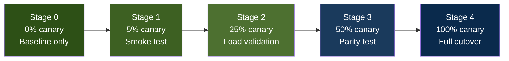
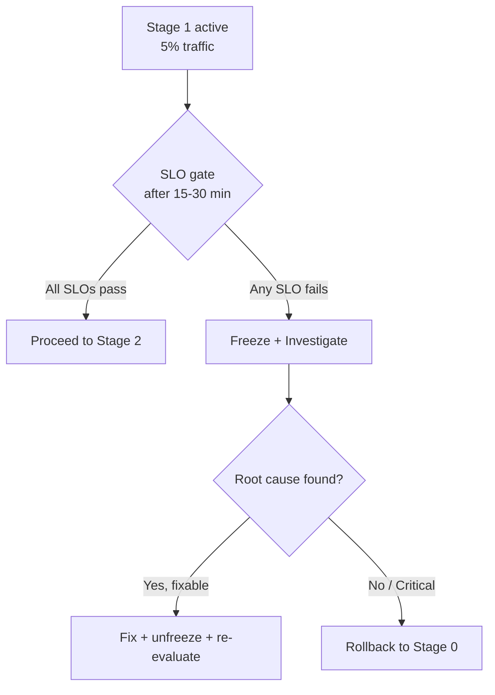

# Canary Rollout Workflow

> **Phase:** 3 — Production Rollout + Resiliency  
> **Scope:** Step-by-step guide for controlled traffic migration from 0% to 100%  
> **Prerequisites:** WS-K (SLO telemetry) + WS-L (canary orchestration) gates pass

---

## Overview

This workflow defines how to safely migrate production traffic from the legacy telephony path to the new OpenSIPS + Asterisk stack using controlled canary stages with SLO-gated progression.



---

## Pre-Flight Checklist

Before starting any canary rollout, verify these conditions:

```bash
# 1. All services healthy
docker ps --filter name=talky- --format "table {{.Names}}\t{{.Status}}"

# 2. Gate verifiers pass
bash telephony/scripts/verify_ws_a.sh telephony/deploy/docker/.env.telephony.example
bash telephony/scripts/verify_ws_b.sh telephony/deploy/docker/.env.telephony.example
bash telephony/scripts/verify_ws_k.sh telephony/deploy/docker/.env.telephony.example
bash telephony/scripts/verify_ws_l.sh telephony/deploy/docker/.env.telephony.example

# 3. Integration tests pass
TELEPHONY_RUN_DOCKER_TESTS=1 python3 -m unittest -v telephony/tests/test_telephony_stack.py

# 4. Metrics endpoint reachable
curl -s http://127.0.0.1:8000/metrics | head -5
```

| Check | Expected Result | Blocking? |
|-------|-----------------|-----------|
| All containers healthy | `talky-opensips`, `talky-asterisk`, `talky-rtpengine` show "healthy" | ✅ Yes |
| WS-A verifier | PASS | ✅ Yes |
| WS-B verifier | PASS | ✅ Yes |
| WS-K verifier | PASS | ✅ Yes |
| WS-L verifier | PASS | ✅ Yes |
| Integration tests | 19/19 pass | ✅ Yes |
| Metrics endpoint | Returns Prometheus-format metrics | ✅ Yes |

---

## Stage 0 → Stage 1 (0% → 5%)

### Purpose
Smoke test with minimal production traffic exposure.

### Procedure

```bash
# Step 1: Verify current state is stage 0
bash telephony/scripts/canary_stage_controller.sh status \
  telephony/deploy/docker/.env.telephony

# Step 2: Advance to stage 1 (5% traffic)
bash telephony/scripts/canary_stage_controller.sh advance \
  telephony/deploy/docker/.env.telephony \
  --reason "Stage 0→1: initial smoke test deployment"

# Step 3: Verify environment was updated
grep CANARY telephony/deploy/docker/.env.telephony
# Expected:
#   OPENSIPS_CANARY_ENABLED=1
#   OPENSIPS_CANARY_PERCENT=5
#   OPENSIPS_CANARY_FREEZE=0

# Step 4: Run immediate health probes
python3 telephony/scripts/sip_options_probe.py 127.0.0.1 15060 5
bash telephony/scripts/sip_options_probe_tls.sh 127.0.0.1 15061 5
```

### Gate Criteria (Hold for 15-30 minutes)

| SLO | Target | Measurement |
|-----|--------|-------------|
| Call setup success rate | ≥ 99% | `telephony_call_setup_success_ratio` |
| Answer latency p95 | ≤ 2.0s | `telephony_answer_latency_seconds{quantile="0.95"}` |
| Transfer success rate | ≥ 95% | `telephony_transfer_success_ratio` |
| Error rate | ≤ 1% | Inverse of call setup success |

### Decision



---

## Stage 1 → Stage 2 (5% → 25%)

### Purpose
Validate behavior under meaningful load (1 in 4 calls).

### Procedure

```bash
# Step 1: Confirm stage 1 SLOs are within target
bash telephony/scripts/canary_stage_controller.sh status \
  telephony/deploy/docker/.env.telephony

# Step 2: Advance to stage 2
bash telephony/scripts/canary_stage_controller.sh advance \
  telephony/deploy/docker/.env.telephony \
  --reason "Stage 1→2: SLOs green for 30min observation window"

# Step 3: Verify
grep CANARY telephony/deploy/docker/.env.telephony
# Expected: OPENSIPS_CANARY_PERCENT=25
```

### Gate Criteria (Hold for 30-60 minutes)

Same SLOs as Stage 1, plus:

| Additional Check | Target | Why |
|-----------------|--------|-----|
| No Alertmanager critical alerts | 0 firing | Validates alert pipeline isn't noisy |
| Asterisk channel count stable | No runaway growth | Memory leak prevention |
| RTPengine sessions balanced | Within 20% of expected | Media relay health |

---

## Stage 2 → Stage 3 (25% → 50%)

### Purpose
Parity test — canary handles half of production traffic.

### Procedure

```bash
bash telephony/scripts/canary_stage_controller.sh advance \
  telephony/deploy/docker/.env.telephony \
  --reason "Stage 2→3: SLOs green for 60min observation — advancing to parity"
```

### Gate Criteria (Hold for 1-2 hours)

All previous SLOs plus:

| Check | Target | Why |
|-------|--------|-----|
| Long-call stability | Calls sustain 10+ minutes | Session timer alignment (RFC 4028) |
| Transfer under load | Blind + attended transfers succeed | WS-M media reliability |
| Resource utilization | CPU/memory within normal bounds | No resource exhaustion at scale |

---

## Stage 3 → Stage 4 (50% → 100%)

### Purpose
Full production cutover — legacy path becomes standby.

### Procedure

```bash
# Step 1: Final go/no-go review
bash telephony/scripts/canary_stage_controller.sh status \
  telephony/deploy/docker/.env.telephony

# Step 2: Execute full cutover
bash telephony/scripts/canary_stage_controller.sh advance \
  telephony/deploy/docker/.env.telephony \
  --reason "Stage 3→4: full production cutover — all SLOs green for 2hr window"

# Step 3: Verify
grep CANARY telephony/deploy/docker/.env.telephony
# Expected: OPENSIPS_CANARY_PERCENT=100
```

### Post-Cutover Stabilization (24-48 hours)

| Activity | Frequency | Tool |
|----------|-----------|------|
| Health probe monitoring | Continuous | Prometheus + Alertmanager |
| SLO dashboard review | Every 4 hours | Prometheus `telephony_*` metrics |
| On-call readiness | 24/7 during stabilization | Operations team |
| Rollback readiness | Tested once at start | `canary_rollback.sh` dry-run |

---

## Emergency Rollback (Any Stage → Stage 0)

```bash
# Immediate rollback — single command
bash telephony/scripts/canary_stage_controller.sh rollback \
  telephony/deploy/docker/.env.telephony \
  --reason "EMERGENCY: <describe the issue>"

# Verify rollback
grep CANARY telephony/deploy/docker/.env.telephony
# Expected:
#   OPENSIPS_CANARY_ENABLED=0
#   OPENSIPS_CANARY_PERCENT=0
#   OPENSIPS_CANARY_FREEZE=0

# Run health probes immediately
python3 telephony/scripts/sip_options_probe.py 127.0.0.1 15060 5
bash telephony/scripts/sip_options_probe_tls.sh 127.0.0.1 15061 5

# Record evidence
echo "Rollback executed at $(date) — reason: <issue>" >> rollback_log.txt
```

---

## Evidence Artifacts

All stage decisions are automatically recorded:

| Artifact | Location | Format |
|----------|----------|--------|
| Stage decisions | `telephony/docs/phase_3/evidence/ws_l_stage_decisions.jsonl` | JSON Lines |
| Metrics snapshots | `telephony/docs/phase_3/evidence/ws_l_metrics_*.prom` | Prometheus text |
| Rollback evidence | `rollback_log.txt` (operator-maintained) | Plaintext |

---

## Reference

- Stage controller runbook: `telephony/docs/phase_3/04_ws_l_stage_controller_runbook.md`
- Official reference: `telephony/docs/phase_3/00_phase_three_official_reference.md`
- OpenSIPS dispatcher docs: https://opensips.org/html/docs/modules/3.4.x/dispatcher.html
- Prometheus recording rules: https://prometheus.io/docs/practices/rules/
