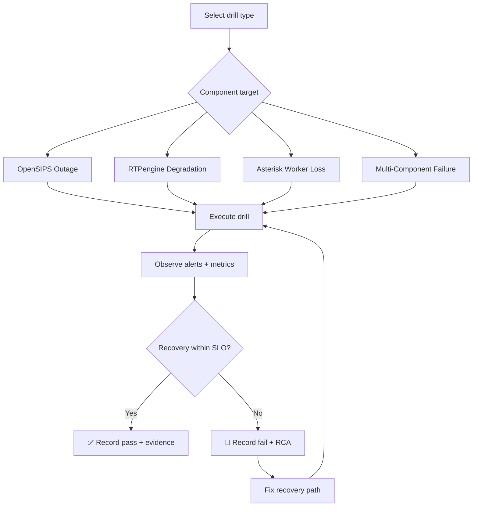
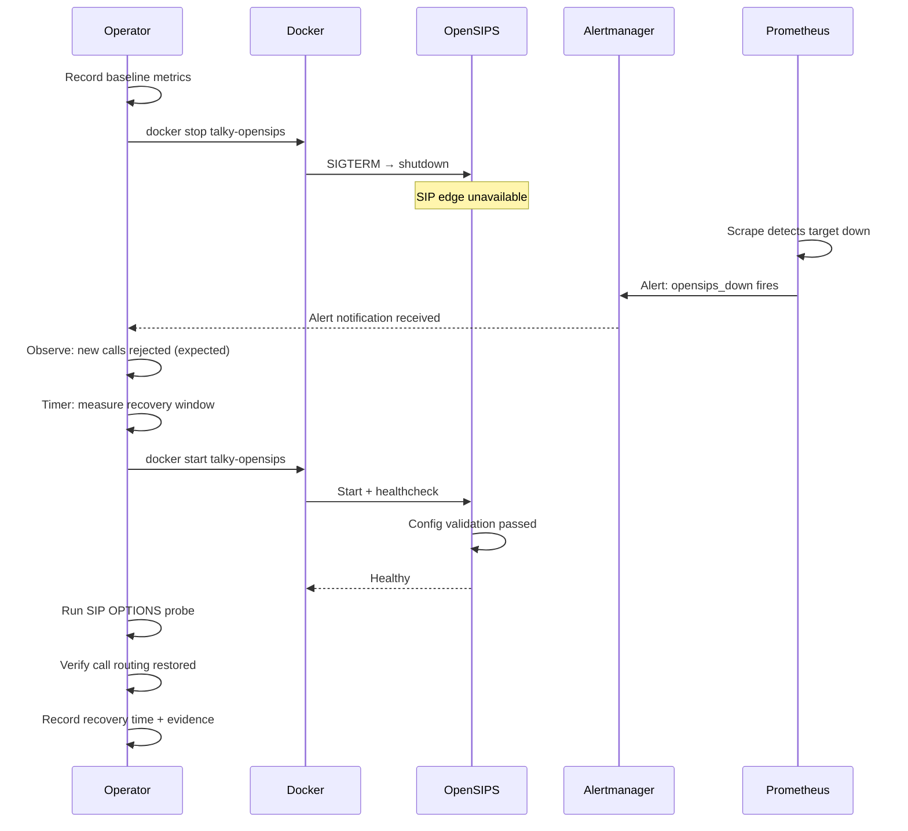

# Failure Injection & Recovery Drill Workflow

> **Phase:** 3 — Production Rollout + Resiliency  
> **Scope:** Controlled failure drills for telephony stack components  
> **Prerequisites:** WS-K + WS-L + WS-M gates pass; system at known-good baseline

---

## Overview

This workflow defines controlled failure injection drills to validate automated recovery, rollback capability, and alert quality under simulated production failure conditions.



---

## Pre-Drill Checklist

```bash
# 1. Verify system is at known-good baseline
docker ps --filter name=talky- --format "table {{.Names}}\t{{.Status}}"
# All 3 active services must be "healthy"

# 2. Verify monitoring is active
curl -s http://127.0.0.1:8000/metrics | grep telephony_call_setup

# 3. Record baseline metrics snapshot
curl -s http://127.0.0.1:8000/metrics > evidence/pre_drill_baseline_$(date +%s).prom

# 4. Notify team of planned drill
echo "DRILL STARTED: $(date) — Target: <component>" | tee drill_log.txt
```

---

## Drill 1: OpenSIPS Node Outage

### Purpose
Validate behavior when the SIP edge proxy is unavailable.

### Expected Behavior
- New calls fail gracefully (SIP 503 or connection refused)
- Existing in-progress calls may drop (expected)
- Alertmanager fires critical alert within 30 seconds
- Recovery restores call routing within 60 seconds of restart

### Procedure



```bash
# Execute drill

# Step 1: Record baseline
curl -s http://127.0.0.1:8000/metrics > evidence/drill1_baseline.prom
DRILL_START=$(date +%s)

# Step 2: Stop OpenSIPS
docker stop talky-opensips
echo "OpenSIPS stopped at $(date)"

# Step 3: Observe (wait 30-60 seconds)
sleep 30

# Step 4: Check alert fired
# (Check Alertmanager at http://127.0.0.1:9093 or CLI)

# Step 5: Attempt SIP probe (should fail)
python3 telephony/scripts/sip_options_probe.py 127.0.0.1 15060 3 || echo "EXPECTED: probe failed"

# Step 6: Restart OpenSIPS
docker start talky-opensips
echo "OpenSIPS restarted at $(date)"

# Step 7: Wait for healthy state
sleep 15
docker ps --filter name=talky-opensips --format "{{.Status}}"

# Step 8: Verify recovery
python3 telephony/scripts/sip_options_probe.py 127.0.0.1 15060 5

# Step 9: Record evidence
DRILL_END=$(date +%s)
RECOVERY_SECONDS=$((DRILL_END - DRILL_START))
echo "Drill 1 complete: recovery in ${RECOVERY_SECONDS}s" | tee -a drill_log.txt
curl -s http://127.0.0.1:8000/metrics > evidence/drill1_recovery.prom
```

### Pass/Fail Criteria

| Criterion | Target | Blocking? |
|-----------|--------|-----------|
| Alert fires within 30s of outage | ≤ 30s | ✅ Yes |
| Recovery within 60s of restart | ≤ 60s | ✅ Yes |
| SIP OPTIONS returns 200 OK post-recovery | 200 OK | ✅ Yes |
| No persistent state corruption | Clean config check | ✅ Yes |

---

## Drill 2: RTPengine Degradation

### Purpose
Validate media path behavior when the RTP relay degrades or restarts.

### Expected Behavior
- In-progress calls may experience brief media interruption
- New calls should still complete setup (SIP signaling is separate from media)
- Media quality metrics show transient degradation
- Recovery restores full media quality

### Procedure

```bash
# Step 1: Record baseline
curl -s http://127.0.0.1:8000/metrics > evidence/drill2_baseline.prom
DRILL_START=$(date +%s)

# Step 2: Simulate RTPengine restart
docker restart talky-rtpengine
echo "RTPengine restarted at $(date)"

# Step 3: Verify NG port comes back
sleep 10
ss -lun | grep ':2223' && echo "RTPengine NG port active" || echo "FAIL: NG port not listening"

# Step 4: Verify health check passes
docker ps --filter name=talky-rtpengine --format "{{.Status}}"

# Step 5: Run SIP probe (signaling should be unaffected)
python3 telephony/scripts/sip_options_probe.py 127.0.0.1 15060 5

# Step 6: Record evidence
DRILL_END=$(date +%s)
RECOVERY_SECONDS=$((DRILL_END - DRILL_START))
echo "Drill 2 complete: recovery in ${RECOVERY_SECONDS}s" | tee -a drill_log.txt
curl -s http://127.0.0.1:8000/metrics > evidence/drill2_recovery.prom
```

### Pass/Fail Criteria

| Criterion | Target | Blocking? |
|-----------|--------|-----------|
| NG port recovers within 15s | ≤ 15s | ✅ Yes |
| SIP signaling unaffected during restart | 200 OK on probe | ✅ Yes |
| No persistent media state corruption | Clean restart | ✅ Yes |

---

## Drill 3: Asterisk Worker Disruption

### Purpose
Validate B2BUA availability when the Asterisk container restarts.

### Expected Behavior
- Active calls are terminated (expected — B2BUA state is in-memory)
- New calls fail during restart window (OpenSIPS returns 503)
- Recovery restores call handling capability
- `depends_on: service_healthy` prevents premature traffic

### Procedure

```bash
# Step 1: Record baseline
curl -s http://127.0.0.1:8000/metrics > evidence/drill3_baseline.prom
DRILL_START=$(date +%s)

# Step 2: Stop Asterisk
docker stop talky-asterisk
echo "Asterisk stopped at $(date)"

# Step 3: Observe OpenSIPS behavior (should reject new calls)
sleep 10

# Step 4: Restart Asterisk
docker start talky-asterisk
echo "Asterisk restarted at $(date)"

# Step 5: Wait for healthy state
sleep 25  # start_period is 20s
docker ps --filter name=talky-asterisk --format "{{.Status}}"

# Step 6: Verify PJSIP transport is ready
docker exec talky-asterisk asterisk -rx "pjsip show transports"

# Step 7: Verify end-to-end call path
python3 telephony/scripts/sip_options_probe.py 127.0.0.1 15060 5

# Step 8: Record evidence
DRILL_END=$(date +%s)
RECOVERY_SECONDS=$((DRILL_END - DRILL_START))
echo "Drill 3 complete: recovery in ${RECOVERY_SECONDS}s" | tee -a drill_log.txt
curl -s http://127.0.0.1:8000/metrics > evidence/drill3_recovery.prom
```

### Pass/Fail Criteria

| Criterion | Target | Blocking? |
|-----------|--------|-----------|
| Asterisk healthy within 30s of restart | ≤ 30s | ✅ Yes |
| PJSIP transport visible post-recovery | `transport-udp` listed | ✅ Yes |
| End-to-end SIP probe passes | 200 OK | ✅ Yes |

---

## Drill 4: Combined Component Failure

### Purpose
Validate behavior under multi-component failure (worst-case scenario).

### Procedure

```bash
# Step 1: Record baseline
curl -s http://127.0.0.1:8000/metrics > evidence/drill4_baseline.prom

# Step 2: Stop all telephony services
docker stop talky-opensips talky-asterisk talky-rtpengine
echo "ALL services stopped at $(date)"

# Step 3: Observe total outage (30 seconds)
sleep 30

# Step 4: Restart in correct dependency order
docker start talky-rtpengine
sleep 5
docker start talky-asterisk
sleep 25  # wait for Asterisk healthy
docker start talky-opensips
sleep 15  # wait for OpenSIPS healthy

# Step 5: Verify full recovery
docker ps --filter name=talky- --format "table {{.Names}}\t{{.Status}}"
python3 telephony/scripts/sip_options_probe.py 127.0.0.1 15060 5
bash telephony/scripts/sip_options_probe_tls.sh 127.0.0.1 15061 5

# Step 6: Record evidence
echo "Drill 4 (multi-failure) complete at $(date)" | tee -a drill_log.txt
curl -s http://127.0.0.1:8000/metrics > evidence/drill4_recovery.prom
```

---

## Post-Drill Report Template

After each drill, create a record using this template:

```markdown
## Drill Report: [Drill Name]
- **Date:** YYYY-MM-DD HH:MM
- **Target:** [Component]
- **Duration:** [X seconds outage, Y seconds recovery]
- **Alert fired?** Yes/No (within Xs)
- **Recovery successful?** Yes/No
- **SLO impact:** [Describe any metric deviation]
- **Evidence files:**
  - `evidence/drillN_baseline.prom`
  - `evidence/drillN_recovery.prom`
- **Operator notes:** [Any observations]
- **Action items:** [Any fixes needed]
```

---

## Reference

- Execution plan: `telephony/docs/phase_3/01_phase_three_execution_plan.md` (WS-N scope)
- Official reference: `telephony/docs/phase_3/00_phase_three_official_reference.md`
- Alertmanager docs: https://prometheus.io/docs/alerting/latest/alertmanager/
- Docker Compose startup order: https://docs.docker.com/compose/how-tos/startup-order/
