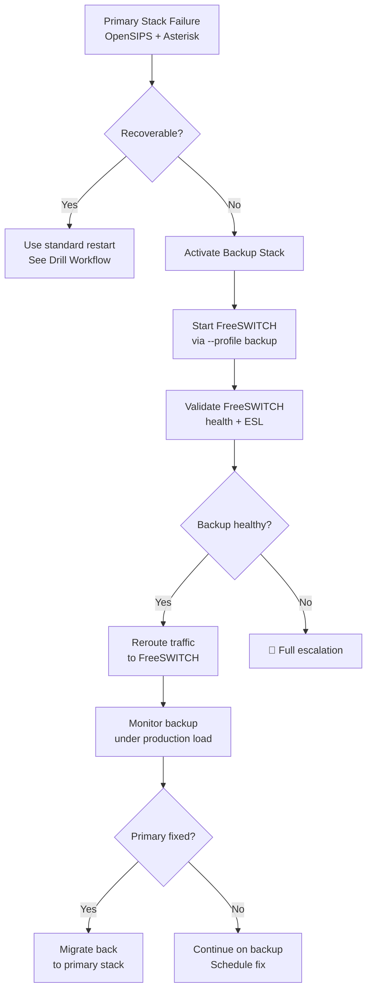
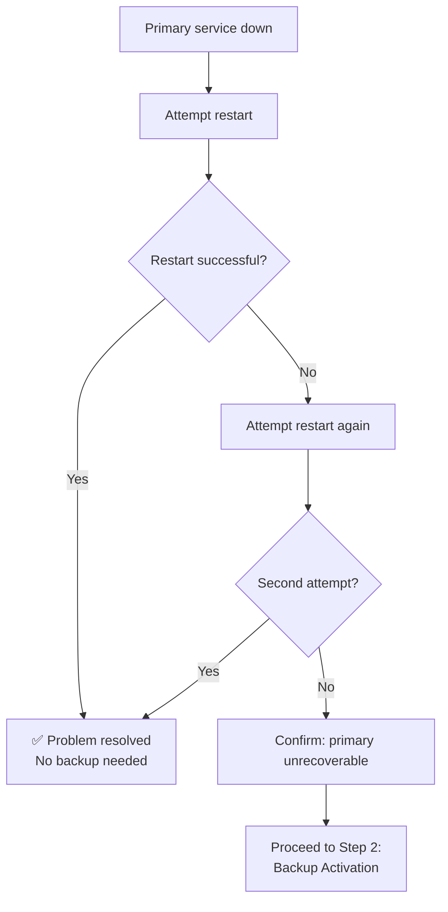
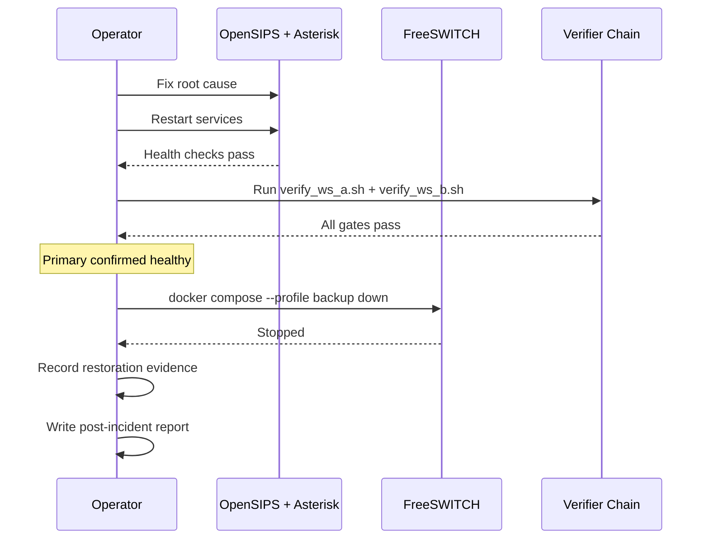

# Backup Activation & Rollback Workflow

> **Phase:** 3 — Production Rollout + Resiliency  
> **Scope:** Controlled activation of Kamailio/FreeSWITCH backup stack as fallback during emergencies  
> **Prerequisites:** System at known-good state; active stack (OpenSIPS + Asterisk) verified

---

## Overview

This workflow defines how to safely activate the backup telephony stack (Kamailio + FreeSWITCH) when the primary stack (OpenSIPS + Asterisk) experiences an unrecoverable failure.



> ⚠️ **Important:** This workflow is for **emergency use only**. The backup stack should not be used as a long-term production path. The goal is to restore service while the primary stack is being repaired.

---

## When to Use This Workflow

| Scenario | Use This Workflow? | Better Alternative |
|----------|--------------------|--------------------|
| OpenSIPS won't start after restart | ✅ Yes | — |
| Asterisk persistent crash loop | ✅ Yes | — |
| Config corruption in primary stack | ✅ Yes | — |
| Temporary SIP probe failure | ❌ No | Wait + retry (see Drill Workflow) |
| RTPengine restart needed | ❌ No | RTPengine is shared by both stacks |
| Canary SLO breach | ❌ No | Use canary rollback (see Canary Workflow) |

---

## Step 1: Confirm Primary Stack Failure

```bash
# Check primary stack health
docker ps --filter name=talky- --format "table {{.Names}}\t{{.Status}}"

# Attempt restart of failed component
docker restart talky-opensips    # or talky-asterisk
sleep 20                         # wait for health check

# Check if restart resolved the issue
docker ps --filter name=talky- --format "table {{.Names}}\t{{.Status}}"
python3 telephony/scripts/sip_options_probe.py 127.0.0.1 15060 5

# If probe still fails → proceed with backup activation
```

### Decision Gate



---

## Step 2: Activate FreeSWITCH Backup

```bash
# Start FreeSWITCH using the backup Docker profile
docker compose -f telephony/deploy/docker/docker-compose.telephony.yml \
  --profile backup up -d freeswitch

# Wait for the health check to pass
echo "Waiting for FreeSWITCH to become healthy..."
sleep 25  # start_period is 20s

# Verify health
docker ps --filter name=talky-freeswitch --format "{{.Names}}\t{{.Status}}"
# Expected: talky-freeswitch   Up X seconds (healthy)
```

---

## Step 3: Validate Backup Stack

```bash
# FreeSWITCH status check
docker exec talky-freeswitch fs_cli -x status
# Expected: "FreeSWITCH ... is ready"

# ESL connectivity check (from host)
docker exec talky-freeswitch fs_cli -x "show module mod_event_socket"
# Expected: mod_event_socket listed as running

# SIP endpoint check
docker exec talky-freeswitch fs_cli -x "sofia status"
# Expected: SIP profiles listed and RUNNING

# Optional: Run WS-B verification suite against backup target
bash telephony/scripts/verify_ws_b.sh telephony/deploy/docker/.env.telephony.example
```

### Validation Checklist

| Check | Command | Expected Result |
|-------|---------|-----------------|
| Container healthy | `docker ps --filter name=talky-freeswitch` | "healthy" status |
| FreeSWITCH status | `fs_cli -x status` | "is ready" |
| ESL module loaded | `fs_cli -x "show module mod_event_socket"` | Module listed |
| SIP profiles active | `fs_cli -x "sofia status"` | Profiles RUNNING |

---

## Step 4: Reroute Traffic (If Using Kamailio Backup Edge)

> **Note:** If OpenSIPS is the failed component, you may need to temporarily use Kamailio as the SIP edge. This requires starting Kamailio manually:

```bash
# Option A: Start Kamailio directly (not in default compose)
docker run -d --name talky-kamailio-emergency \
  --network host \
  -v $(pwd)/telephony/kamailio/conf/kamailio.cfg:/etc/kamailio/kamailio.cfg:ro \
  -v $(pwd)/telephony/kamailio/conf/dispatcher.list:/etc/kamailio/dispatcher.list:ro \
  -v $(pwd)/telephony/kamailio/conf/address.list:/etc/kamailio/address.list:ro \
  -v $(pwd)/telephony/kamailio/conf/tls.cfg:/etc/kamailio/tls.cfg:ro \
  kamailio/kamailio:latest

# Option B: Update dispatcher.list to point to FreeSWITCH port
# (if using OpenSIPS but Asterisk failed)
# Edit telephony/opensips/conf/dispatcher.list:
#   Change: sip:127.0.0.1:5088  →  sip:127.0.0.1:5080
# Then reload OpenSIPS config
```

---

## Step 5: Monitor Backup Under Load

```bash
# Continuous health monitoring
watch -n 10 'docker exec talky-freeswitch fs_cli -x "show channels count"'

# Check for error patterns in logs
docker logs talky-freeswitch --tail 50 -f

# Verify metrics still flowing
curl -s http://127.0.0.1:8000/metrics | grep telephony_call_setup
```

---

## Step 6: Restore Primary Stack

Once the primary stack issue is resolved:

```bash
# Step 6a: Restart primary components
docker restart talky-asterisk
sleep 25  # wait for healthy
docker restart talky-opensips
sleep 15  # wait for healthy

# Step 6b: Verify primary is healthy
docker ps --filter name=talky- --format "table {{.Names}}\t{{.Status}}"
python3 telephony/scripts/sip_options_probe.py 127.0.0.1 15060 5

# Step 6c: Run full verification
bash telephony/scripts/verify_ws_a.sh telephony/deploy/docker/.env.telephony.example
bash telephony/scripts/verify_ws_b.sh telephony/deploy/docker/.env.telephony.example

# Step 6d: Stop backup stack
docker compose -f telephony/deploy/docker/docker-compose.telephony.yml \
  --profile backup down

# Step 6e: Verify backup is stopped
docker ps --filter name=talky-freeswitch
# Expected: no output (container stopped)
```

### Restoration Sequence



---

## Post-Incident Report Template

```markdown
## Backup Activation Report

### Incident
- **Date/Time:** YYYY-MM-DD HH:MM — HH:MM
- **Duration:** X minutes on backup stack
- **Failed Component:** [OpenSIPS / Asterisk / Both]
- **Root Cause:** [Description]

### Timeline
1. HH:MM — Primary failure detected
2. HH:MM — Restart attempt #1 (failed)
3. HH:MM — Restart attempt #2 (failed)
4. HH:MM — Decision: activate backup
5. HH:MM — FreeSWITCH backup started
6. HH:MM — Backup validated and serving traffic
7. HH:MM — Primary root cause identified
8. HH:MM — Primary fixed and restored
9. HH:MM — Backup deactivated
10. HH:MM — Normal operations confirmed

### Impact
- **Calls dropped during transition:** [N]
- **Time on backup stack:** [X minutes]
- **SLO deviation:** [Description or "none"]

### Action Items
1. [Preventive measure 1]
2. [Preventive measure 2]
3. [Monitoring improvement]
```

---

## Reference

- Docker Compose profiles: Backup services use `profiles: ["backup"]`
- FreeSWITCH README: `telephony/freeswitch/README.md`
- Kamailio README: `telephony/kamailio/README.md`
- Phase 3 execution plan: `telephony/docs/phase_3/01_phase_three_execution_plan.md`
