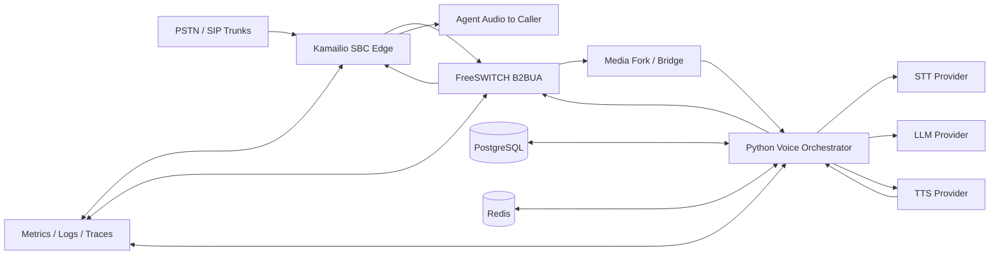
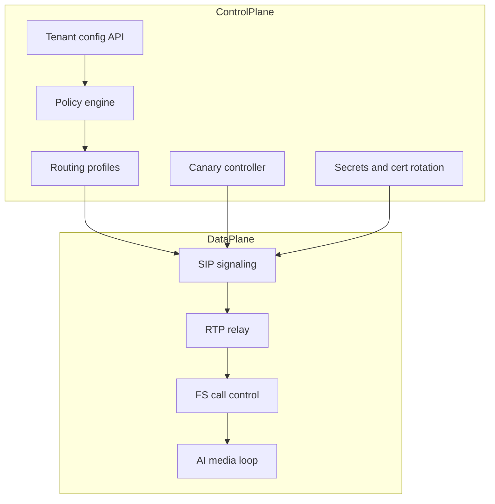
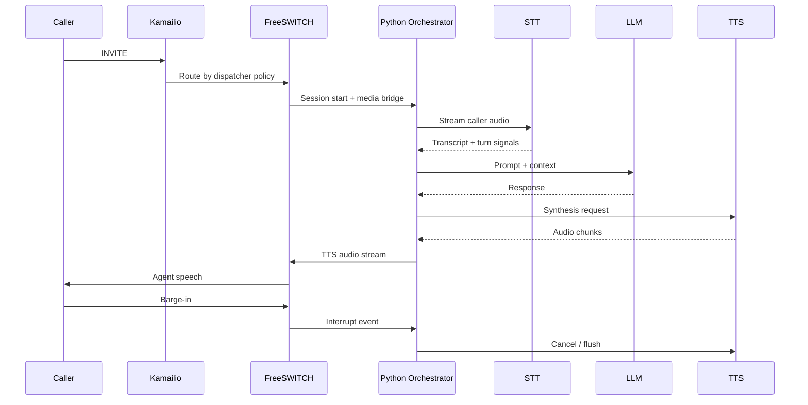
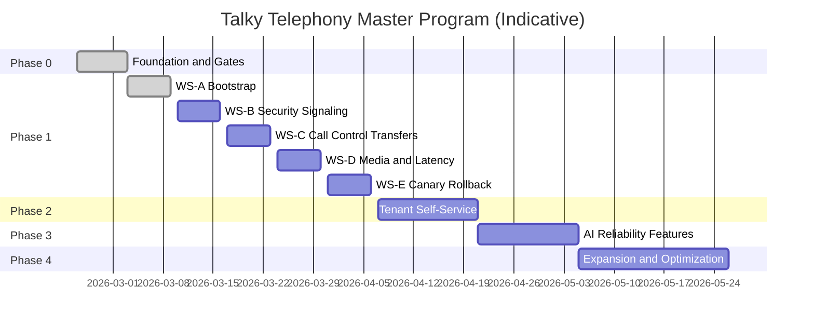
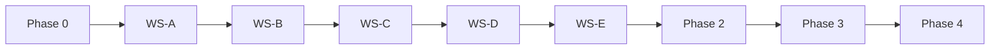
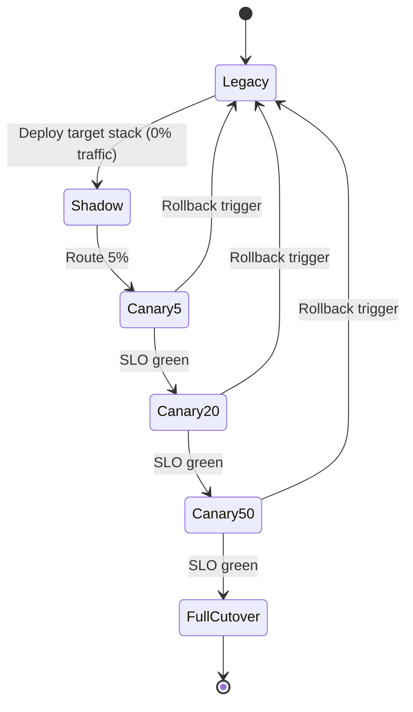

# Talky.ai Voice System Master Plan (A to Z)

Date: 2026-02-23  
Owner: Talky.ai Platform  
Status: Active Plan (`WS-A complete`, `WS-B complete`, `WS-C complete`, `WS-D complete`, `WS-E complete`)  
Scope: End-to-end production telephony system modernization with strict gated execution

---

## 1. Program Intent

Build a production-grade, multi-tenant voice platform where:
1. Signaling is carrier-grade and modular.
2. Media is low-latency and measurable.
3. AI orchestration remains in Python.
4. Every release is reversible with clear rollback controls.
5. No phase begins before prior phase acceptance is complete.

---

## 2. Hard Rules (Non-Negotiable)

1. Sequential execution only: Phase N must be fully accepted before Phase N+1 starts.
2. No "best effort pass": each gate requires objective evidence.
3. No big-bang cutover: canary progression only.
4. Security controls are baseline requirements, not optional add-ons.
5. Rollback path must be tested before traffic expansion.
6. Changes are production-safe by design (idempotent deploys, deterministic configs, audited deltas).

---

## 3. Target Capabilities

1. Bring-your-own SIP trunk onboarding by tenant.
2. Inbound + outbound calls with stable media.
3. Blind and attended transfer.
4. Barge-in and interruption-safe AI turn-taking.
5. Low-latency STT/LLM/TTS pipeline with measurable SLOs.
6. Real-time observability (signal, media, AI, and business KPIs).
7. Canary deployment and rapid rollback automation.
8. Multi-tenant policy isolation.

---

## 4. Architecture Blueprint

### 4.1 End-to-End Target Graph



### 4.2 Control Plane vs Data Plane



### 4.3 Call Lifecycle Sequence



---

## 5. A-to-Z Work Breakdown

| Letter | Work Item | Primary Output | Acceptance Signal |
|---|---|---|---|
| A | Assess current production and gap map | Baseline architecture + risk inventory | Signed assessment document |
| B | Build immutable environment contracts | `.env`/secret contract + config schema | Config validation CI pass |
| C | Create telephony bootstrap stack | Kamailio + rtpengine + FreeSWITCH up | WS-A verifier pass |
| D | Define tenant SIP model | Tenant trunk/profile schema | CRUD + validation tests pass |
| E | Establish signaling security baseline | ACL, TLS, rate limits | Security smoke pass |
| F | Formalize call state machine | Unified call states/events | Event consistency tests pass |
| G | Gate deployment workflow | Sequential phase gates in docs/CI | Gate enforcement confirmed |
| H | Harden FreeSWITCH control path | ESL ACL and auth hardening | Unauthorized access blocked |
| I | Implement ingress policy engine | Per-tenant route selection | Tenant isolation test pass |
| J | Join media path to AI bridge | Stable bidirectional audio | 30-min soak without drift |
| K | Keepalive and failure recovery | SIP/WS keepalive + reconnect | Recovery tests pass |
| L | Latency instrumentation | STT/LLM/TTS timing spans | P50/P95 dashboard live |
| M | Multi-tenant limits and quotas | Per-tenant guardrails | Quota enforcement tests pass |
| N | Normalize codec/sample-rate policy | Stable PCM/resample policy | No audible artifacts in QA |
| O | Operational runbooks | Incident + rollback runbooks | Drill completion evidence |
| P | Provision canary routing controls | 5% to 50% progressive rollout | Canary controller test pass |
| Q | Qualify transfer features | Blind + attended transfer | >=99% transfer success in test |
| R | Recordings and compliance controls | Retention + redaction flow | Compliance checklist pass |
| S | Scale and load validation | Concurrency benchmark report | Meets SLO under target load |
| T | Telemetry unification | SIP/media/AI traces + IDs | End-to-end traceability pass |
| U | Upgrade strategy and version pinning | Artifact/version policy | Reproducible build proof |
| V | Verify disaster rollback | One-command rollback path | Rollback drill <= 2 min |
| W | Web/API management integration | Dashboard control endpoints | API integration tests pass |
| X | eXperience validation | MOS-style QA and barge-in UX tests | UX quality signoff |
| Y | Yield optimization | Cost/latency tuning loop | Cost and latency targets met |
| Z | Zero-downtime cutover completion | Full traffic on target stack | Post-cutover stability window pass |

---

## 6. Phase Plan (Strict Sequence)

## Phase 0: Program Foundation

1. Baseline system inventory.
2. Security and compliance requirements freeze.
3. CI/CD gating skeleton.
4. Rollback design before implementation.

Exit Criteria:
1. Approved architecture.
2. Approved risk register.
3. Approved acceptance gates.

## Phase 1: Telephony Foundation

Status: `Complete` (WS-A through WS-E complete)

Workstreams:
1. WS-A Infrastructure Bootstrap (`Complete`)
2. WS-B Security + Signaling Baseline (`Complete`)
3. WS-C Call Control + Transfer Baseline (`Complete`)
4. WS-D Media Bridge + Latency Baseline (`Complete`)
5. WS-E Canary + Rollback Control (`Complete`)

Exit Criteria:
1. Secure signaling baseline enabled.
2. Transfer reliability validated.
3. Latency baseline established.
4. Canary + rollback drill successful.

## Phase 2: Tenant Self-Service + Policy Automation

1. Tenant SIP/trunk onboarding APIs.
2. Per-tenant route and codec policies.
3. Quotas, limits, and abuse controls.
4. Tenant operational audit logs.

Exit Criteria:
1. Tenant isolation verified.
2. Self-service onboarding works without manual ops edits.

## Phase 3: AI Voice Reliability and Feature Depth

1. Full barge-in and interruption consistency.
2. Dynamic prompt and voice policy per tenant.
3. Transfer context preservation.
4. Prompt-safe fallbacks and guardrails.

Exit Criteria:
1. Stable conversational quality across supported providers.
2. No critical turn-state desynchronization defects.

## Phase 4: Production Expansion + Cost/Performance Optimization

1. Progressive traffic increases.
2. Capacity tuning and autoscaling.
3. Cost per successful minute optimization.
4. Regional resilience validation.

Exit Criteria:
1. SLO met for 30 consecutive days.
2. Error budget policy compliance.

---

## 7. Timeline Graph (Indicative)



---

## 8. Dependency Graph



---

## 9. SLOs and Quality Targets

| Domain | Metric | Target | Rollback Trigger |
|---|---|---|---|
| Signaling | Call setup success | >= 99.0% | < 98.5% for 10 min |
| Transfer | Blind transfer success | >= 99.0% | < 95.0% |
| Latency | Response start P95 | <= 1200 ms | > 1500 ms for 15 min |
| Media | One-way/no-audio incidents | <= 0.5% | > 1.0% |
| Platform | Critical error rate | <= 0.5% | > 1.0% |
| Stability | Recovery from node failure | <= 30 sec | > 60 sec |

---

## 10. Testing Pyramid and Release Gates

1. Unit Tests:
   - SIP policy parsing
   - call state transitions
   - media frame normalization
2. Integration Tests:
   - Kamailio route behavior
   - FreeSWITCH ESL control path
   - rtpengine control/listener checks
3. End-to-End Tests:
   - call connect, AI response, barge-in, transfer
4. Soak Tests:
   - sustained session stability
5. Canary Tests:
   - 5% staged traffic with control comparison

Gate policy:
1. All lower-level tests must pass before higher-level tests run.
2. No production promotion with unresolved P1/P2 defects.

---

## 11. Security Baseline Plan

1. Signaling:
   - TLS where required by trunk/provider profile.
   - strict source ACLs.
   - flood/rate controls (`pike`, `ratelimit` style policies).
2. FreeSWITCH Control:
   - non-default credentials.
   - restricted inbound ACL for ESL.
3. Secrets:
   - rotated credentials with audit.
4. Multi-Tenant:
   - tenant ID enforced in every config and route decision.

Acceptance:
1. Security smoke tests pass.
2. Unauthorized route/control attempts are denied and logged.

---

## 12. Migration and Cutover Strategy



Operational Policy:
1. One canary at a time.
2. Fixed observation windows before progression.
3. Automatic rollback on trigger breach.

---

## 13. Repository Structure (Target)

```text
telephony/
+-- docs/
|   +-- plan.md
|   +-- 00_overview.md
|   +-- 01_target_architecture.md
|   +-- 02_migration_plan.md
|   +-- 03_cutover_checklist.md
|   +-- 04_operations_runbook.md
|   +-- 05_current_to_target_code_migration.md
|   +-- 06_phase_one_execution_plan.md
|   `-- 07_phase_one_gated_checklist.md
+-- kamailio/
|   `-- conf/
+-- rtpengine/
|   +-- conf/
|   `-- src/           # C/C++ extensions or custom modules (future)
+-- freeswitch/
|   +-- conf/
|   `-- mods/          # C/C++ custom FS modules (future)
+-- deploy/
|   `-- docker/
`-- scripts/
```

Note:
1. C/C++ code remains isolated in `telephony/rtpengine/src` and `telephony/freeswitch/mods`.
2. Python orchestration remains in backend app services.

---

## 14. Risk Register (Top Items)

| Risk | Probability | Impact | Mitigation |
|---|---|---|---|
| Port conflicts in host network mode | Medium | High | Configurable SIP ports + preflight checks |
| Media distortion due to sample-rate mismatch | Medium | High | Enforced codec/sample policy + QA checks |
| Transfer behavior differences across carriers | Medium | Medium | Carrier profile tests + fallback logic |
| Signaling flood abuse | Medium | High | ACL + pike/rate-limit baseline |
| Canary false positives/negatives | Medium | Medium | Control vs canary metric split + sufficient duration |
| Config drift across envs | High | Medium | Immutable artifacts + CI config linting |

---

## 15. Operational Checklists

### 15.1 Before Enabling Canary

1. All phase gates for current stage are green.
2. Rollback command tested in current environment.
3. Metrics dashboard for canary/control is live.
4. On-call owner assigned.

### 15.2 During Canary

1. Observe setup success, transfer success, latency, media quality.
2. Track tenant-specific outliers.
3. Do not deploy unrelated changes.

### 15.3 After Canary

1. Record decision and evidence.
2. Either progress to next stage or roll back.
3. Publish concise release report.

---

## 16. Immediate Execution Order (From Today)

1. Execute WS-C implementation only against approved plan.
2. Complete WS-C evidence and signoff.
3. Start WS-D only after WS-C is fully accepted.
4. Continue same pattern through WS-E.

---

## 17. Definition of Done (Program)

The program is complete only when:
1. All phases (0 to 4) are accepted with recorded evidence.
2. Full traffic runs on target stack.
3. SLOs are sustained for a defined stability window.
4. Rollback remains validated post-cutover.
5. Tenant self-service telephony onboarding is operational.

---

## 18. Official References (Used for Plan Alignment)

1. Kamailio Dispatcher (stable): https://kamailio.org/docs/modules/stable/modules/dispatcher.html  
2. Kamailio Modules (5.8 stable index): https://www.kamailio.org/docs/modules/5.8.x/  
3. Kamailio Pike module overview: https://kamailio.org/docs/modules/devel/modules/pike.html  
4. rtpengine overview and features: https://rtpengine.readthedocs.io/en/mr12.4/overview.html  
5. FreeSWITCH mod_event_socket: https://developer.signalwire.com/freeswitch/FreeSWITCH-Explained/Modules/mod_event_socket_1048924  
6. FreeSWITCH mod_commands (`uuid_transfer`): https://developer.signalwire.com/freeswitch/confluence-to-docs-redirector/display/FREESWITCH/mod_commands  
7. Docker network drivers: https://docs.docker.com/engine/network/drivers/  
8. Docker host network driver: https://docs.docker.com/engine/network/tutorials/host/  
9. Google SRE Canarying Releases: https://sre.google/workbook/canarying-releases/
